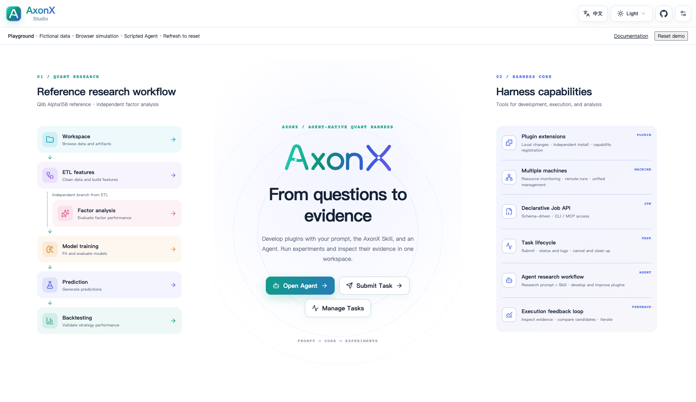
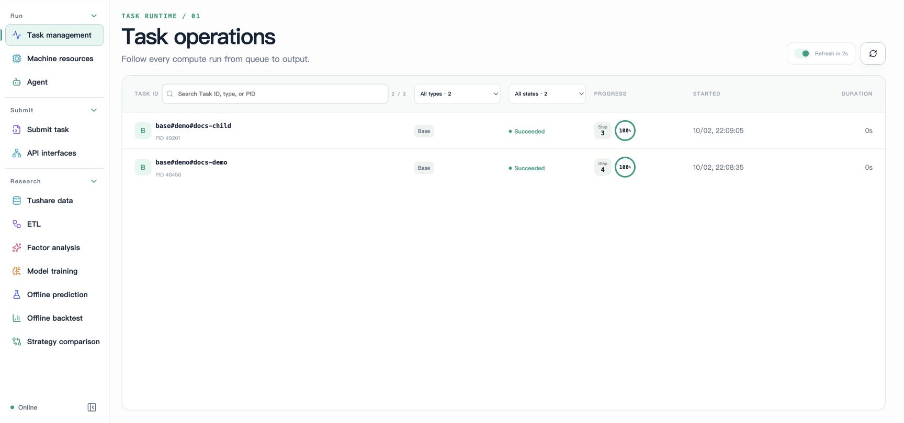
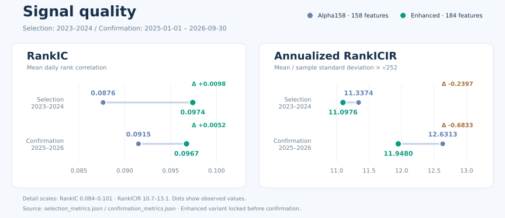
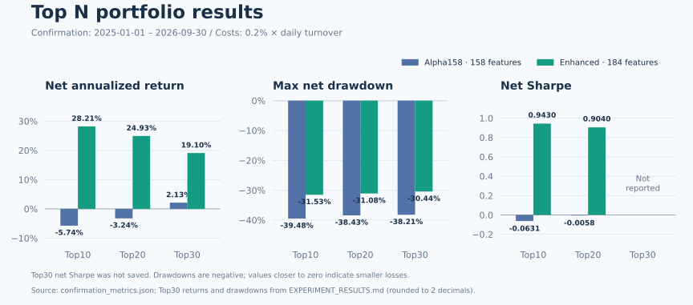

<p align="center">
  
</p>

<p align="center"><strong>面向金融量化研究的 Agent Harness。</strong></p>

<p align="center">
  <a href="https://github.com/FlowLLM-AI/AxonX/blob/main/pyproject.toml"></a>
  <a href="https://pypi.org/project/axonx/"></a>
  <a href="https://pypi.org/project/axonx/"></a>
  <a href="https://github.com/FlowLLM-AI/AxonX/graphs/commit-activity"></a>
  <a href="https://github.com/FlowLLM-AI/AxonX/graphs/traffic"></a>
  <a href="https://github.com/FlowLLM-AI/AxonX/forks"></a>
  <a href="https://github.com/FlowLLM-AI/AxonX/blob/main/LICENSE"></a>
  <a href="https://flowllm-ai.github.io/AxonX/zh/concepts/architecture"></a>
  <a href="https://flowllm-ai.github.io/AxonX/zh/docs"></a>
  <a href="https://github.com/FlowLLM-AI/AxonX/blob/main/README.md"></a>
  <a href="https://github.com/FlowLLM-AI/AxonX/blob/main/README_ZH.md"></a>
  <a href="https://deepwiki.com/FlowLLM-AI/AxonX"></a>
</p>

<p align="center">⭐ <a href="https://github.com/FlowLLM-AI/AxonX">给 AxonX 点个 GitHub Star</a>！</p>

<a id="axonx-是什么"></a>

## 🧠 AxonX 是什么？

**AxonX 是面向金融量化研究的 Agent 原生框架。**

它将数据处理、因子分析、训练、预测和回测封装为输入输出明确的 **Task**。插件提供算法；框架负责执行、记录和产物管理。

研究者使用 **AxonX Studio** 中的表单和图表，Agent 与脚本通过 CLI / MCP 调用能力。
各入口通过 **Job** 提交、跟踪和查询任务，利用同一工作区中的研究记录检查日志、产物和上下游关系。

<a id="为什么使用-axonx"></a>

## ✨ 为什么使用 AxonX？

- 可复用的研究 Task。 带类型的输入输出明确数据、模型与产物要求。→ [Task 契约](https://flowllm-ai.github.io/AxonX/zh/reference/task-contracts)
- 管理执行过程。 在工作进程中运行 Task，跟踪状态、进度、日志与结果，支持等待和取消。→ [任务管理](https://flowllm-ai.github.io/AxonX/zh/guides/task-management)
- 追溯研究结果。 保存的参数、产物和依赖图帮助你复用数据和比较实验。→ [任务血缘](https://flowllm-ai.github.io/AxonX/zh/concepts/task-lineage)
- 各入口共用工作流程。 CLI / MCP、Studio 与 Agent 共享 Job 和 Task 契约、记录及产物。→ [AxonX Studio](https://flowllm-ai.github.io/AxonX/zh/getting-started/studio) · [Agent](https://flowllm-ai.github.io/AxonX/zh/agent/usage)
- 扩展并远程运行。 添加研究插件，在选定的目标环境中执行 Task。→ [插件管理](https://flowllm-ai.github.io/AxonX/zh/plugins/management) · [远程机器](https://flowllm-ai.github.io/AxonX/zh/guides/remote-machines)

## 📰 最新更新

- AxonX **0.1.0** 发布： 面向量化研究的 Agent Harness，提供插件化 Task、执行跟踪、任务血缘，以及 CLI / MCP / Studio 统一接入。→ [官网文档](https://flowllm-ai.github.io/AxonX/zh/)
- 通过 SKILL.md + CLI 接入 Agent： 为 Codex、Claude Code 等加载 [AxonX Skill](skills/axonx/SKILL.md)，让 Agent 发现 Task 契约、开发插件、提交研究任务并检查结果。→ [Agent 接入指南](https://flowllm-ai.github.io/AxonX/zh/agent/external)
- AxonX Studio 能力发布： 在同一工作台浏览任务与产物、查看训练曲线与回测、比较策略。→ <a href="https://flowllm-ai.github.io/AxonX/playground/?lang=zh" target="_self">Playground 在线试玩</a>（数据与执行均为模拟）
- 使用 Skill + CLI 开发 Alpha158 增强版： Codex 为 Alpha158 新增 **26** 个特征。在 2025-01-01 至 2026-09-30 确认期，Top10 扣费年化收益从 **−5.74%** 提高至 **28.21%**，Top20 从 **−3.24%** 提高至 **24.93%**。→ [Benchmark](#benchmark-agent-开发市场横截面增强特征) · [完整结果](plugins/a158_enhanced/EXPERIMENT_RESULTS.md)


<a id="快速开始"></a>

## 🚀 快速开始

要求 **Python 3.12+**，本地 Task 执行支持 **macOS 和 Linux**。

### 从 PyPI 安装

```bash
pip install "axonx[studio]"
```

包含 CLI、HTTP API、MCP 和预构建的 AxonX Studio。只使用核心能力时，可安装 `axonx`。研究插件单独安装。

### 从源码安装

构建 Studio 需要 Node.js 22.13+（22.x）、24.x 或 26+：

```bash
git clone https://github.com/FlowLLM-AI/AxonX.git && cd AxonX
pip install -e .
(cd axonx_studio && npm ci && npm run build)
pip install ./axonx_studio
```

开发依赖和前端热更新见[贡献指南](CONTRIBUTING_ZH.md)
与 [Studio 开发文档](https://flowllm-ai.github.io/AxonX/zh/development/studio)。

### 配置环境变量

在启动目录创建 `.env`，CLI 会自动加载当前目录或父目录中的配置；已有环境变量优先。

```dotenv
# 本机服务鉴权：替换为自己的 token
AXONX_SERVICE_TOKEN=replace-with-your-local-service-token

# 可选：目标 AxonX 服务（axonx start --config remote）
# AXONX_TARGET=192.0.2.10:1024
# AXONX_TARGET_TOKEN=your-target-service-token
```

模型、行情下载和远程服务等可选配置见 [example.env](example.env)。

### 启动 AxonX

默认启动：

```bash
axonx start
```

指定监听 IP 和端口：

```bash
axonx start --service.host 127.0.0.1 --service.port 8181
```

使用自定义端口时，浏览器访问 `http://127.0.0.1:8181/`，后续 CLI 服务命令追加 `--target 127.0.0.1:8181`，并提供本机服务的
token，例如：

```bash
axonx version --target 127.0.0.1:8181 --token '<本机服务 token>'
```

指定 `--target` 后，CLI 默认读取 `AXONX_TARGET_TOKEN`；上述 `--token` 显式使用本机凭据。默认端口的本机命令则读取
`AXONX_SERVICE_TOKEN`。远程服务配置见[远程执行](#cli-直连远程服务)。

服务保持运行，后续 CLI 命令在另一个终端中执行。

### 打开 AxonX Studio

默认启动后，打开 `http://127.0.0.1:1024/`，进入 **设置 → 本机服务令牌**，填入 `.env` 中配置的 `AXONX_SERVICE_TOKEN`。随后可以：

- 查询 Task 定义、填写参数、提交任务，查看状态、进度、日志和上下游关系。
- 浏览工作区文件，检查参数、元数据和研究产物。
- 查看因子分析、训练曲线、预测结果、回测指标与分期汇总。
- 查询机器资源，在已配置的本机与远程服务之间切换。
- 配置模型后，在 Agent 页面通过会话排查任务和分析研究结果。

<table>
  <tr>
    <th width="50%">首页</th>
    <th width="50%">任务管理</th>
  </tr>
  <tr>
    <td valign="top">
      <a href="docs/figures/studio/home.png"></a>
    </td>
    <td valign="top">
      <a href="docs/figures/studio/task-list.png"></a>
    </td>
  </tr>
</table>

[Studio 入门](https://flowllm-ai.github.io/AxonX/zh/getting-started/studio)

<a id="快速演示"></a>

## 🧪 CLI 快速演示

### 下载 Tushare 数据

在服务的 `.env` 中配置 `AXONX_TUSHARE_TOKEN`（[example.env](example.env)），然后启动或重启服务。
使用内置 Tushare 任务下载一周的日线行情和复权因子，再查看它的状态和日志：

```bash
axonx submit \
  --task download_tushare_task \
  --task-name tushare-demo \
  --start-date 20230901 \
  --end-date 20230907 \
  --datasets 'daily,adj_factor'

axonx status --task-id 'api#download_tushare_task#tushare-demo'
axonx read_task_log --task-id 'api#download_tushare_task#tushare-demo'
```

`--task` 选择任务，`--task-name` 指定名称；日期使用 `YYYYMMDD` 格式，`--datasets` 选择下载的数据组，以逗号分隔。
`submit` 命令返回 JSON（模拟示例）：

```json
{
  "answer": {
    "task_id": "api#download_tushare_task#tushare-demo",
    "run_id": "f5caee3a7b3c40849d0fb3bdc0f0cd23",
    "task": "download_tushare_task"
  },
  "success": true,
  "metadata": {}
}
```

`success: true` 表示提交成功；任务异步下载，成功后将 Parquet 文件保存到工作区的 `tushare/` 目录。
查询时使用返回的 `task_id`，保留 `run_id` 可通过 `wait_task` 等待本次执行结束。

### 其他 CLI 命令

将占位 ID 替换为返回的 `answer.task_id` / `answer.run_id`；上游成功后再提交下游 Task。

```bash
# 任务状态、日志与依赖
axonx wait_task --task-id '<task_id>' --run-id '<run_id>' --client-timeout 600
axonx status --task-id '<task_id>'
axonx read_task_log --task-id '<task_id>'
axonx get_task_graph --task-id '<task_id>'

# 服务与工作区
axonx version
axonx machine_status
axonx list_entries --path ''

# 插件：在服务的 Python 环境中安装，然后重启服务
pip install axonx-alpha158
axonx plugin list
axonx plugin show axonx-alpha158

# 研究流程（已有完整历史行情时跳过下载）
axonx get_task_definition --task a158_etl
axonx submit --task download_tushare_task --start-date 20140101 --end-date 20231231 --datasets 'static,stk_limit,daily,adj_factor,index_weight'
axonx submit --task a158_etl --start-date 20150101 --end-date 20231231
axonx submit --task a158_train --source-tasks '<etl_task_id>' --train-start 20150101 --train-end 20230101
axonx submit --task a158_predict --source-tasks '<train_task_id>' --pred-start 20230101 --pred-end 20231231
axonx submit --task a158_backtest --source-tasks '<predict_task_id>'
# 可选因子分析：ETL 的独立下游
axonx submit --task a158_factor --source-tasks '<etl_task_id>'
```

在 **AxonX Studio** 查看结果；
详情见[研究流程](https://flowllm-ai.github.io/AxonX/zh/research/workflow)与 [CLI 参考](docs/zh/reference/cli.md)。

<a id="agent-接入与开发指南"></a>

## 🤝 Agent 接入与开发指南

| 方式       | 使用方法                                                                                     | 开发指南                                                                                        |
| ---------- | -------------------------------------------------------------------------------------------- | ----------------------------------------------------------------------------------------------- |
| 内置 Agent | 配置模型后，在 **Studio → Agent** 中使用；模型配置见 [example.env](example.env)。            | 可按需加载随安装包提供的开发指南，语言由应用的 `language` 配置决定，默认为英文。                |
| 外部 Agent | 为 Codex、Claude Code 等配置 [AxonX Skill](skills/axonx/SKILL.md)，通过 CLI / MCP 使用服务。 | 保留 Skill 引用的源码仓库，或调整文档引用路径；参见[中文开发与运维指南](docs/zh/dev_guide.md)。 |

### 通过 MCP 接入外部 Agent

默认启动服务后，在 Agent 客户端中使用以下连接参数：

| 参数       | 值                                         |
| ---------- | ------------------------------------------ |
| 地址       | `http://127.0.0.1:1024/mcp`                |
| 传输       | Streamable HTTP                            |
| 鉴权请求头 | `Authorization: Bearer <AxonX 服务 token>` |

使用所连接服务的 `AXONX_SERVICE_TOKEN`；自定义端口或连接远程服务时，调整主机地址与端口。
客户端配置和工具发现见 [MCP 集成](https://flowllm-ai.github.io/AxonX/zh/agent/mcp-integration)。

### 配置内置 Agent

默认后端使用 **Claude Agent SDK**。在 `.env` 中配置模型凭据、兼容服务地址与模型名称：

```dotenv
CLAUDE_CODE_API_KEY=your-model-api-key
CLAUDE_CODE_BASE_URL=https://api.anthropic.com
CLAUDE_CODE_MODEL_NAME=your-model-name
```

将占位值替换为服务商提供的凭据和可用模型名称，并使用其 Claude 兼容地址。
修改 `.env` 后重启 AxonX，再打开 **Studio → Agent**。其他可选配置见 [example.env](example.env)。

内置 Agent 的 `components.agent.default.load_dev_guide` 默认为 `false`。需要加载中文指南时，在启动命令中覆盖配置即可：

```bash
axonx start --components.agent.default.load_dev_guide true --language zh
```

指南加载与工具配置相互独立；Agent 可调用的 Job 由 `job_tools`
配置决定，默认提供任务与产物查询能力。配置方法见 [Agent 配置](https://flowllm-ai.github.io/AxonX/zh/agent/configuration)。

<a id="alpha158-与插件系统"></a>

## 🧩 Alpha158 与插件系统

[Alpha158](plugins/a158/README_ZH.md) 将 158 个价量特征、LightGBM 模型和 TopN 回测封装为研究 Task。主链路为 **ETL →
Train → Predict → Backtest**，因子分析是 ETL 的独立下游。

| 阶段     | 主要产物                              |
| -------- | ------------------------------------- |
| 数据处理 | 特征、标签、交易状态与统计。          |
| 因子分析 | 因子诊断结果，不作为训练的前置条件。  |
| 训练     | LightGBM 模型、验证曲线与特征重要性。 |
| 预测     | 样本外预测与统计。                    |
| 回测     | TopN 回测、分期汇总与持仓产物。       |

操作示例见上面的 [CLI 快速演示](#快速演示)，完整参数与数据要求见[插件文档](plugins/a158/README_ZH.md)。扩展自己的研究方法时，可从源码检查、构建和安装插件；相关命令见下方 [CLI 命令](#axonx-cli-命令与远程执行)，开发与部署流程见[插件管理](https://flowllm-ai.github.io/AxonX/zh/plugins/management)。

<a id="benchmark-agent-开发市场横截面增强特征"></a>

## 📊 Benchmark Agent 开发市场横截面增强特征

Codex 依据 [docs/en/dev_guide.md](docs/en/dev_guide.md) 中的 Task 契约、插件注册与 CLI 流程，将 `a158`
扩展为独立的 [Alpha158 Enhanced](plugins/a158_enhanced/README_ZH.md)：开发特征和分组开关，检查与安装插件，通过 AxonX
提交训练、预测、回测并读取产物。原插件保留不变，增强版使用独立的 `a158e_*` Task 注册名。

可复用提示词（根据本次开发计划整理）：

```text
先阅读 docs/en/dev_guide.md，从 plugins/a158 创建独立的 a158_enhanced 插件。
保留原始 158 个特征、标签、训练参数和回测假设，增加市场环境、成交活跃度、相对表现与交互特征。
验证特征时点和原始数据一致性；通过 AxonX 执行消融实验，在筛选期锁定方案后再进行独立确认。
保留任务、参数、产物与失败记录，报告 RankIC、TopN 扣费收益和风险，不预设结果提升。
```

### 特征与实验设置

新增 **26 个特征**，合计 **184 个**：市场环境（`market`，11 个）、成交活跃度（`liquidity`，6 个）、
相对表现（`relative`，5 个）和交互（`interaction`，4 个）。
历史金额分组使用截至 **T−1** 的 20 日平均成交金额，反映交易活跃度，不代表市值。
当日特征在 **T 日收盘后**可用；市场统计不依据未来标签或可买入状态筛选股票。
开发记录中，21 项相关测试通过；11,441,741 行、179 个原始字段与基线逐值一致。

训练使用 **2015–2022 年**数据，标签、样本过滤与 LightGBM 超参数保持一致。
**2023–2024 年**筛选期比较基线与三种增强组合；在 RankIC、Top10 / Top20 净年化收益均超过基线的候选方案中，
选择 RankIC 最高者，最终锁定全部四组。
独立确认期为 **2025-01-01 至 2026-09-30**，仅比较基线与锁定方案，不根据确认期结果继续调参。

日费用 = **0.002 × 实际换手率**，年化使用 **252 个交易日**。
净 Sharpe = `mean(扣费日收益 − 日化无风险收益) / 样本标准差 × √252`，默认年无风险利率为 **1.2%**。
特征明细、训练设置和完整指标定义见[插件文档](plugins/a158_enhanced/README_ZH.md)、
[实验结果](plugins/a158_enhanced/EXPERIMENT_RESULTS.md)与[回测口径](https://flowllm-ai.github.io/AxonX/zh/research/backtest)。

### RankIC



确认期 RankIC 由 **0.0915** 提高至 **0.0967**，增加 **0.0052**。

### Top10 / Top20 / Top30



确认期 Top10 / Top20 / Top30 净年化收益分别从 **−5.74% / −3.24% / 2.13%** 提高到 **28.21% / 24.93% / 19.10%**，增量为
**33.95 / 28.16 / 16.97 个百分点**，最大回撤减小。Top10 / Top20 净 Sharpe 提高；Top30 净 Sharpe 未保存，图中不补算。

确认期每日 RankIC 差值，以及 Top10 / Top20 日净收益差值的 95% 区间均跨零。区间通过同日增强版与基线配对、20 交易日循环区块
bootstrap（2000 次、随机种子 42）计算，不代表年化复利收益差的区间。增强版 Top1–3 收益也有所下降。

回测使用收盘成交代理、延迟退出和未结清持仓按成本记账，收益在实际退出日确认。
未模拟盘后排队、部分成交或逐日未实现盈亏，上述收益与回撤应结合这些假设解读。

[开发计划](plugins/a158_enhanced/DEVELOPMENT_PLAN.md) · [执行过程](plugins/a158_enhanced/EXPERIMENT_PROCESS.md) · [完整结果](plugins/a158_enhanced/EXPERIMENT_RESULTS.md) · [指标与校验数据](plugins/a158_enhanced/experiments/README.md) · [回测口径](https://flowllm-ai.github.io/AxonX/zh/research/backtest)

<a id="axonx-cli-命令与远程执行"></a>

## 🛠️ AxonX CLI 命令与远程执行

CLI 的服务命令调用相应 Job；`exec` 和未指定目标的插件管理命令在当前 Python 环境执行。

| 用途                 | 命令示例                                                                                      |
| -------------------- | --------------------------------------------------------------------------------------------- |
| 帮助 / 服务版本      | `axonx help` / `axonx version`                                                                |
| 启动服务             | `axonx start`                                                                                 |
| 查看注册 Task        | `axonx exec` / `axonx list_installed_task_definitions`                                        |
| 查询 Task 协议       | `axonx get_task_definition --task a158_etl`                                                   |
| 当前进程执行         | `axonx exec --task demo --x 2 --y 3`                                                          |
| 提交研究任务         | `axonx submit --task a158_train --source-tasks '<etl_task_id>'`                               |
| 等待本次运行         | `axonx wait_task --task-id '<task_id>' --run-id '<run_id>' --client-timeout 86400`            |
| 跟踪进度和日志       | `axonx stream_task --task-id '<task_id>' --stream true`                                       |
| 查询任务列表 / 状态  | `axonx list_task_statuses` / `axonx status --task-id '<task_id>'`                             |
| 读取日志             | `axonx read_task_log --task-id '<task_id>'`                                                   |
| 查询上下文 / 依赖图  | `axonx get_task_context --task-id '<task_id>'` / `axonx get_task_graph --task-id '<task_id>'` |
| 取消任务             | `axonx cancel --task-id '<task_id>'` / `axonx cancel --run-id '<run_id>'`                     |
| 删除已结束任务及文件 | `axonx delete_tasks --task-ids '["<task_id>"]'`                                               |
| 浏览工作区           | `axonx list_entries --path ''`                                                                |
| 预览产物             | `axonx preview_file --path '<工作区相对路径>'`                                                |
| 查询机器 / 资源      | `axonx list_machines` / `axonx machine_status`                                                |
| 查询插件 / 详情      | `axonx plugin list` / `axonx plugin show axonx-alpha158`                                      |
| 检查 / 构建插件源码  | `axonx plugin inspect ./plugins/a158` / `axonx plugin build ./plugins/a158`                   |
| 安装 / 卸载插件      | `axonx plugin install ./plugins/a158` / `axonx plugin uninstall axonx-alpha158`               |

### CLI 直连远程服务

目标机器先安装 AxonX 与研究插件，配置自己的 `AXONX_SERVICE_TOKEN` 并启动可达的服务。客户端配置目标 token，在支持远程的命令上明确指定地址：

```bash
export AXONX_TARGET_TOKEN='your-target-service-token'
axonx machine_status --target 192.0.2.10:1024
axonx plugin list --target 192.0.2.10:1024
axonx submit --task demo --x 2 --y 3 --target 192.0.2.10:1024
axonx wait_task --task-id '<task_id>' --run-id '<run_id>' \
  --client-timeout 120 --target 192.0.2.10:1024
```

地址为示例，请替换为实际服务。提交、等待、状态、日志和产物查询使用同一 `--target`；任务使用目标机器的插件、数据与工作区。CLI
直连无需启动本机服务。

远程插件安装会在本机构建 wheel，上传并安装到目标环境：

```bash
axonx plugin install ./plugins/a158 --target 192.0.2.10:1024
```

`plugin build` 始终在本机执行；远程 `plugin inspect` 接受目标已安装的发行包名或插件名。`start` 和 `exec` 不通过 `--target`
远程执行。

### 在 Studio 中使用远程机器

在本机 `.env` 中配置远程服务地址和 token：

```dotenv
# 可选：Studio 中使用的远程 AxonX 服务
AXONX_TARGET=192.0.2.10:1024
AXONX_TARGET_TOKEN=your-target-service-token
```

将示例地址替换为实际服务，然后使用内置的 `remote` 配置启动：

```bash
axonx start --config remote
```

`remote` 继承默认配置，将目标地址与 token 加入服务的 `targets`。Studio 使用本机 token 访问同源后端，由后端转发到选中的远程服务。配置多个目标、自定义
YAML 和连接排查见[远程机器指南](https://flowllm-ai.github.io/AxonX/zh/guides/remote-machines)。

<a id="axonx-文档"></a>

## 📚 AxonX 文档

| 主题                 | GitHub Pages 文档                                                                                                                                                                                                                                                                       |
| -------------------- | --------------------------------------------------------------------------------------------------------------------------------------------------------------------------------------------------------------------------------------------------------------------------------------- |
| 安装与首个 Task      | [快速开始](https://flowllm-ai.github.io/AxonX/zh/getting-started/quickstart)                                                                                                                                                                                                            |
| 浏览器操作           | [AxonX Studio](https://flowllm-ai.github.io/AxonX/zh/getting-started/studio)                                                                                                                                                                                                            |
| Component、Job、Task | [架构](https://flowllm-ai.github.io/AxonX/zh/concepts/architecture) · [框架扩展](https://flowllm-ai.github.io/AxonX/zh/development/framework-extensions)                                                                                                                                |
| Task 协议与生命周期  | [Task 契约](https://flowllm-ai.github.io/AxonX/zh/reference/task-contracts) · [任务管理](https://flowllm-ai.github.io/AxonX/zh/guides/task-management) · [任务血缘](https://flowllm-ai.github.io/AxonX/zh/concepts/task-lineage)                                                        |
| Agent 开发与运维     | [外部 Agent](https://flowllm-ai.github.io/AxonX/zh/agent/external) · [开发指南](https://flowllm-ai.github.io/AxonX/zh/dev_guide) · [Agent 配置](https://flowllm-ai.github.io/AxonX/zh/agent/configuration) · [MCP 集成](https://flowllm-ai.github.io/AxonX/zh/agent/mcp-integration)    |
| 插件开发与部署       | [插件管理](https://flowllm-ai.github.io/AxonX/zh/plugins/management) · [Alpha158](https://flowllm-ai.github.io/AxonX/zh/plugins/alpha158) · [Alpha158 Enhanced](https://flowllm-ai.github.io/AxonX/zh/plugins/alpha158-enhanced)                                                        |
| 量化研究             | [研究流程](https://flowllm-ai.github.io/AxonX/zh/research/workflow) · [实验设计](https://flowllm-ai.github.io/AxonX/zh/research/experiments) · [结果解读](https://flowllm-ai.github.io/AxonX/zh/research/results) · [回测解读](https://flowllm-ai.github.io/AxonX/zh/research/backtest) |
| 远程运行             | [远程机器](https://flowllm-ai.github.io/AxonX/zh/guides/remote-machines)                                                                                                                                                                                                                |
| CLI 与配置           | [CLI](https://flowllm-ai.github.io/AxonX/zh/reference/cli) · [配置](https://flowllm-ai.github.io/AxonX/zh/reference/configuration)                                                                                                                                                      |

浏览[完整中文文档](https://flowllm-ai.github.io/AxonX/zh/docs)或[英文文档](https://flowllm-ai.github.io/AxonX/en/docs)。

<a id="参与贡献"></a>

## 💬 参与贡献

欢迎提交问题反馈、功能建议、文档改进、研究插件和代码贡献。请先搜索[已有 Issues](https://github.com/FlowLLM-AI/AxonX/issues)，开发环境、目录约定和检查要求见[贡献指南](CONTRIBUTING_ZH.md)。

研究算法放在 `plugins/`，复用框架扩展点；行为变化同步更新中英文文档。贡献实验时，请附数据与时间窗口、参数、成本口径和可复核的结果材料。

<a id="许可证"></a>

## ⚖️ 许可证

AxonX 基于 [Apache License 2.0](LICENSE) 开源。
