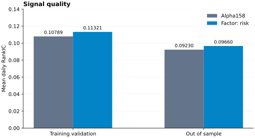
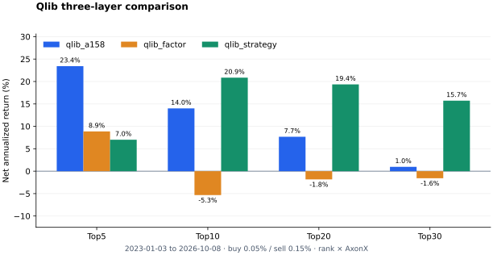

<p align="center">
  
</p>

<p align="center"><strong>从研究 Prompt 到量化代码，再到可追溯的实验。</strong></p>

<p align="center">
  <a href="https://github.com/FlowLLM-AI/AxonX/blob/main/pyproject.toml"></a>
  <a href="https://pypi.org/project/axonx/"></a>
  <a href="https://pypi.org/project/axonx/"></a>
  <a href="https://github.com/FlowLLM-AI/AxonX/graphs/commit-activity"></a>
  <a href="https://github.com/FlowLLM-AI/AxonX/graphs/traffic"></a>
  <a href="https://github.com/FlowLLM-AI/AxonX/forks"></a>
  <a href="https://github.com/FlowLLM-AI/AxonX/blob/main/LICENSE"></a>
  <a href="https://flowllm-ai.github.io/AxonX/zh/concepts/architecture"></a>
  <a href="https://flowllm-ai.github.io/AxonX/zh/docs"></a>
  <a href="https://github.com/FlowLLM-AI/AxonX/blob/main/README.md"></a>
  <a href="https://github.com/FlowLLM-AI/AxonX/blob/main/README_ZH.md"></a>
  <a href="https://deepwiki.com/FlowLLM-AI/AxonX"></a>
</p>

<p align="center">⭐ <a href="https://github.com/FlowLLM-AI/AxonX">给 AxonX 点个 GitHub Star</a>！</p>

<a id="axonx-是什么"></a>

## 🧠 AxonX 是什么？

**AxonX 是面向 Agent 的量化研究 Harness，为量化代码开发、实验执行和结果分析提供统一的工具与运行环境。**

将你的探索 Prompt 与 [AxonX Skill](skills/axonx/SKILL.md) 结合，通过外部或内置 Agent 开发新的研究插件，
或在已有插件上优化。Agent 编写量化代码，通过 AxonX 执行实验、读取结果，继续迭代因子、模型与组合策略。
**用户提出研究问题，Agent 实现量化逻辑，Harness 管理执行与证据。**

CLI、HTTP、MCP 和 **AxonX Studio** 通过共享的 Job 提交、查询 Task。
选定的执行服务运行插件代码，将参数、状态、依赖和产物保存在自己的工作区，让研究者与 Agent 检查同一份证据。

[快速开始](#快速开始) · [插件体系](#alpha158-与插件系统) ·
[实验结果](#benchmark-agent-开发市场横截面增强特征) · [文档入口](#axonx-文档) ·
<a href="https://flowllm-ai.github.io/AxonX/playground/?lang=zh" target="_self">Playground 在线试玩</a>

<a id="为什么使用-axonx"></a>

## ✨ 为什么使用 AxonX？

- **把研究问题落实为量化代码。** Skill 说明插件开发、Task 契约、执行与证据检查方法；用户的 Prompt 决定 Agent 探索什么。→ [AxonX Skill](skills/axonx/SKILL.md)
- **从可运行的基线逐步扩展。** 在插件中增加特征、调整训练逻辑或开发持仓策略，同时复用兼容的实现与产物。→ [Alpha158](plugins/qlib_a158/README_ZH.md) · [因子](plugins/qlib_factor/README_ZH.md) · [策略](plugins/qlib_strategy/README_ZH.md)
- **通过统一契约执行实验。** 查询带类型的输入输出，提交工作进程 Task，跟踪进度与日志，等待完成或取消运行。→ [任务管理](https://flowllm-ai.github.io/AxonX/zh/guides/task-management)
- **把代码改动与研究证据关联起来。** 检查配置、Task/Run ID、依赖、模型、预测和回测产物，用于排查失败与比较候选方案。→ [任务血缘](https://flowllm-ai.github.io/AxonX/zh/concepts/task-lineage) · [实验设计](docs/zh/research/experiments.md)
- **选择 Agent 与执行环境。** 使用外部 Agent 或 Studio 内置 Agent，可视化检查结果，并在选定的本机或远程服务中运行 Task。→ [Agent 接入](https://flowllm-ai.github.io/AxonX/zh/agent/external) · [远程机器](https://flowllm-ai.github.io/AxonX/zh/guides/remote-machines)

## 📰 最新更新

- **Alpha158 改进实验：** 比较适配后的基线、新增风险因子与排名保留策略。→ [结果与证据边界](#benchmark-agent-开发市场横截面增强特征)
- **Studio Playground：** 使用模拟数据与执行流程体验任务管理和研究图表。→ <a href="https://flowllm-ai.github.io/AxonX/playground/?lang=zh" target="_self">在线试玩</a>


<a id="快速开始"></a>

## 🚀 快速开始：使用 Agent 开发量化插件

要求 **Python 3.12+**；本地 Task 执行支持 **macOS 和 Linux**。

### 1. 安装与启动

```bash
pip install "axonx[studio]"
# 可选：在执行服务环境安装 Alpha158 插件
pip install axonx-qlib-a158
```

在启动目录创建 `.env`，填写本机服务 token：

```dotenv
AXONX_SERVICE_TOKEN=replace-with-your-local-service-token
```

```bash
axonx start
```

CLI 从当前目录或父目录加载 `.env`，已有环境变量优先。保持服务运行，在另一终端执行后续命令。
模型、行情与远程配置见 [example.env](example.env)；源码开发与 Studio 构建见[贡献指南](CONTRIBUTING_ZH.md)。
直接 pip 安装或 editable 源码改动后需重启服务。

<a id="快速演示"></a>

### 2. 验证服务并打开 Studio

内置 demo 无需行情或模型凭据：

```bash
axonx submit --task demo --x 2 --y 3
axonx wait_task --task-id '<returned_task_id>' --run-id '<returned_run_id>' --client-timeout 120
axonx get_task_context --task-id '<returned_task_id>'
```

使用 `submit` 返回的 `answer.task_id` 与 `answer.run_id`，等待 `succeeded` 后再读取输出或提交下游 Task。
`source_tasks` 记录血缘，不会自动执行整张 DAG。

访问 `http://127.0.0.1:1024/`，在 **设置 → 本机服务 token** 中填写 `AXONX_SERVICE_TOKEN`。
任务、研究图表与 Agent 工作区的操作见 [Studio 指南](docs/zh/getting-started/studio.md)。

<table>
  <tr><th width="50%">首页</th><th width="50%">任务管理</th></tr>
  <tr>
    <td><a href="docs/figures/studio/home.png"></a></td>
    <td><a href="docs/figures/studio/task-list.png"></a></td>
  </tr>
</table>

<a id="agent-接入与开发指南"></a>

### 3. 准备源码并接入 Agent

提供 AxonX 源码仓库，让 Agent 阅读 [AxonX Skill](skills/axonx/SKILL.md)，或按客户端支持的方式安装 Skill。
仅安装 Python 包不会提供示例插件源码。根据使用习惯，选择下面的外部 Agent 或 Studio 内置 Agent。

#### 外部 Agent：CLI 或 MCP

使用 Codex、Claude Code 等客户端，为源码仓库提供文件和命令工具；模型凭据由客户端提供。
可直接使用 `axonx` CLI，也可以按以下配置通过 MCP 连接服务：

| 参数       | 值                                         |
| ---------- | ------------------------------------------ |
| 地址       | `http://127.0.0.1:1024/mcp`                |
| 传输       | Streamable HTTP                            |
| 鉴权请求头 | `Authorization: Bearer <AxonX 服务 token>` |

使用所连接服务的 token；自定义端口或连接远程服务时调整地址。
详见 [MCP 集成](https://flowllm-ai.github.io/AxonX/zh/agent/mcp-integration)。

#### 内置 Agent：Studio

默认后端使用 Claude Agent SDK。在 `.env` 中填写服务商提供的凭据、Claude 兼容地址与模型名称，然后重启服务：

```dotenv
CLAUDE_CODE_API_KEY=your-model-api-key
CLAUDE_CODE_BASE_URL=https://api.anthropic.com
CLAUDE_CODE_MODEL_NAME=your-model-name
```

加载随包提供的中文开发指南：

```bash
axonx start --components.agent.default.load_dev_guide true --language zh
```

进入 **Studio → Agent**，为源码仓库配置 `cwd` 和 SDK 文件／命令工具。
指南加载默认为 `false`，与工具配置独立。默认 Job 桥接提供任务和产物查询。
安装、提交可通过 CLI，或将所需 Job 加入 `job_tools`。
详见 [Agent 配置](https://flowllm-ai.github.io/AxonX/zh/agent/configuration)。

### 4. 向 Agent 提出研究目标

明确基线、假设、数据、评估窗口、指标和执行目标。例如：

> 阅读 AxonX Skill 与 qlib_a158 实现，开发独立研究插件，探索残差波动和下行风险能否改进 Alpha158 排序。
> 只使用信号时点可得的信息；因子消融时固定数据快照、标签、训练参数、评估窗口和交易成本。
> 实现并测试量化代码，注册、安装插件，通过 AxonX 执行 ETL、训练、预测与回测。
> 保留 Task/Run ID，报告 RankIC、净收益、回撤、换手与局限。在开发窗口选择候选方案，并预留独立确认窗口。

也可以让 Agent 优化已有插件的特征计算、训练流程或持仓规则。
请在 Prompt 中明确目标是执行效率、信号质量还是交易表现，以及如何评估。

每次实验保留代码／版本、数据、窗口、参数、成本和 Task/Run ID，让 Agent 根据同一份证据比较候选方案并迭代。
插件开发、服务安装和 Task 契约详见[开发指南](docs/zh/dev_guide.md)。

开始 Alpha158 研究前，配置 `AXONX_TUSHARE_TOKEN` 并准备足够的历史数据，再按[研究流程](docs/zh/research/workflow.md)
执行各阶段；完整复现命令见[实验指南](docs/zh/research/experiments.md#comparison)。

<a id="alpha158-与插件系统"></a>

## 🧩 从 Qlib Alpha158 到可扩展的研究插件

研究主链为 **ETL → Train → Predict → Backtest**，因子分析从 ETL 独立分支。三个插件逐层复用实现与产物，其他研究方法也可通过同一套插件契约接入：

| 插件                                                | 研究能力                                       | 扩展方式                                                         |
| --------------------------------------------------- | ---------------------------------------------- | ---------------------------------------------------------------- |
| [qlib_a158](plugins/qlib_a158/README_ZH.md)         | 158 个价量特征、LightGBM、因子分析与 TopN 回测 | 将 Qlib Alpha158 适配为 AxonX Task。                             |
| [qlib_factor](plugins/qlib_factor/README_ZH.md)     | 13 个可选的市场矩、中性动量与风险特征          | 扩展 ETL 与训练，复用预测与回测；训练默认仍使用 158 个基线特征。 |
| [qlib_strategy](plugins/qlib_strategy/README_ZH.md) | 最短持有期、排名保留与换仓限制                 | 复用预测和股票回测账本，无需重新训练。                           |

基线使用 Tushare 数据，并调整了股票池、标签、训练与交易协议，详见[与原始 Qlib 的差异](plugins/qlib_a158/README_ZH.md#与原始-qlib-的差异)。
插件注册、Task 契约和产物要求见[开发指南](docs/zh/dev_guide.md)。

<a id="benchmark-agent-开发市场横截面增强特征"></a>

## 📊 Alpha158 改进案例：因子与持仓策略

以下实验比较 Alpha158 基线、增加两个风险因子的模型，以及复用该模型预测的持仓策略：

| 配置          | 量化改动                                                        | Top20 净年化 | 净夏普 | 最大回撤 | 日均双边换手 |
| ------------- | --------------------------------------------------------------- | -----------: | -----: | -------: | -----------: |
| Alpha158 基线 | 158 个特征，固定持有 1 日                                       |        7.67% | 0.3619 |  -38.65% |      198.83% |
| 风险因子模型  | 增加 20 日残差波动与下行风险，共 160 个特征                     |        9.03% | 0.4052 |  -40.69% |      199.35% |
| 排名保留策略  | 复用因子预测；最短持有 3 日，排名保留，每日每侧换仓数量上限 20% |       32.37% | 1.1575 |  -24.91% |       40.01% |

训练区间为 `[20150101,20230101)`，评估区间为 `20230103–20261008`，共 909 个市场日。
买入费用 0.05%、卖出费用 0.15%。换仓限制针对股票数量，并非成交金额；首次建仓不受此限制。
策略插件默认最短持有期为 10 日，本次实验显式设为 3 日。





**证据边界：** 三组配置于 2026-10-10 重跑，尚无独立确认窗口。
基础／因子模型的 `feature_fraction` 为 0.9／1.0，差异不能单独归因于新增因子。
三组回测均报告 `incomplete_market_data`；成交使用同收盘报价代理，2026 年也并非完整年度。
这些结果描述的是适配后的 AxonX 实验，不能据此认定优于原始 Qlib 基准。

[完整设定、指标、复现命令与任务来源](docs/zh/research/experiments.md#comparison)。

<a id="axonx-cli-命令与远程执行"></a>

## 🛠️ CLI 与远程执行

查询定义、跟踪运行和检查日志的命令见 [CLI 参考](docs/zh/reference/cli.md)，插件安装与更新见[插件管理](docs/zh/plugins/management.md)。

### CLI 直连远程服务

配置目标服务的 `AXONX_TARGET_TOKEN`，在安装、提交、等待与查询中使用相同的 `--target`：

```bash
axonx plugin install ./plugins/qlib_factor --target 'http://<host>:1024'
axonx get_task_definition --task qlib_factor_train --target 'http://<host>:1024'
```

显式 `--target` 默认使用 `AXONX_TARGET_TOKEN`；默认本机调用使用 `AXONX_SERVICE_TOKEN`。
未指定目标时，插件命令操作当前 Python 环境。

### 在 Studio 中使用远程机器

在本机服务环境配置 `AXONX_TARGET` 与 `AXONX_TARGET_TOKEN`，运行 `axonx start --config remote`，然后在 Studio 选择机器。
目标服务拥有自己的插件、数据和工作区；多目标配置见[远程机器指南](docs/zh/guides/remote-machines.md)。

<a id="axonx-文档"></a>

## 📚 文档入口

| 目标            | 从这里开始                                                                                                                                             |
| --------------- | ------------------------------------------------------------------------------------------------------------------------------------------------------ |
| 安装并运行研究  | [快速开始](https://flowllm-ai.github.io/AxonX/zh/getting-started/quickstart) · [研究流程](docs/zh/research/workflow.md)                                |
| 使用 Agent 开发 | [AxonX Skill](skills/axonx/SKILL.md) · [Agent 接入](docs/zh/agent/external.md) · [内置配置](docs/zh/agent/configuration.md)                            |
| 实现研究插件    | [Task 开发](docs/zh/dev_guide.md) · [插件管理](docs/zh/plugins/management.md) · [产物契约](docs/zh/reference/research-artifacts.md)                    |
| 理解 Harness    | [架构](docs/zh/concepts/architecture.md) · [Job 与 Task](docs/zh/concepts/jobs-and-tasks.md) · [框架扩展](docs/zh/development/framework-extensions.md) |
| 评估研究结果    | [实验设计](docs/zh/research/experiments.md) · [回测解读](docs/zh/research/backtest.md) · [策略对比](docs/zh/research/strategy-comparison.md)           |
| 管理运行服务    | [CLI 参考](docs/zh/reference/cli.md) · [配置](docs/zh/reference/configuration.md) · [远程执行](docs/zh/guides/remote-machines.md)                      |

[中文文档](https://flowllm-ai.github.io/AxonX/zh/docs) · [English documentation](https://flowllm-ai.github.io/AxonX/en/docs)

<a id="参与贡献"></a>

## 💬 参与贡献

欢迎贡献 Harness 能力、研究插件、实验依据与文档。
环境和检查要求见[贡献指南](CONTRIBUTING_ZH.md)，问题与提案见 [GitHub Issues](https://github.com/FlowLLM-AI/AxonX/issues)。
算法放在插件中，保留公开契约，同步更新中英文文档；贡献研究结果时附上可复现的设定与产物。

<a id="许可证"></a>

## ⚖️ 许可证

[Apache License 2.0](LICENSE)。
