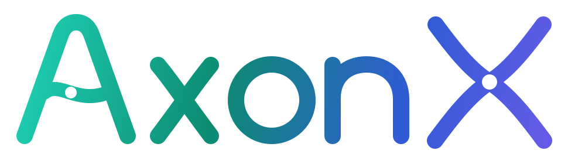
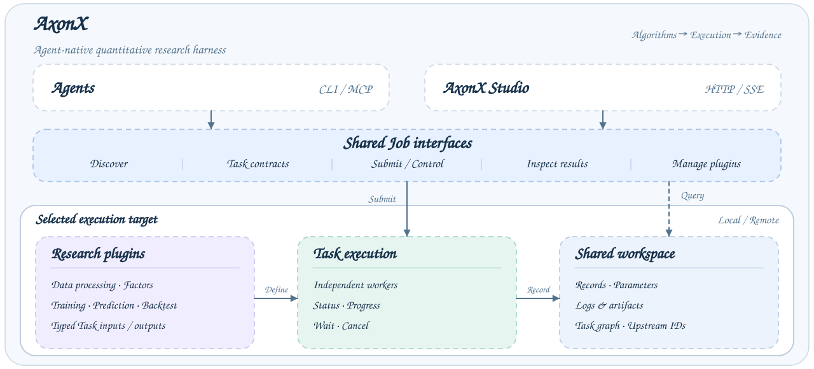

<p align="center">
  
</p>

<p align="center"><strong>面向金融量化研究的 Agent Harness。</strong></p>

<p align="center">
  <a href="pyproject.toml"></a>
  <a href="https://pypi.org/project/axonx/"></a>
  <a href="https://pypi.org/project/axonx/"></a>
  <a href="https://github.com/FlowLLM-AI/AxonX/graphs/commit-activity"></a>
  <a href="LICENSE"></a>
  <br />
  <a href="https://flowllm-ai.github.io/AxonX/zh/docs"></a>
  <a href="README.md"></a>
  <a href="README_ZH.md"></a>
  <a href="https://deepwiki.com/FlowLLM-AI/AxonX"></a>
</p>

## AxonX 是什么？

AxonX 将研究代码、任务执行、日志和结果连接到同一个工作区。它把数据处理、因子分析、训练、预测和回测表示为具有明确输入输出契约的 Task，让 CLI、AxonX Studio 和 Agent 通过 Job 接口访问同一套能力。

研究者可以检查结果如何产生、复用上游数据、比较实验，并让 Agent 查询任务和产物。插件作者提供研究算法，AxonX 提供执行与检查基础设施。目前 AxonX 处于 alpha 阶段。

## 为什么使用 AxonX？

- **将研究代码复用为 Task。** 类型化输入输出明确数据、模型和产物的要求。→ [Task 契约](https://flowllm-ai.github.io/AxonX/zh/reference/task-contracts)
- **执行过程可检查。** 将 Task 提交到独立 worker 进程，跟踪状态、进度、日志和结果。→ [任务管理](https://flowllm-ai.github.io/AxonX/zh/guides/task-management)
- **从结果追溯输入。** 工作区同时保存参数、产物和上游 Task ID，便于复用数据集、检查实验差异。→ [任务血缘](https://flowllm-ai.github.io/AxonX/zh/concepts/task-lineage)
- **CLI、AxonX Studio 和 Agent 共用工作流程。** 使用脚本、浏览器表单与图表，或通过已配置工具读取任务证据的助手。→ [AxonX Studio](https://flowllm-ai.github.io/AxonX/zh/getting-started/studio) · [Agent](https://flowllm-ai.github.io/AxonX/zh/agent/usage)
- **插件扩展与远程执行。** 将研究能力打包为插件，并明确选择远程执行目标。→ [插件管理](https://flowllm-ai.github.io/AxonX/zh/plugins/management) · [远程机器](https://flowllm-ai.github.io/AxonX/zh/guides/remote-machines)

## AxonX Studio

AxonX Studio 提供任务提交、运行详情、机器资源、工作区浏览和研究结果视图。


安装和连接方式见 [AxonX Studio 入门](https://flowllm-ai.github.io/AxonX/zh/getting-started/studio)。

## 快速开始

要求 **Python 3.12+**，本地 Task 执行支持 **macOS 和 Linux**。请使用已激活的虚拟环境。

### 从 PyPI 安装

```bash
pip install "axonx[studio]"
```

包含 CLI、API、MCP 和预构建的 AxonX Studio。只需核心功能时，安装 `axonx`。

### 从源码安装

构建 AxonX Studio 需要 Node.js 22.13+（22.x）、24.x 或 26+：

```bash
git clone https://github.com/FlowLLM-AI/AxonX.git
cd AxonX
pip install -e .
cd axonx_studio
npm ci && npm run build
cd ..
pip install ./axonx_studio
```

此方式从源码安装核心，并在本地构建和安装 AxonX Studio。开发环境见[贡献指南](https://flowllm-ai.github.io/AxonX/zh/development/contributing)，修改前端见 [AxonX Studio 开发](https://flowllm-ai.github.io/AxonX/zh/development/studio)。

### 配置 .env

在启动 AxonX 的目录创建 `.env`，CLI 会自动加载；已有环境变量优先于文件中的配置。

```dotenv
# 服务鉴权：设置自己的 token
AXONX_SERVICE_TOKEN=replace-with-your-local-service-token

# 可选：内置 Agent（Claude 兼容后端）
# CLAUDE_CODE_API_KEY=your-api-key
# CLAUDE_CODE_BASE_URL=https://api.anthropic.com
# CLAUDE_CODE_MODEL_NAME=your-model-name

# 可选：Tushare 数据下载
# AXONX_TUSHARE_TOKEN=your-tushare-token
# AXONX_TUSHARE_BASE_URL=http://api.waditu.com/dataapi
```

任务管理和 AxonX Studio 只需服务 token。使用研究助手时填写 Agent 配置，下载行情时填写 Tushare token；仅使用自有兼容接口时覆盖 Tushare 地址。远程服务和钉钉配置见 [example.env](example.env)。不要将 `.env` 提交到版本库。

### 打开 AxonX Studio

```bash
axonx start --service.host 127.0.0.1
```

打开 <http://127.0.0.1:1024/>，在 **Settings → Service token** 中填入 `.env` 的 `AXONX_SERVICE_TOKEN`。异步提交、等待和结果检查见[完整快速开始](https://flowllm-ai.github.io/AxonX/zh/getting-started/quickstart)。

## 使用 Agent 辅助研究

内置助手使用 Claude Agent SDK 和已配置的 Job 工具，检查任务状态、日志、上游关系和工作区产物。配置 [Agent 后端](https://flowllm-ai.github.io/AxonX/zh/agent/configuration)后，打开 AxonX Studio 的 **Agent** 页面。普通研究 Task 无需模型凭据也能运行。

提供具体 Task ID 和问题，例如：

- “检查 Task `<task_id>` 的状态、末尾日志和上游任务，说明失败发生在哪里，以及下一步应检查什么。”
- “比较回测 Task `<A>` 与 `<B>`：先确认共同日期窗口和成本假设，再解释结果差异。”

外部 Agent 也可以通过服务的 Bearer token 连接 Streamable HTTP MCP 端点 `http://127.0.0.1:1024/mcp`。可用工具取决于服务配置。工具与权限说明见 [Agent 使用](https://flowllm-ai.github.io/AxonX/zh/agent/usage)和 [MCP 集成](https://flowllm-ai.github.io/AxonX/zh/agent/mcp-integration)。

## 如何工作

**CLI / AxonX Studio / 外部 Agent → Job 接口 → Task 执行 → 工作区记录与产物。**

Job 校验调用参数并协调框架能力。提交研究任务时，TaskManager 启动 worker 进程并返回运行标识，Task 写入状态、日志和输出，查询 Job 与 AxonX Studio 再读取这些记录。`axonx exec` 在当前进程直接执行 Task。

研究插件提供具体算法。上游 Task ID 记录任务关系，各阶段的执行由用户或脚本组织。组件边界见[架构说明](https://flowllm-ai.github.io/AxonX/zh/concepts/architecture)。

## 量化研究与插件



典型研究链路为 **原始数据 → ETL → 训练 → 预测 → 回测**，因子分析从 ETL 分支执行。任务通过 `source_tasks` 记录上游 ID，可以在不同实验间复用数据集和预测结果。每个阶段由用户或调用程序组织提交。

核心框架提供 Task 契约与运行基础设施，研究插件实现具体因子、模型和回测逻辑：

| 插件源码                                                                             | 用途                               |
| ------------------------------------------------------------------------------------ | ---------------------------------- |
| [Alpha158](https://flowllm-ai.github.io/AxonX/zh/plugins/alpha158)                   | Alpha158 研究任务实现              |
| [Alpha158 Enhanced](https://flowllm-ai.github.io/AxonX/zh/plugins/alpha158-enhanced) | 扩展的 Alpha158 研究任务与实验说明 |

在执行服务的 Python 环境安装研究插件，再重启服务：

```bash
pip install axonx-alpha158
# Or: pip install axonx-alpha158-enhanced
```

插件安装和数据准备见[量化研究流程](https://flowllm-ai.github.io/AxonX/zh/research/workflow)。行情数据与 Agent 功能需要各自的服务商配置。收益定义、成本和交易假设见[回测解读](https://flowllm-ai.github.io/AxonX/zh/research/backtest)。

AxonX Studio 读取生成的产物，展示训练指标、预测结果和回测汇总。例如，回测视图提供整体信号指标与分期汇总：


截图展示已有实验的结果页面。各阶段输出的阅读方式见[研究结果解读](https://flowllm-ai.github.io/AxonX/zh/research/results)。

## 文档导航

| 我想要……                    | 指南                                                                                                                                                                                                  |
| --------------------------- | ----------------------------------------------------------------------------------------------------------------------------------------------------------------------------------------------------- |
| 安装并运行第一个 Task       | [快速开始](https://flowllm-ai.github.io/AxonX/zh/getting-started/quickstart)                                                                                                                          |
| 在浏览器提交和检查任务      | [AxonX Studio 入门](https://flowllm-ai.github.io/AxonX/zh/getting-started/studio)                                                                                                                     |
| 运行研究链路并理解结果      | [量化研究流程](https://flowllm-ai.github.io/AxonX/zh/research/workflow)                                                                                                                               |
| 配置研究助手或外部 MCP 工具 | [Agent 配置](https://flowllm-ai.github.io/AxonX/zh/agent/configuration) · [MCP 集成](https://flowllm-ai.github.io/AxonX/zh/agent/mcp-integration)                                                     |
| 在其他机器执行任务          | [远程机器](https://flowllm-ai.github.io/AxonX/zh/guides/remote-machines)                                                                                                                              |
| 配置和调用 AxonX            | [配置](https://flowllm-ai.github.io/AxonX/zh/reference/configuration) · [CLI](https://flowllm-ai.github.io/AxonX/zh/reference/cli) · [Python](https://flowllm-ai.github.io/AxonX/zh/reference/python) |
| 开发研究任务或扩展框架      | [开发指南](https://flowllm-ai.github.io/AxonX/zh/dev_guide) · [框架扩展](https://flowllm-ai.github.io/AxonX/zh/development/framework-extensions)                                                      |

浏览[完整双语文档](https://flowllm-ai.github.io/AxonX/zh/docs)。

## 参与贡献

欢迎问题反馈、功能建议、文档改进、研究插件和代码贡献。请先搜索[已有 Issues](https://github.com/FlowLLM-AI/AxonX/issues)，开发环境与检查要求见[贡献指南](https://flowllm-ai.github.io/AxonX/zh/development/contributing)。

## 许可证

AxonX 基于 [Apache License 2.0](LICENSE) 开源。
