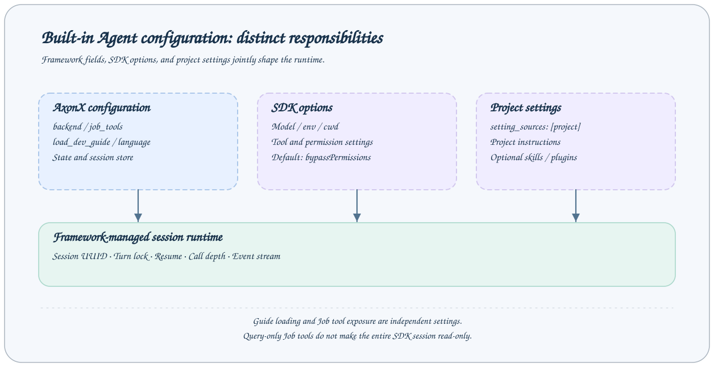

# Claude Agent Configuration

The current built-in Agent backend is `claude`, implemented with the Claude Agent SDK. AxonX manages session identity, the Job tool bridge, and state directories; the SDK manages model calls and its own execution options.



## Basic configuration

Inherit from `default` in a custom service configuration and override the Agent component:

```yaml
extends: default
components:
  agent:
    default:
      backend: claude
      setting_sources: [project]
      state_dir: agent/claude
      session_store:
        backend: local
        path: agent/session-store
      job_tools:
        - list_entries
        - preview_file
        - list_task_ids
        - list_task_statuses
        - status
        - read_task_log
        - get_task_graph
        - get_task_context
```

This configuration shows the field structure; model and permission settings still inherit their defaults. At service startup, Job names are checked against configured Jobs. The list cannot contain empty strings or duplicates, and a string cannot replace the list.

## Model environment

The default configuration maps variables in the service environment to the SDK subprocess:

| Service environment variable | SDK environment usage |
| --- | --- |
| `CLAUDE_CODE_API_KEY` | `ANTHROPIC_AUTH_TOKEN` |
| `CLAUDE_CODE_BASE_URL` | `ANTHROPIC_BASE_URL` |
| `CLAUDE_CODE_MODEL_NAME` | `ANTHROPIC_MODEL` and default model aliases |

```bash
export CLAUDE_CODE_API_KEY='<model credentials>'
export CLAUDE_CODE_BASE_URL='<compatible backend URL>'
export CLAUDE_CODE_MODEL_NAME='<available model name>'
```

The exact URL and model name depend on the available backend. AxonX currently has no built-in adapter catalog for choosing arbitrary model backends; an environment mapping should not be interpreted as compatibility with every service.

`components.agent.default.env` overrides the SDK subprocess environment. The framework merges the Application environment with this mapping. Do not place model secrets in session prompts or file-preview examples.

## Framework-managed fields

| Field | Default behavior | Description |
| --- | --- | --- |
| `backend` | `claude` in the default configuration | Current built-in implementation |
| `job_tools` | Empty list in the component constructor; eight query Jobs in the default configuration | In-process AxonX MCP tool list |
| `state_dir` | `agent/claude` | SDK configuration directory, with another level for the component name |
| `session_store.backend` | `local` | Currently supports only local |
| `session_store.path` | `agent/session-store` | Session storage root |
| `cwd` | Workspace root | SDK option whose execution directory is resolved by the framework |

State paths are resolved relative to the workspace. Absolute state paths must also be inside the workspace. When the default component name is `default`, the SDK configuration directory is `<workspace>/agent/claude/default`.

An empty `cwd` uses the workspace. A relative `cwd` must stay inside the workspace, while an absolute `cwd` may point elsewhere. This changes project setting discovery and session project identity, so establish the execution scope first.

If the subprocess environment explicitly sets `CLAUDE_CONFIG_DIR`, the framework does not generate the default configuration directory. Session `session_store.path` and the SDK configuration directory serve different purposes; do not treat them as the same cache.

## SDK options and permissions

Remaining component keyword arguments must be fields of `ClaudeAgentOptions` in the installed SDK. Unknown options fail during construction. Fields may change with SDK versions; use the actual dependency version and runtime validation as the reference.

The default configuration includes `permission_mode: bypassPermissions`, `setting_sources: [project]`, `session_store_flush: batched`, and the Claude Code preset system prompt. The default appended prompt asks the Agent to respond as AxonX and first query actual workspace evidence.

`setting_sources: [project]` only declares that project-level Claude settings are loaded. It does not mean the SDK's own tools are disabled. Optional skills and local plugins are SDK options, shown only as commented examples in the default configuration:

```yaml
# SDK configuration example; values must match the installed SDK
components:
  agent:
    default:
      skills: all
      plugins:
        - type: local
          path: /path/to/skills-plugin
```

Replace the example path with the actual plugin location on the service machine. When changing SDK permission modes or tool restrictions, use values explicitly supported by that version and verify the effect of project settings.

## Exposing Job tools

AxonX maps listed Jobs to `mcp__axonx__<job-name>` and appends them to the SDK's `allowed_tools`. Unlisted Jobs are not exposed through this bridge. Existing `mcp_servers` cannot use the reserved name `axonx`.

The default eight Jobs query tasks and files, but the bridge list in `allowed_tools` is not the SDK's overall security policy. The SDK's own file and command tools, along with project/plugins, may provide other capabilities. In particular, the default `bypassPermissions` does not make all actions read-only.

Adding `submit` or `cancel` changes the workspace operations the Agent can call. The configured list grants capabilities; review its actual effect together with service account permissions, cwd, SDK tools, and project settings.

## Session fields are framework-managed

Do not manually configure `resume`, `session_id`, `continue_conversation`, or `session_store` in component SDK options to replace AxonX session management. The backend generates a UUID for a new session, resumes through the request's `session_id`, and always uses the framework session store.

Each session_id has its own turn lock; execution within a session is serial. Deleting a running session is rejected. Stopping a turn calls the SDK interrupt and does not cancel a research Task.

## Call depth

The default `agent_chat` Step has `max_depth` set to 3 to limit nested Agent call chains through the bridge. When the current depth reaches the limit, it returns failure without calling the model.

```yaml
jobs:
  agent_chat:
    steps:
      - backend: agent_stream
        max_depth: 3
```

This does not limit a user session to three questions or three tool calls. The framework injects the internal depth parameter; do not maintain it manually as a normal user argument.

## Applying and verifying changes

Restart the service after updating configuration. First confirm that the Agent component starts and the Job catalog exists, then run a short turn that only queries existing tasks. Inspect actual tool blocks and the final result to verify the model connection, cwd, and session storage.

This page is based on the repository's default configuration and adapter layer; no actual model request was made. Verify external SDK capabilities and model availability separately in the deployment environment.

## Related documentation and implementation

- [Agent usage](usage.md), [Authentication](../guides/authentication.md)
- [Default configuration](../../../axonx/config/default.yaml)
- [Claude backend](../../../axonx/components/agent/claude/backend.py)
- [Job tool bridge](../../../axonx/components/agent/claude/tools.py)
