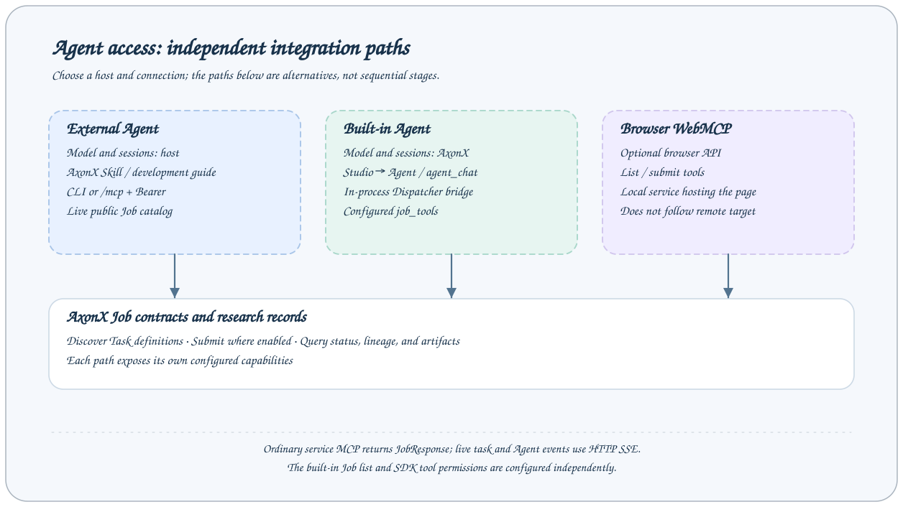

# Agent Integration Overview

AxonX gives agents discoverable Task contracts, execution interfaces, and research records. Use an existing agent host to operate AxonX, or use built-in sessions in Studio. Both paths share research services and workspaces; different parties manage model configuration and sessions.

## Choose a path

|                     | External agent                                                         | Built-in agent                                                          |
| ------------------- | ---------------------------------------------------------------------- | ----------------------------------------------------------------------- |
| Entry point         | Hosts such as Codex or Claude Code                                     | Studio → Agent, or the `agent_chat` Job                                 |
| Model configuration | Managed by the external host                                           | Server-side Claude Agent SDK configuration                              |
| AxonX connection    | Direct CLI access or service `/mcp`                                    | Built-in component invokes configured Jobs through Dispatcher           |
| Instructions        | [AxonX Skill](../../../skills/axonx/SKILL.md) and development guide    | Optionally load the development guide bundled with the package          |
| Tool scope          | Available CLI commands or public service MCP catalog                   | `job_tools`, SDK tools, and permission settings                         |
| Session records     | Managed by the external host                                           | Managed by AxonX session storage                                        |
| Reading path        | [External agents](external.md) → [MCP integration](mcp-integration.md) | [Built-in configuration](configuration.md) → [Built-in usage](usage.md) |

External integration does not require `CLAUDE_CODE_*` settings or built-in guide loading. The built-in agent's eight default Job tools query tasks and files; the public external MCP catalog may also include submission, cancellation, and installation. Actual capabilities depend on the selected path's configuration and schemas.

## The shared research loop

1. Establish the service address, credentials, and workspace; query machine resources and installed plugins.
2. Discover Task definitions and read their actual input and output schemas.
3. Reuse successful upstream tasks and execute only the stages the experiment needs.
4. Keep the returned `task_id` and `run_id`, and wait for that execution's terminal state.
5. Inspect logs, metadata, artifacts, and lineage before forming a research conclusion.

Keep the same `--target` across stages when using direct CLI access. Studio forwards requests through its same-origin backend to the selected machine. Tasks, data, and plugins live in the execution service's environment; agent integration does not migrate them automatically.

## Continue by goal

- Operate a service or develop research plugins: [external agents](external.md), [development and operations guide](../dev_guide.md).
- Analyze existing records in a browser: [built-in agent usage](usage.md).
- Design ablations and independent confirmation: [experiment design and confirmation](../research/experiments.md).
- Look up connections, responses, and events: [MCP integration](mcp-integration.md), [API overview](../api/overview.md).
