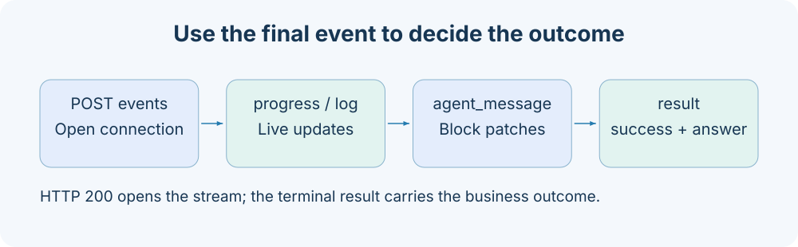

# Agent API

Session management and individual conversation turns are invoked through Jobs. Both creation and continuation use agent_chat; live presentation uses HTTP SSE.



## Calling conventions

All endpoints below use `POST /jobs/{name}` with a `{"arguments":{...}}` request body. For remote forwarding, add `target` at the envelope's top level, outside arguments. Every response uses [JobResponse](overview.md#responses-and-errors). Table defaults come from the current built-in configuration and Steps. Deployments may change Job Schemas; the running service's `/jobs` is authoritative.

All JSON examples illustrate structure; replace task IDs, session IDs, file paths, and hashes with values actually returned by your service. See [Task contracts](../reference/task-contracts.md) for the complete shared TaskStatus fields.

## Endpoint list

| Job                    | Purpose                                                               |
| ---------------------- | --------------------------------------------------------------------- |
| `agent_chat`           | Run one Agent conversation turn; omit session_id to create a session. |
| `list_agent_sessions`  | List sessions, newest first.                                          |
| `get_agent_session`    | Read the session summary, message history, and presentation blocks.   |
| `rename_agent_session` | Set a custom title.                                                   |
| `tag_agent_session`    | Set or clear a tag.                                                   |
| `delete_agent_session` | Permanently delete a session and its child Agent records.             |
| `fork_agent_session`   | Create a new session from history.                                    |
| `cancel_agent_turn`    | Interrupt the session's current turn.                                 |

## agent_chat

Run one Agent conversation turn; omit session_id to create a session.

| Parameter    | Type   | Required | Default       | Constraints and meaning                 |
| ------------ | ------ | -------- | ------------- | --------------------------------------- |
| `message`    | string | Yes      | `— (omitted)` | User message for this turn; minLength=1 |
| `session_id` | string | No       | `— (omitted)` | Backend session UUID; UUID format       |

Only the business fields listed in the table are accepted.

**Request**

```json
{
  "arguments": {
    "message": "List the tasks in this workspace and explain their statuses."
  }
}
```

**Response**

answer is the backend's final text; metadata comes from the SDK ResultMessage and includes session_id and usage/result information for this turn. SSE also emits agent_message.

```json
{
  "answer": "There are currently no tasks in this workspace.",
  "success": true,
  "metadata": {}
}
```

**Behavior and failure cases**

To continue, pass back metadata.session_id. A backend lock serializes turns within a session; concurrent calls wait for the previous turn to finish. The system injects agent_depth, defaulting to 0, with max_depth=3 by default; it is not a public request parameter. The default backend is Claude and requires valid model configuration.

## list_agent_sessions

List sessions, newest first.

| Parameter | Type    | Required | Default       | Constraints and meaning                              |
| --------- | ------- | -------- | ------------- | ---------------------------------------------------- |
| `limit`   | integer | No       | `— (omitted)` | Number of sessions to return; minimum=1, maximum=200 |
| `offset`  | integer | No       | `0`           | Number of sessions to skip; minimum=0                |

Only the business fields listed in the table are accepted.

**Request**

```json
{
  "arguments": {
    "limit": 20,
    "offset": 0
  }
}
```

**Response**

answer is an array of SDK session summaries; each item adds a backend field.

```json
{
  "answer": [],
  "success": true,
  "metadata": {}
}
```

**Behavior and failure cases**

Omitting limit passes None to the SDK, rather than assuming 20. The current SDK supplies the summary fields, commonly session_id, summary, custom title, and timestamps.

## get_agent_session

Read the session summary, message history, and presentation blocks.

| Parameter    | Type    | Required | Default       | Constraints and meaning                                        |
| ------------ | ------- | -------- | ------------- | -------------------------------------------------------------- |
| `session_id` | string  | Yes      | `— (omitted)` | Backend session UUID; UUID format                              |
| `limit`      | integer | No       | `— (omitted)` | Number of historical messages to read; minimum=1, maximum=1000 |
| `offset`     | integer | No       | `0`           | Number of historical messages to skip; minimum=0               |

Only the business fields listed in the table are accepted.

**Request**

```json
{
  "arguments": {
    "session_id": "17eeef86-6bc7-4565-a4a2-41249b5576ab",
    "limit": 100
  }
}
```

**Response**

answer contains info, messages, and blocks. info adds backend; messages retain SDK data; blocks are a projection that the frontend can display.

```json
{
  "answer": {
    "info": {
      "session_id": "17eeef86-6bc7-4565-a4a2-41249b5576ab",
      "backend": "claude"
    },
    "messages": [],
    "blocks": []
  },
  "success": true,
  "metadata": {}
}
```

**Behavior and failure cases**

offset counts messages; omitting limit passes None. Historical blocks are not the same as SSE presentation patches. A missing session produces a KeyError business failure.

## rename_agent_session

Set a custom title.

| Parameter    | Type   | Required | Default       | Constraints and meaning           |
| ------------ | ------ | -------- | ------------- | --------------------------------- |
| `session_id` | string | Yes      | `— (omitted)` | Backend session UUID; UUID format |
| `title`      | string | Yes      | `— (omitted)` | Custom session title; minLength=1 |

Only the business fields listed in the table are accepted.

**Request**

```json
{
  "arguments": {
    "session_id": "17eeef86-6bc7-4565-a4a2-41249b5576ab",
    "title": "Experiment review"
  }
}
```

**Response**

answer is {session_id: UUID}; fork returns a new session UUID, while the other operations return the requested UUID.

```json
{
  "answer": {
    "session_id": "17eeef86-6bc7-4565-a4a2-41249b5576ab"
  },
  "success": true,
  "metadata": {}
}
```

**Behavior and failure cases**

title must contain at least one character.

## tag_agent_session

Set or clear a tag.

| Parameter    | Type        | Required | Default       | Constraints and meaning           |
| ------------ | ----------- | -------- | ------------- | --------------------------------- |
| `session_id` | string      | Yes      | `— (omitted)` | Backend session UUID; UUID format |
| `tag`        | string/null | Yes      | `— (omitted)` | Session tag; null clears it       |

Only the business fields listed in the table are accepted.

**Request**

```json
{
  "arguments": {
    "session_id": "17eeef86-6bc7-4565-a4a2-41249b5576ab",
    "tag": null
  }
}
```

**Response**

answer is {session_id: UUID}; fork returns a new session UUID, while the other operations return the requested UUID.

```json
{
  "answer": {
    "session_id": "17eeef86-6bc7-4565-a4a2-41249b5576ab"
  },
  "success": true,
  "metadata": {}
}
```

**Behavior and failure cases**

tag is required; null means clear it, rather than omit it.

## delete_agent_session

Permanently delete a session and its child Agent records.

| Parameter    | Type   | Required | Default       | Constraints and meaning           |
| ------------ | ------ | -------- | ------------- | --------------------------------- |
| `session_id` | string | Yes      | `— (omitted)` | Backend session UUID; UUID format |

Only the business fields listed in the table are accepted.

**Request**

```json
{
  "arguments": {
    "session_id": "17eeef86-6bc7-4565-a4a2-41249b5576ab"
  }
}
```

**Response**

answer is {session_id: UUID}; fork returns a new session UUID, while the other operations return the requested UUID.

```json
{
  "answer": {
    "session_id": "17eeef86-6bc7-4565-a4a2-41249b5576ab"
  },
  "success": true,
  "metadata": {}
}
```

**Behavior and failure cases**

Running sessions cannot be deleted; stop the turn before deleting the session.

## fork_agent_session

Create a new session from history.

| Parameter          | Type   | Required | Default       | Constraints and meaning                                     |
| ------------------ | ------ | -------- | ------------- | ----------------------------------------------------------- |
| `session_id`       | string | Yes      | `— (omitted)` | Backend session UUID; UUID format                           |
| `up_to_message_id` | string | No       | `— (omitted)` | Optional message UUID at which to end the fork; UUID format |
| `title`            | string | No       | `— (omitted)` | Custom session title; minLength=1                           |

Only the business fields listed in the table are accepted.

**Request**

```json
{
  "arguments": {
    "session_id": "17eeef86-6bc7-4565-a4a2-41249b5576ab",
    "title": "Branch experiment"
  }
}
```

**Response**

answer is {session_id: UUID}; fork returns a new session UUID, while the other operations return the requested UUID.

```json
{
  "answer": {
    "session_id": "17eeef86-6bc7-4565-a4a2-41249b5576ab"
  },
  "success": true,
  "metadata": {}
}
```

**Behavior and failure cases**

up_to_message_id is optional; when a message UUID is specified, the fork ends at that message. A new session_id is returned.

## cancel_agent_turn

Interrupt the session's current turn.

| Parameter    | Type   | Required | Default       | Constraints and meaning           |
| ------------ | ------ | -------- | ------------- | --------------------------------- |
| `session_id` | string | Yes      | `— (omitted)` | Backend session UUID; UUID format |

Only the business fields listed in the table are accepted.

**Request**

```json
{
  "arguments": {
    "session_id": "17eeef86-6bc7-4565-a4a2-41249b5576ab"
  }
}
```

**Response**

answer is {session_id: UUID}; fork returns a new session UUID, while the other operations return the requested UUID.

```json
{
  "answer": {
    "session_id": "17eeef86-6bc7-4565-a4a2-41249b5576ab"
  },
  "success": true,
  "metadata": {}
}
```

**Behavior and failure cases**

A session that is not running returns KeyError; this does not cancel independently submitted research Tasks.

## Failure response examples

A session_id that does not match the UUID regex returns HTTP 422. If the UUID is valid but no turn is running, cancel_agent_turn returns a business failure:

```json
{
  "answer": "KeyError: 'Agent session is not running: 17eeef86-6bc7-4565-a4a2-41249b5576ab'",
  "success": false,
  "metadata": {}
}
```

Model connectivity, SDK permissions, and session restoration failures may produce other errors. Once a streaming request starts, use the final result.success to determine success; connection status cannot establish that the turn succeeded. SDK summary/message structures vary with dependency versions. The stable AxonX top-level fields are JobResponse and the info/messages/blocks groups.

## Related documentation

- [Protocol, authentication, and errors](overview.md)
- [Using the Agent](../agent/usage.md)
- [CLI reference](../reference/cli.md)
- [Event protocol](events.md)

Implementation references: `axonx/config/default.yaml`, `axonx/steps/agent/` and `axonx/components/service/http/jobs.py`.
