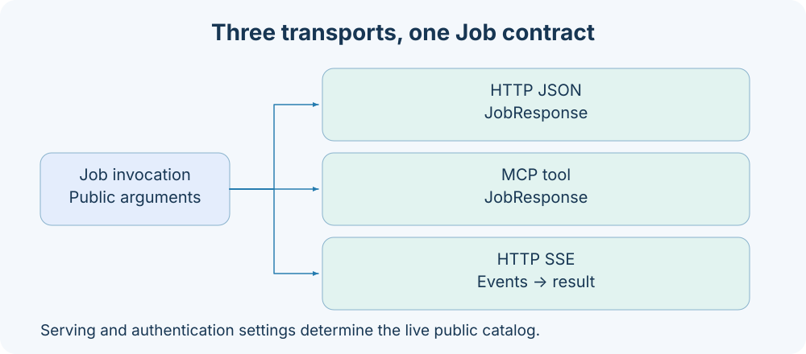
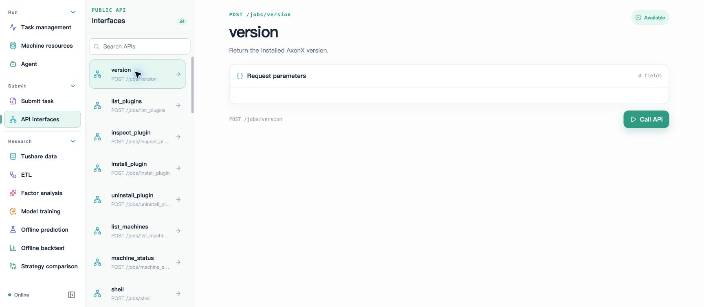

# API protocol overview

AxonX exposes Jobs through ordinary HTTP JSON, HTTP SSE, and MCP tools. All three share business Schemas and JobResponse; consult the capability pages for Task, Agent, and file-operation parameters. The service must be running; confirm its token and actual public catalog before calling it.





Studio's **API interfaces** displays Jobs exposed by the current machine and generates forms from their parameter Schemas. No call has been made in the illustration above; see [Getting started with Studio](../getting-started/studio.md) for a complete call response.

## Routes

| Method | Path | Purpose | Successful response |
| --- | --- | --- | --- |
| GET | `/health` | Whether the current Application is running | JobResponse, answer.running |
| GET | `/jobs` | Actual public Job catalog | JobResponse, answer.items/total |
| POST | `/jobs/{name}` | Ordinary call | JobResponse |
| POST | `/jobs/{name}/events` | Live events | text/event-stream, ending with result |
| POST | `/files` | Upload raw bytes to staging | JobResponse, with FileCopy in answer |
| DELETE | `/files?path=...` | Clean up staged files | JobResponse, answer.path |
| MCP | `/mcp` | Streamable HTTP tool interface | MCP containing JobResponse |
| Multiple HTTP methods | `/proxy/{name}/{path}` | Configured upstream proxy | Upstream response |

All business requests execute on the current service by default. `GET /jobs?target=http%3A%2F%2Fnode-b%3A1024` queries a configured target's catalog; target in Job requests follows the same configuration-matching rules. proxy is a separate upstream-forwarding capability; see [HTTP proxy](../guides/http-proxy.md).

## Authentication and the public catalog

When `service.token` is configured, both the root paths and subpaths of `/health`, `/jobs`, `/files`, and `/mcp` require:

```http
Authorization: Bearer your-service-token
```

OPTIONS requests skip this check. Studio's static pages and `/proxy` are outside these protocol-protected root paths; proxy uses the upstream request's credentials. `requires_auth=false` does not bypass a configured service token.

Two conditions determine which Jobs are public:

1. `enable_serve=true`.
2. The service has a token configured, or the Job has `requires_auth=false`.

Jobs default to `requires_auth=true`, so without a token in the default configuration, you cannot assume every default Job appears in the catalog. Jobs with `enable_stream=false` accept ordinary calls, but local `/events` returns 404. Restart the service after changing configuration; the catalog is determined when the HTTP application is built.

## Request envelope

```json
{
  "arguments": {"task": "demo", "x": 1, "y": 2},
  "target": "http://node-b:1024"
}
```

`arguments` is the business-parameter dictionary, defaulting to `{}`; `target` is optional and defaults to local execution. The envelope rejects additional top-level fields. target must be listed in this service's `targets`. The service configuration stores the remote token; the browser submits only the address.

CLI `--target` instead connects directly to the address using the client's own token, without requiring this service's targets. MCP tools receive only Job business parameters, without the HTTP target envelope described above.

## Minimal calls

Assume the service address is `http://127.0.0.1:1024` and the token is stored in `AXONX_SERVICE_TOKEN`.

```bash
curl -s http://127.0.0.1:1024/health \
  -H "Authorization: Bearer $AXONX_SERVICE_TOKEN"

curl -s http://127.0.0.1:1024/jobs \
  -H "Authorization: Bearer $AXONX_SERVICE_TOKEN"

curl -s -X POST http://127.0.0.1:1024/jobs/version \
  -H "Authorization: Bearer $AXONX_SERVICE_TOKEN" \
  -H 'Content-Type: application/json' \
  -d '{"arguments":{}}'
```

Health response:

```json
{"answer":{"running":true},"success":true,"metadata":{}}
```

The catalog returns JobCatalog. Only one item is shown below to illustrate the field structure; the actual Schema is more complete:

```json
{
  "answer": {
    "items": [{
      "name": "version",
      "description": "Return the installed AxonX version.",
      "input_schema": {"type":"object","properties":{}},
      "output_schema": {"type":"object"}
    }],
    "total": 1
  },
  "success": true,
  "metadata": {}
}
```

output_schema describes the shared JobResponse and does not guarantee that every capability-specific answer type is modeled separately. Task definitions' output_schema is supplied separately by the task-catalog endpoints.

## Responses and errors

| Field | Type | Default | Explanation |
| --- | --- | --- | --- |
| answer | Any JSON-serializable value | `""` | Business answer or error text |
| success | boolean | true | Final business outcome of the Job |
| metadata | object | `{}` | Additional information; the Agent provides session_id and related values here |

```json
{"answer":"KeyError: 'base#demo#missing'","success":false,"metadata":{}}
```

This is an example of a business failure within HTTP 200. Clients must check both the HTTP status and success; a 200 alone is insufficient.

| HTTP status | Common trigger | Response and handling |
| --- | --- | --- |
| 401 | Missing or mismatched token | `{"detail":"Invalid bearer token"}`; check the connection target and token source |
| 404 | Job is not public, name is unknown, or streaming is disabled | `{"detail":"Unknown job"}`; query the catalog again |
| 422 | Invalid request envelope, parameter Schema, or target configuration | detail text or FastAPI validation details; revise the request |
| 502 | Connection or protocol failure in an ordinary remote call | detail text; check remote health and credentials |
| 413 | Upload exceeds the size limit | detail text; reduce the artifact size |
| 409 | Staging destination conflict | detail text; inspect staged content and symbolic links |

Exceptions within executing Steps usually become success=false. After a streaming call starts, exceptions become failed result events and can no longer be represented by HTTP status. A stream that disconnects without a terminal result is not successful.

## MCP and events

MCP automatically registers tool names, descriptions, and parameters for public Jobs; tools return ordinary JobResponse. MCP's Streamable HTTP is a transport mode and does not replace the AxonX SSE event protocol at `/jobs/{name}/events`. Live task logs, Agent thinking, and tool blocks use the [Event protocol](events.md).

File uploads do not pass bytes directly through Job arguments or MCP tools; first use the [file-transfer routes](workspace.md#file-upload-and-cleanup).

## Related documentation

- [Task API](tasks.md)
- [Workspace API](workspace.md)
- [Machine API](machines.md)
- [Agent API](agent.md)
- [Plugin and sync API](plugins-sync.md)
- [Authentication rules](../guides/authentication.md)
- [Python usage](../reference/python.md)

Implementation references: `axonx/constants.py`, `components/service/http/app.py`, `jobs.py`, `files.py`, `components/job/contracts.py`.
