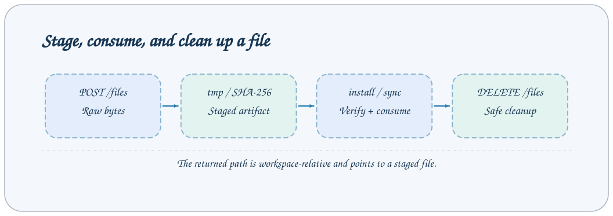

# Workspace and file-transfer API

Workspace Jobs handle directories, metadata, and data previews. File transfer uses separate HTTP routes to stage wheels and synchronization archives.



## Calling conventions

All endpoints below use `POST /jobs/{name}` with a `{"arguments":{...}}` request body. For remote forwarding, add `target` at the envelope's top level, outside arguments. Every response uses [JobResponse](overview.md#responses-and-errors). Table defaults come from the current built-in configuration and Steps. Deployments may change Job Schemas; the running service's `/jobs` is authoritative.

All JSON examples illustrate structure; replace task IDs, session IDs, file paths, and hashes with values actually returned by your service. See [Task contracts](../reference/task-contracts.md) for the complete shared TaskStatus fields.

## Endpoint list

| Job              | Purpose                                         |
| ---------------- | ----------------------------------------------- |
| `list_entries`   | List one directory level within the workspace.  |
| `list_task_runs` | List task directories containing metadata.json. |
| `preview_file`   | Preview supported file types.                   |
| `delete_entries` | Delete files or directories in the workspace.   |

## list_entries

List one directory level within the workspace.

| Parameter | Type   | Required | Default | Constraints and meaning                |
| --------- | ------ | -------- | ------- | -------------------------------------- |
| `path`    | string | No       | `""`    | Path relative to the service workspace |

Only the business fields listed in the table are accepted.

**Request**

```json
{
  "arguments": {}
}
```

**Response**

answer is WorkspaceListing: path, entries, and truncated. Each entry contains name, path, kind, preview_kind, supported, size, and modified_at.

```json
{
  "answer": {
    "path": "",
    "entries": [],
    "truncated": false
  },
  "success": true,
  "metadata": {}
}
```

**Behavior and failure cases**

path defaults to an empty string, representing the root directory; directories sort first. At most 5000 entries are returned. truncated=true indicates truncation; no offset pagination is provided.

## list_task_runs

List task directories containing metadata.json.

| Parameter   | Type   | Required | Default       | Constraints and meaning                                               |
| ----------- | ------ | -------- | ------------- | --------------------------------------------------------------------- |
| `task_type` | string | Yes      | `— (omitted)` | Task type directory; minLength=1, regex `^[A-Za-z0-9][A-Za-z0-9_-]*$` |

Only the business fields listed in the table are accepted.

**Request**

```json
{
  "arguments": {
    "task_type": "train"
  }
}
```

**Response**

answer has the same structure as WorkspaceListing, retaining only task-result directories.

```json
{
  "answer": {
    "path": "train",
    "entries": [],
    "truncated": false
  },
  "success": true,
  "metadata": {}
}
```

**Behavior and failure cases**

Running or failed directories without metadata are excluded from the research-results list. task_type is a directory name, rather than a Task registration name.

## preview_file

Preview supported file types.

| Parameter | Type    | Required | Default       | Constraints and meaning                                                               |
| --------- | ------- | -------- | ------------- | ------------------------------------------------------------------------------------- |
| `path`    | string  | Yes      | `— (omitted)` | Path relative to the service workspace                                                |
| `offset`  | integer | No       | `0`           | Number of data rows to skip in CSV/Parquet previews; minimum=0                        |
| `limit`   | integer | No       | `200`         | Maximum number of data rows returned in CSV/Parquet previews; minimum=1, maximum=5000 |

Only the business fields listed in the table are accepted.

**Request**

```json
{
  "arguments": {
    "path": "base/base#demo#api-demo/metadata.json"
  }
}
```

**Response**

answer is discriminated by kind: text/markdown/json/yaml/csv/parquet/unsupported; every type includes size.

```json
{
  "answer": {
    "kind": "json",
    "size": 1200,
    "content": "",
    "data": {},
    "parse_error": null,
    "truncated": false
  },
  "success": true,
  "metadata": {}
}
```

**Behavior and failure cases**

offset/limit apply only to CSV and Parquet data rows, default to 0/200, and have a maximum limit of 5000. text/markdown reads at most 512 KiB; JSON/YAML larger than 32 MiB returns parse_error. Parsing failure can still have success=true; always inspect parse_error.

## delete_entries

Delete files or directories in the workspace.

| Parameter | Type  | Required | Default       | Constraints and meaning                                              |
| --------- | ----- | -------- | ------------- | -------------------------------------------------------------------- |
| `paths`   | array | Yes      | `— (omitted)` | List of workspace-relative paths to delete; maxItems=200, minItems=1 |

Only the business fields listed in the table are accepted.

**Request**

```json
{
  "arguments": {
    "paths": ["tmp/example.txt"]
  }
}
```

**Response**

answer is an array of DeletedEntry; deleted is a relative path and kind is file/directory for each item.

```json
{
  "answer": [
    {
      "deleted": "tmp/example.txt",
      "kind": "file"
    }
  ],
  "success": true,
  "metadata": {}
}
```

**Behavior and failure cases**

At most 200 paths are allowed; the root directory and paths escaping the workspace cannot be deleted. Prefer delete_tasks for task directories to preserve task-status and log-management constraints.

## Related documentation

- [Protocol, authentication, and errors](overview.md)
- [Workspace operations](../guides/workspace-files.md)
- [CLI reference](../reference/cli.md)
- [Event protocol](events.md)

Implementation references: `axonx/config/default.yaml`, `axonx/steps/workspace/` and `axonx/components/service/http/jobs.py`.

## File upload and cleanup

`POST /files` accepts a raw binary request body or `multipart/form-data`. Both formats return the same FileCopy and stage only the file bytes; uploading a Python script does not execute it.

For raw binary uploads, `x-file-name` is required. Optional `x-file-directory` specifies a workspace-relative subdirectory beginning with tmp; it cannot target an arbitrary workspace location. Existing clients can continue using this format:

```bash
curl -s -X POST http://127.0.0.1:1024/files \
  -H "Authorization: Bearer $AXONX_SERVICE_TOKEN" \
  -H 'Content-Type: application/octet-stream' \
  -H 'x-file-name: axonx_example-0.1.0-py3-none-any.whl' \
  -H 'x-file-directory: tmp/plugins' \
  --data-binary @dist/axonx_example-0.1.0-py3-none-any.whl
```

For multipart uploads, send exactly one file in the `file` field and optionally a text `directory` field. The file part supplies the filename. If supplied, `x-file-name` and a nonempty `x-file-directory` override the filename and directory. Other fields and multiple files are rejected. Omit the Content-Type header when using `curl -F`; curl supplies the multipart boundary automatically.

```bash
curl -s -X POST http://127.0.0.1:1024/files \
  -H "Authorization: Bearer $AXONX_SERVICE_TOKEN" \
  -F 'file=@dist/axonx_example-0.1.0-py3-none-any.whl' \
  -F 'directory=tmp/plugins'
```

The runtime dependency `python-multipart` is declared in `pyproject.toml`; no service configuration switch is needed to enable either format.

FileCopy has the response structure below; use the actual returned hash and byte size:

```json
{
  "answer": {
    "path": "tmp/plugins/aaaaaaaaaaaaaaaaaaaaaaaaaaaaaaaaaaaaaaaaaaaaaaaaaaaaaaaaaaaaaaaa/axonx_example-0.1.0-py3-none-any.whl",
    "sha256": "aaaaaaaaaaaaaaaaaaaaaaaaaaaaaaaaaaaaaaaaaaaaaaaaaaaaaaaaaaaaaaaa",
    "size": 4096
  },
  "success": true,
  "metadata": {}
}
```

Staging directories are named after the content's SHA-256; uploading identical content with the same filename is idempotent. The default per-file limit is 256 MiB. The service checks both Content-Length and actual streamed bytes. Multipart requests allow an additional 64 KiB of request framing; the file itself must still fit the per-file limit. Multipart temporary files are closed after storage or on failure, including request cancellation. An invalid Content-Length or malformed multipart body (including too many parts) returns 400; exceeding the limit returns 413. Missing/invalid filenames, missing `file` uploads, unsupported fields, directory escapes, and similar errors return 422; symbolic links or a destination occupied by different content return 409.

Consumers install_plugin and sync_tasks use the returned path. Installation also requires sha256. Completing an upload does not mean the plugin has been installed or the task snapshot applied. Consumers clean up staged artifacts; unconsumed uploads can be cleaned up explicitly:

```bash
curl -s -X DELETE 'http://127.0.0.1:1024/files?path=tmp%2Fplugins%2Fyour-digest%2Fyour-wheel.whl' \
  -H "Authorization: Bearer $AXONX_SERVICE_TOKEN"
```

The example path is a placeholder; replace it with the actual path. The cleanup response answer is `{"path":"returned path"}`. Repeated cleanup of a valid path already consumed is harmless. This route cleans only staged files and cannot delete arbitrary workspace files. Backend path rules reject absolute paths, escaping paths, and paths outside tmp.

## Preview response types

| kind        | Specific fields                                                 | Consumption guidance                                         |
| ----------- | --------------------------------------------------------------- | ------------------------------------------------------------ |
| text        | content, truncated                                              | Do not infer the complete file from truncated content        |
| markdown    | content, frontmatter, frontmatter_error, truncated              | Read frontmatter separately and report its errors separately |
| json / yaml | content, data, parse_error, truncated                           | Do not analyze data when parse_error is nonempty             |
| csv         | columns, rows, offset, limit, has_more                          | Add the number of returned rows to offset for the next page  |
| parquet     | CSV-style fields plus column_schema, row_count, row_group_count | schema supplies column types and nullable                    |
| unsupported | size                                                            | The endpoint provides no preview content for this format     |

Raw file size in bytes, row-pagination offset, and log-byte offset are distinct information. Text previews have no general character pagination. Parquet row counts and row-group information come from file metadata; returned rows represent only the current window.
