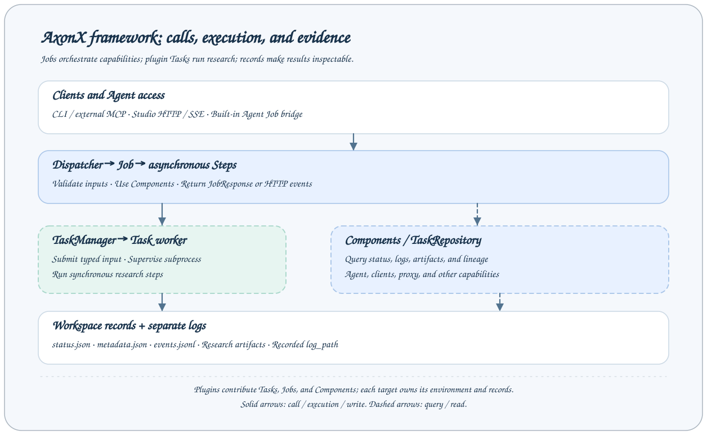

# Architecture Overview

AxonX separates capability calls, research execution, and result storage. The CLI, Studio, and external Agents call Jobs; asynchronous Job Steps access components; time-consuming research runs as synchronous Tasks in worker processes. Once results reach the workspace, task queries and Studio use the same records.

## Responsibilities by Layer

| Layer         | Responsibility                                                           | Typical objects                           |
| ------------- | ------------------------------------------------------------------------ | ----------------------------------------- |
| Client        | Assemble parameters and credentials; consume JSON or events              | CLI, Studio, HttpClient, McpClient        |
| Protocol      | HTTP, MCP, SSE, uploads, and Bearer authentication                       | HttpService                               |
| Orchestration | Validate parameters, execute asynchronous steps, and produce JobResponse | Dispatcher, Job, BaseStep                 |
| Component     | Manage reusable capabilities and their lifecycles                        | TaskManager, TaskRepository, Agent, Proxy |
| Task          | Execute specific research steps and produce validated results            | BaseTask and plugin Tasks                 |
| Storage       | Save status, successful metadata, progress, and research artifacts       | Workspace and separate log directory      |

Regular HTTP calls and SSE event calls pass through the same Job capability layer. MCP maps public Jobs to tools and returns regular responses. SSE is a separate HTTP endpoint for live events; these are different transports.

## Execution Chain for Queries

Using `status` as an example:

1. The client submits `task_id` to `/jobs/status`.
2. The protocol validates service credentials; Dispatcher finds the Job and validates its parameters.
3. The Job executes the `get_status` Step.
4. The Step queries records through TaskManager / Repository.
5. The response includes status in `JobResponse.answer`.

A query does not execute the Task again. Repository watches workspace records and provides the current index to callers; observing file changes and executing workers are separate responsibilities.

## Execution Chain for Research

Using `submit --task demo` as an example:

1. The `submit_task` Step encodes structured parameters as Task command arguments.
2. The local TaskManager validates the task definition and identity, creates a queued record, and starts a separate subprocess.
3. The Job returns a TaskHandle containing `task_id`, `run_id`, and the registered name.
4. The worker parses typed input, executes synchronous steps sequentially, and writes progress, status, and logs.
5. On success, it builds typed output, writes `metadata.json`, then publishes the successful status.
6. The client confirms the terminal state with `wait_task` and reads results from files or research pages.

`axonx exec` runs the same kind of Task directly in the current CLI process, without HTTP or a persistent TaskManager. Process isolation supports cancellation and reconciliation after abnormal exits; it is not a code security sandbox.

## Application Assembly

Application creates Components, Jobs, and Scheduler from configuration and registries. Components declare dependencies through `depend`; the application starts them in topological order. Normal shutdown closes them in reverse dependency order, while startup failures roll back objects already started.

Component names in configuration therefore serve as actual references. For example, TaskManager's `task_repository: default` binds the Repository of that name; synchronization components can also depend on it. Removing a component while retaining references causes startup failure rather than automatic use of another backend.

The persistent service manages Application through the ASGI lifespan. Service exit initiates shutdown, and TaskManager stops its workers. Files preserve status, but there is no general mechanism for resuming interrupted execution.

## Plugins and Agents

Plugins contribute Tasks, Components, and Jobs through installed Python distribution entry points and `plugin.yaml`. Task types and input/output schemas come from plugin classes; plugins implement the quantitative algorithms. Components and Jobs load during application assembly. Task-only wheel updates through the installation Job can refresh live definitions and subsequent submissions; direct pip/source changes and changes marked `restart_required` need a service restart.

AxonX supplies the quantitative research Harness: Task contracts, execution, records, and artifact queries. The model/tool loop and conversational context are managed by the external Agent host or the built-in Claude Agent SDK backend. With a Skill or development guide, source access, and code tools, either Agent path can develop plugins and use Task evidence for iteration. The built-in Agent is a component whose capabilities depend on Job tools, SDK tools, working directory, and permission mode. Research Tasks can execute independently of Agent.

A remote service is another complete Application with its own plugin environment, workers, and workspace. Studio forwards remote operations through the local backend, while an explicit CLI `--target` connects directly to the target.

## Design Boundaries

- `source_tasks` records upstream relationships; the framework does not automatically execute the entire DAG.
- Repository indexes can be rebuilt from records; artifact files and plugin environments must be preserved separately.
- Synchronization copies terminal Task directories, without migrating active workers or copying the entire workspace.
- Resource queries provide machine readings, without automatic machine selection or GPU scheduling.

## Further Reading

- [Jobs and Tasks](jobs-and-tasks.md): the two execution abstractions and how to choose between them.
- [Workspace](workspace.md): file formats and recovery boundaries.
- [Remote Machines](../guides/remote-machines.md): the two remote call paths.
- [Framework Extensions](../development/framework-extensions.md): component and orchestration extensions.

Implementation entry points: [Application](../../../axonx/core/application.py), [TaskRunner](../../../axonx/task/runtime/runner.py), [HTTP assembly](../../../axonx/components/service/http/app.py).
