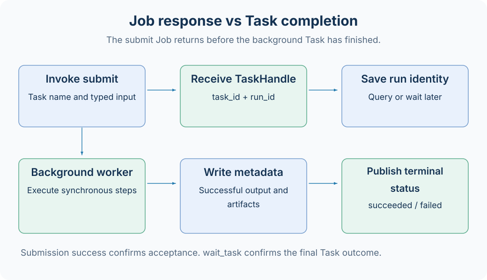

# Jobs and Tasks

A Job is an asynchronous capability call within an AxonX Application; a Task is a synchronous execution unit with typed input and output. Each has its own step abstraction: a Job Step is an asynchronous capability step, while a Task Step is a synchronous function called sequentially.



## Comparison

| Question               | Job                                                       | Task                                                     |
| ---------------------- | --------------------------------------------------------- | -------------------------------------------------------- |
| How is it found?       | A Job name in configuration, such as `submit`             | A registered name, such as `demo`                        |
| How does it execute?   | Dispatcher validates it, then executes asynchronous Steps | TaskRunner executes synchronous callables sequentially   |
| Input contract         | The Job's JSON Schema and defaults                        | Pydantic input_cls                                       |
| Output contract        | JobResponse and optional events                           | Pydantic output_cls and metadata                         |
| Lifecycle              | From the start of a call to its response                  | queued, running, terminal states, and persistent records |
| Long-running execution | Can wait for components or external I/O                   | `submit` usually runs in a separate worker               |

Here, “synchronous” means a function must execute and return directly: it cannot be declared with `async def` or return an awaitable. Background Task execution comes from TaskManager starting a process, rather than making Task Steps asynchronous.

## From Names to Execution Identity

```bash
axonx get_task_definition --task demo
axonx submit --task demo --task-name add-check --x 1 --y 2
```

In this call:

- `submit` is the Job name.
- `demo` is the registered Task definition name used to resolve the class and schema.
- `add-check` is the instance name specified by the user.
- `base#demo#add-check` is the Task ID, corresponding to a workspace directory.
- `run_id` identifies this execution and is provided by the returned TaskHandle.

A Task ID is not the value passed to `--task`. To query an instance that has run, use `status --task-id`; to query an executable definition, use `get_task_definition --task`.

## What submit Returns

The key part of a typical response is shown below; `run_id` is illustrative:

```json
{
  "success": true,
  "answer": {
    "task_id": "base#demo#add-check",
    "run_id": "a9f248807a0a496abf3738422b379a51",
    "task": "demo"
  }
}
```

This means the Job has accepted and submitted the Task. The research logic can still fail. For example, submission of `demo --fail true` can succeed, but the worker will later raise an exception and finish as failed.

Save the complete handle, then wait using both identities:

```bash
axonx wait_task --task-id 'base#demo#add-check' \
  --run-id '<run_id returned by submit>' --client-timeout 600
```

`wait_task` returns the terminal status, with `success` true only when the Task is succeeded. Rerunning a fixed name changes `run_id`; waiting with the old ID will not silently treat another execution as the original task.

## exec and submit

```bash
# Run in the current CLI process; no HTTP service needs to be started first
axonx exec --task demo --x 1 --y 2

# An existing service accepts the task and starts a worker on its machine
axonx submit --task demo --x 1 --y 2
```

`exec` suits plugin debugging, one-off scripts, and parameter checks. `submit` suits background research initiated from Studio or an API and supports waiting, cancellation, and queries through TaskManager.

Both use Task input/output contracts and workspace records. `exec` does not add the current process to another persistent service's worker management list; do not rely on that service to cancel this CLI process.

## Choosing an Abstraction for New Capabilities

For model training, data transformation, or backtesting that needs artifacts and experiment identity, usually implement a Task. Implement `build_task_steps()` and `build_output_params()` and inherit an appropriate research contract.

For querying status, connecting to remote services, calling existing components, or combining capabilities into a public interface, usually implement a Job with asynchronous Steps. A Job can also explicitly call `submit`, wait for results, then execute subsequent steps; this requires custom orchestration logic.

Do not replace a Task with a Job solely to achieve background execution, or create a new research Task for every status query.

## Related Documentation

[Task Lifecycle](task-lifecycle.md) · [Task Management](../guides/task-management.md) · [Task Contracts](../reference/task-contracts.md) · [Existing Development Guide](../dev_guide.md)

Source: [BaseTask](../../../axonx/task/core/task.py), [submit and wait Steps](../../../axonx/steps/task/command.py), [Job models](../../../axonx/components/job/contracts.py).
