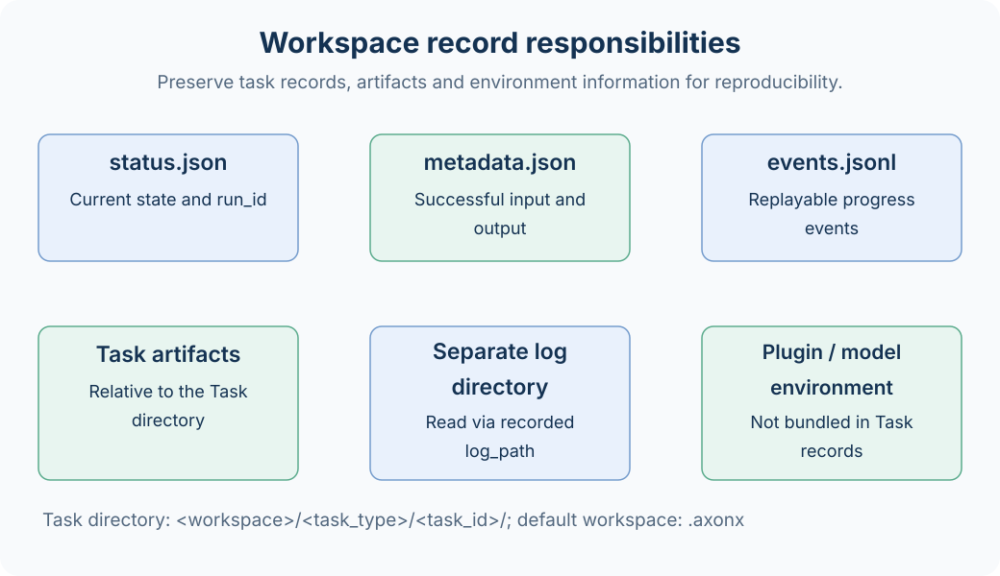

# Workspace and Persistent Records

The workspace stores task status, successful results, and research artifacts, providing the shared data source for Studio and task queries. Its default root is `.axonx` under the startup directory. The built-in default configuration accepts `AXONX_WORKSPACE_DIR` from the shell or `.env`; an explicit `workspace_dir` configuration or `--workspace-dir` CLI option can also select the root. The log directory is configured separately and defaults to `logs`.



## Directory Layout

The following illustrates a demo and a research plugin task; plugin filenames depend on actual artifacts:

```text
.axonx/
  base/
    base#demo#trial-01/
      status.json
      metadata.json
      events.jsonl
  etl/
    etl#my-etl#dataset-01/
      status.json
      metadata.json
      events.jsonl
      dataset.parquet
  train/
  predict/
  backtest/
  analysis/
  inference/
  tushare/                       # Raw data written by data download tasks
  plugins/artifacts/             # Default CLI wheel build cache
  agent/                         # Session data under the default Agent configuration
logs/                            # Separate log directory, not necessarily inside the workspace
```

The directory rule is `<task_type>/<task_id>`, rather than `<task_type>/<registered_name>/<run_id>`. Task type directories come from the enumeration; a directory's existence does not mean its algorithm plugin is installed.

## Three Types of Records

| File          | When it appears                  | Responsibility                                                                           |
| ------------- | -------------------------------- | ---------------------------------------------------------------------------------------- |
| status.json   | Acceptance and execution         | run_id, state, steps, errors, exit code, log path, result                                |
| metadata.json | On success                       | Definition identity, creation time, typed input/output, artifact references, and lineage |
| events.jsonl  | When the worker records progress | Replayable progress events recorded line by line                                         |

Status is a mutable snapshot; metadata packages a successful result. They are not duplicates: metadata contains no `run_id`, and status `result` corresponds to metadata `output_params`.

Atomic writes reduce the chance of reading partial JSON. Readers still tolerate invalid records or records inconsistent with directory identity by treating them as missing; manual file edits should not be a routine task management method.

## Relative Artifact Paths

A research Task's `output_params.artifacts` can record artifacts:

```json
{
  "artifacts": {
    "dataset": {
      "path": "data/dataset.parquet",
      "size": 10240,
      "sha256": "<file SHA-256>"
    }
  }
}
```

Here, path is relative to the Task directory. The workspace preview path is therefore:

```text
etl/etl#my-etl#dataset-01/data/dataset.parquet
```

Do not treat an artifact's path as relative to the workspace root, or use absolute paths or `../` to escape the task directory. Production plugins should record size and sha256 after writing the file.

## Where Logs Are Stored

`status.log_path` records the actual log location. The logging system is controlled by `log_dir`; Task logs are not guaranteed to live inside task directories. Read them through `read_task_log` or Studio task details rather than guessing `<task_dir>/log.txt`.

`events.jsonl` is a progress event log, distinct from Python text logs. Backing up task directories preserves progress events; text logs in an external directory need a separate backup.

## Indexes and Files

TaskRepository scans and watches status and metadata under type directories, maintaining the index needed for task queries. Restarting can rebuild indexes from valid files; it does not retrain models or download raw data for you.

Task lists mainly depend on status records. Research result lists use task directories containing metadata, so successful research tasks, migrated records with only metadata, and failed tasks can have different visibility across entry points.

## Backup Scope

To reproduce experiments, retain task directories, raw data, service configuration, plugin versions, and model dependencies. Preserve Agent sessions, logs, and plugin source separately according to actual usage.

Copying the entire workspace after stopping writes is the easiest way to obtain consistent files. Task synchronization copies only terminal Task directories and cannot replace a complete backup of raw data, Agent sessions, logs, and the software environment.

Rerunning a fixed name replaces the old directory. Deleting upstream directories creates missing nodes in downstream lineage and may prevent downstream reruns from reading original artifacts.

## Related Documentation

[Workspace Browsing](../guides/workspace-files.md) · [Task Contracts](../reference/task-contracts.md) · [Research Artifacts](../reference/research-artifacts.md) · [Backup and Recovery](../guides/operations.md)

Source: [Workspace layout](../../../axonx/task/storage/workspace.py), [Metadata](../../../axonx/task/storage/metadata.py), [Artifact paths](../../../axonx/task/storage/artifacts.py).
