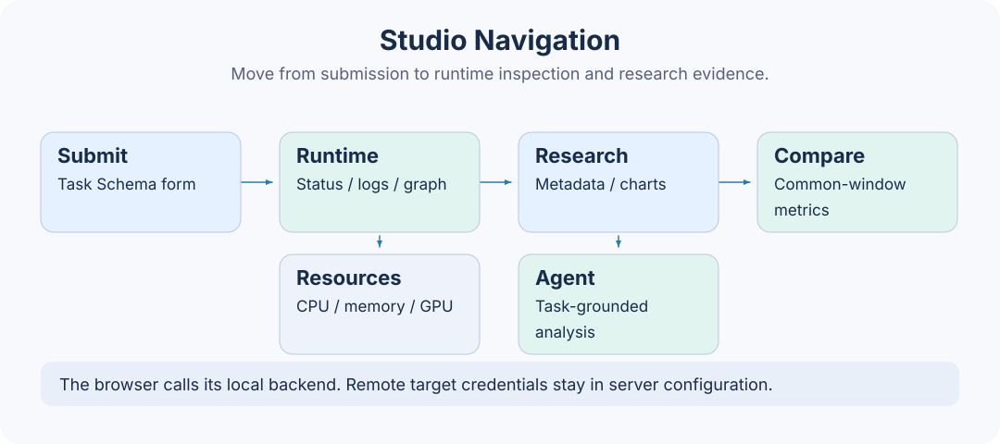

# Extending Studio

This page explains how to add pages, forms, or charts to the existing Studio. For backend Task, Step, and Job extensions, see the [development guide](../dev_guide.md). For a first run, see [getting started with Studio](../getting-started/studio.md).

## Development environment

Start the service from the repository root, then run the frontend in another terminal:

```bash
cd axonx_studio
npm ci
npm run dev
```

The complete development toolchain requires Node.js 20.19.0 or later in the 20.x series, 22.13.0 or later in the 22.x series, or version 24.0.0 and above. These ranges satisfy both the current Vite and ESLint toolchain dependencies. Vite listens on 4173 by default, and the development proxy connects to `http://127.0.0.1:1024` by default. Use `AXONX_DEV_SERVER` to point to another backend and restart Vite after changing it. The proxy covers `/health`, `/jobs`, `/files`, `/mcp`, and `/proxy`.

`npm run build` performs TypeScript checks first, then outputs `dist`. Build artifacts are for backend static hosting; the development server provides hot updates. Their startup methods differ.

## Directory responsibilities

| Location | Responsibility |
| --- | --- |
| `src/app` | Hash routing, navigation, machine selection, page dispatch, and shared application state |
| `src/features` | Business pages for submission, run center, Agent, research, and workspace |
| `src/shared/api` | Job requests, response unwrapping, SSE, and shared types |
| `src/shared/schema` | JSON Schema field types and form-value conversion |
| `src/shared/ui` | Reusable components such as SchemaForm and panel dragging |
| `src/shared/hooks` | Asynchronous loading, polling, and copy feedback |
| `src/styles` | Design variables, shell, and feature styles |
| `src/locales` | Chinese and English translation resources |



## Adding a page

Routes use `#<machineId>/<section>/<view>/<resource>`. For example, `#local/task-defs/catalog/demo` identifies the local demo submission form. `routeHash` encodes resource identifiers and `parseHash` decodes them; do not manually concatenate Task IDs containing `#`.

1. Create the page, necessary types, and API wrappers in `features/<feature>`.
2. Register the section and default view in `app/routes.ts`.
3. Add navigation entries in `app/navigation.ts`.
4. Connect page dispatch in `app/PageOutlet.tsx` and pass the selected machine.
5. Add user-visible text to both locales; keep the corresponding Chinese and English documentation in sync.

Distinguish page route state from temporary UI state. Shareable resource selections suit the Hash; expanded panels and loading progress belong in component state. Invalid sections return to the home page.

## Calling the backend

Call Jobs consistently through `axonx.invoke` in `shared/api/client.ts` or an existing feature API wrapper:

```typescript
const definitions = await axonx.invoke(
  "list_installed_task_definitions",
  {},
  { target: selectedMachine, signal: controller.signal },
);
```

The request body is `{ arguments, target }`, and the outer response is JobResponse. The client handles HTTP errors and `success: false` centrally; business pages receive the unwrapped `answer`. Return types should reflect the actual backend protocol. Do not hide protocol differences with forced type assertions.

Machine selection must carry through lists, details, submission, and file previews. Same-origin `/jobs` requests include the service token from browser settings; the backend resolves remote target addresses and credentials. See the [machine guide](../guides/remote-machines.md).

## Forms and real-time state

Prefer reusing SchemaForm. Integer and floating-point fields become numbers, enums decode from JSON values, array and object inputs use JSON, and empty optional fields are omitted. Optional Boolean fields without defaults are also omitted when off. The server remains responsible for final validation.

Pass AbortSignal to cancel stale requests. Reuse `usePolling` for list polling and the SSE parser for long-task events. Completion of a Job call does not mean a background Task has finished. See [real-time events](../api/events.md) for the event protocol.

## Charts and files

Research pages read task artifacts. New calculations should follow explicit definitions and explain differences from plugin summaries. See the [research artifact reference](../reference/research-artifacts.md) for the sources of training curves, returns, holdings, and other fields. Missing files and empty data should have clear empty states.

Keep file previews workspace-relative. `/files` provides temporary uploads and cleanup, not general downloads; obtain complete artifacts from the execution machine's workspace. Do not concatenate server absolute paths into public UI. On pages with multiple charts, handle container resize and release resources on component unmount.

## Verification and submission

```bash
npm run test
npm run lint
npm run build
```

Choose relevant tests for the changes. Existing tests cover routing, Schema value conversion, event parsing, and request unwrapping and can be extended. UI checks should at least cover English and Chinese, empty data, loading failures, long text, and narrow windows. Do not expose tokens, private sessions, task identifiers, or machine addresses in screenshots.

When updating user documentation, also add feature entry points, prerequisites, steps, and failure handling. Screenshots and SVGs use English, and screenshots must not contain credentials, private paths, or session content.

## Implementation references

- `axonx_studio/src/app/routes.ts`, `PageOutlet.tsx`, `navigation.ts`
- `axonx_studio/src/shared/api/client.ts`, `event.ts`
- `axonx_studio/src/shared/schema/values.ts`
- `axonx_studio/vite.config.ts`, `package.json`
