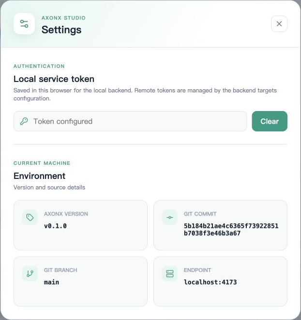
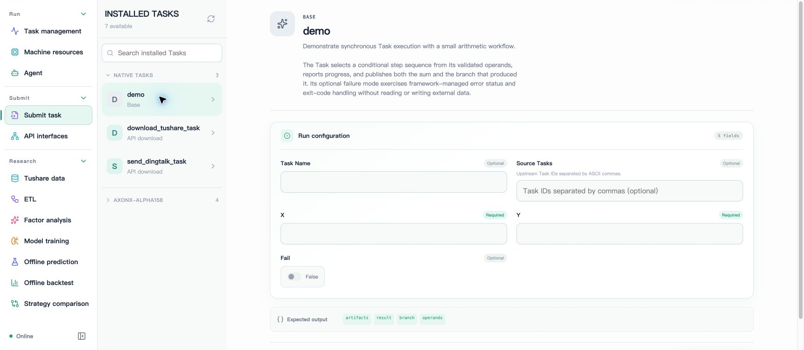
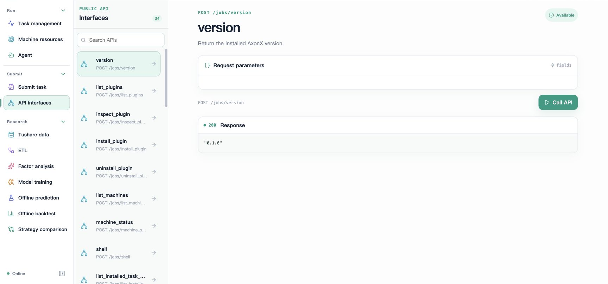
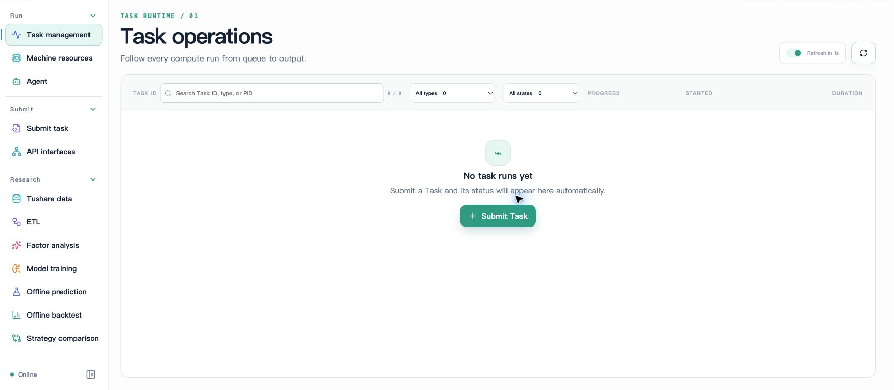

# Getting started with Studio

Open **Playground** from the website navigation to try Studio without a service. It includes a complete research chain and two backtests. In task submission, select `playground.backtest`, choose `strategy` and `outcome`, then follow progress, logs and results in the task center or cancel execution. Successful tasks appear in Backtest; Strategy comparison compares the sample runs. Agent replies are scripted. All data and execution are simulated; refresh or use **Reset demo** to restore initial state.

AxonX Studio is a workbench for tasks and research. It reads Job and Task definitions provided by the service, generates submission forms from Schemas, and displays run status, logs, dependencies, and standard research artifacts.


The screenshots on this page use the English interface; the documentation is available in English and Chinese. Screenshots show actual pages, and the visible task and plugin counts depend on the current machine. Task identifiers, private paths, remote addresses, and browser tabs from real experiments are excluded from documentation images; `docs-demo` and `docs-child` in task-operation screenshots are built-in demos created specifically for the documentation.

## Open Studio

Install AxonX with Studio, then start the service (`axonx[full]` also includes Studio):

```bash
pip install "axonx[studio]"
axonx start --service.host 127.0.0.1
```

Configure the [Service token](../guides/authentication.md) before starting, then open `http://127.0.0.1:1024/`. AxonX loads static assets from the `axonx_studio` Python package. The API still works when Studio is not installed.

For frontend development and proxy configuration, see [Studio development](../development/studio.md).

## Configure the connection

Open **Settings** in the upper-right corner and enter the token used by the local service in **Service token**. The browser saves the local token; use the same settings entry to clear it. The screenshot only shows “Token configured” and contains no credential value.



The machine selector defaults to **Local**. Once remote targets are configured, the selector lists the service's `targets`. Studio continues to send requests to the same-origin backend; the remote address is passed through the outer request's `target`, and remote tokens are stored in backend configuration.

Switching machines changes the available task definitions, run records, and research results. Confirm the current target before operations, especially submission, cancellation, and deletion. See [Using remote machines](../guides/remote-machines.md) for connection differences.

## From submission form to task details



1. Open **Submit task** and select `demo` under **Native tasks**.
2. Enter `X` and `Y`, for example `2` and `3`; leave `Fail` as `False`.
3. Optionally enter a `Task Name` for easy lookup, or leave it blank to generate a name. `Source Tasks` accepts Task IDs separated by ASCII commas.
4. Click **Submit run**, then open **Task management** after a successful submission to view the run.
5. Open task details and check the state, steps, logs, dependency graph, and final output.

The form comes from the Task's `input_schema`. Required fields, enumerations, booleans, numbers, and JSON objects are handled according to field types; blank optional fields are not automatically submitted as empty strings. The backend still performs actual model validation, and complex Schema constraints cannot rely solely on form rendering.

Rerunning a fixed instance name replaces a completed task directory. To retain multiple experiments, use different Task Names or generated names. See [Lifecycle](../concepts/task-lifecycle.md).

## Use task and resource pages


Both demos in the screenshot succeeded; see [Task management](../guides/task-management.md) and [Task lineage](../concepts/task-lineage.md) for operation details, logs, and relationship graphs.

**Task management** provides filters for task type, state, and name, and supports automatic refresh, details, cancellation, and multi-selection deletion. Active task details show progress and logs through an event stream; completed logs can be read on demand.

The dependency graph shows tasks and upstream relationships. Relationships for running tasks may come from status configuration, while successful task relationships come from metadata; missing upstream records appear as missing nodes. Graph relationships are not an automatic execution plan.

**Machine resources** shows CPU, memory, and GPU metrics for the current target. Device data depends on the machine and available vendor tools; missing GPU data does not necessarily indicate GPU failure, nor does it mean the framework automatically selects machines or allocates devices.

## View research results

| Page                | Main content                                           | Details                                                   |
| ------------------- | ------------------------------------------------------ | --------------------------------------------------------- |
| Tushare data        | Raw data directories and Parquet previews              | [Data download](../research/tushare.md)                   |
| ETL                 | Row counts, date ranges, features, and labels          | [Interpreting results](../research/results.md)            |
| Factor analysis     | Factor scores and metric groups                        | [Interpreting results](../research/results.md)            |
| Model training      | Model configuration, metrics, and training curves      | [Artifact protocol](../reference/research-artifacts.md)   |
| Offline prediction  | Prediction data, statistics, and artifacts             | [Interpreting results](../research/results.md)            |
| Offline backtest    | Daily curves, quality, and period summaries            | [Interpreting backtests](../research/backtest.md)         |
| Strategy comparison | Comparison of two backtests over their shared interval | [Strategy comparison](../research/strategy-comparison.md) |

Research pages read `metadata.json` and `output_params.artifacts`. A run record in the task list does not guarantee that displayable research metadata has been produced. For failed tasks, incomplete fields, or corrupt metadata, investigate details and logs first.

Deletion on research pages removes the selected directories and artifacts; downstream dependencies are not automatically rebuilt. Confirm which experiments must be retained before deleting; see [Workspace files](../guides/workspace-files.md) for operation semantics.

## Agent and API entry points

**Agent** supports resuming sessions, viewing text and tool calls, stopping the current turn, and renaming, tagging, forking, and deleting sessions. The explanation entry in task details can pass the Task ID to Agent, but an actual conversation requires available model configuration. Stopping a conversation does not cancel a Task.

**API interfaces** generates call forms from the current target's Job catalog. It calls Jobs rather than directly executing arbitrary Tasks: for example, select `get_task_definition` to inspect a definition, then use `submit` to submit a registered task. Ordinary calls return responses; see [SSE events](../api/events.md) for streaming protocols.



The screenshot shows an actual call to the read-only `version` interface, returning HTTP 200 and a version string. Other interfaces may submit tasks or change data; check their semantics before calling them.

## Page links and preferences

Page routes use `#machine/page/view/resource`, for example `#local/task-defs/catalog/demo`. The router encodes the resource portion; when copying a Task ID to the command line, quote it as a complete string.

Language, theme, and panel width are saved in browser preferences and do not change server-side research configuration. All screenshots on this page use English; switch to Chinese through the language button at the top.

## Feature screenshot index

| Feature                                                                     | Documentation containing screenshots                      |
| --------------------------------------------------------------------------- | --------------------------------------------------------- |
| Home, demo submission, settings, API debugging                              | [Quick start](quickstart.md) and this page                |
| Task list, details, and logs                                                | [Task management](../guides/task-management.md)           |
| Parameter snapshots and relationship graphs                                 | [Task lineage](../concepts/task-lineage.md)               |
| CPU, memory, and GPU                                                        | [Remote machines](../guides/remote-machines.md)           |
| New Agent session                                                           | [Agent usage](../agent/usage.md)                          |
| Data download form and Parquet preview                                      | [Tushare data](../research/tushare.md)                    |
| ETL, factors, training parameters and curves, prediction                    | [Research results](../research/results.md)                |
| Returns, quality, positions, overall and annual/quarterly/monthly summaries | [Interpreting backtests](../research/backtest.md)         |
| Five strategy comparison tabs                                               | [Strategy comparison](../research/strategy-comparison.md) |
| Notification task form                                                      | [Notifications](../research/notifications.md)             |

## Empty state on first use



Before any tasks have run, the list shows an empty state. Submit this page's demo to produce the successful records shown earlier; a complete research workflow is not required to verify the connection.

## When problems occur

| Symptom                                   | Check first                                                                                         |
| ----------------------------------------- | --------------------------------------------------------------------------------------------------- |
| Page opens, but API returns 401           | Whether the local token matches service configuration                                               |
| Task definitions or API catalog are empty | Whether the service has a token, plugins are installed on the selected machine, and Jobs are public |
| Research page has no results              | Whether the corresponding metadata was generated and contains standard outputs                      |
| Charts lack curves                        | Whether fields or files such as training_curve, daily, and summary exist                            |
| Remote machine request fails              | Backend targets addresses, tokens, and target service connectivity                                  |

See [FAQ](../faq.md) and [Troubleshooting and recovery](../guides/operations.md) for more information.
