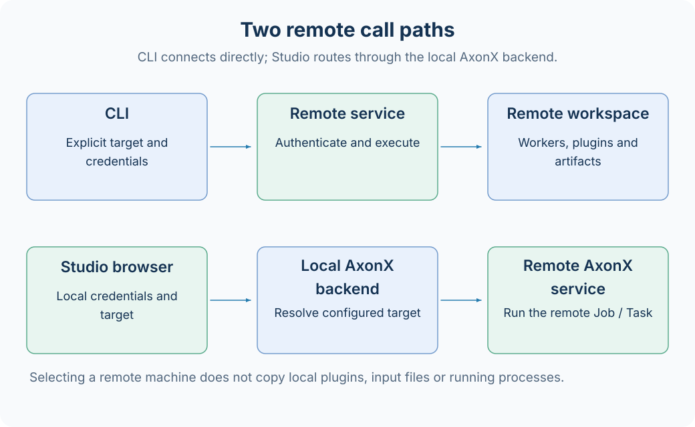
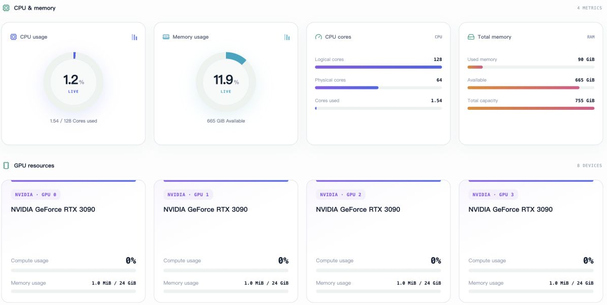

# Using remote machines

AxonX can call a service on another machine. Tasks execute in the called service's Python environment and use its plugins, workspace, and log directory. CLI direct connections and Studio backend forwarding require separate credential configuration.



## Prepare the target service

Install AxonX, required research plugins, and model dependencies on the target machine, configure a separate service token, then start:

```bash
export AXONX_SERVICE_TOKEN='<target service token>'
axonx start --service.host 0.0.0.0 --service.port 1024
```

The target's HTTP(S) address must be reachable by clients. The built-in Uvicorn service does not handle TLS; terminate HTTPS externally for deployment across networks. See [Deployment guide](deployment.md).

## CLI direct connections

```bash
export AXONX_TARGET_TOKEN='<target service token>'
axonx version --target 'http://research.example:1024'
axonx get_task_definition --task demo --target 'http://research.example:1024'
axonx submit --task demo --x 1 --y 2 --target 'http://research.example:1024'
```

The domain here is a placeholder and must be replaced. The CLI connects directly to the target; it requires neither a running local AxonX service nor adding the target to local targets.

With an explicit `--target`, the CLI reads credentials from `AXONX_TARGET_TOKEN` by default; without one, it connects to the local service and reads `AXONX_SERVICE_TOKEN`. `--token` overrides the environment source.

Continue selecting the same target when waiting, checking status, and reading logs. TaskHandle does not turn the remote address into automatic routing information; retain the target address alongside it in scripts or experiment records.

## Studio backend forwarding

Studio requests its own same-origin backend, and the browser stores the local service token. The backend selects preconfigured remote credentials based on the request's target.

Example local configuration `remote.yaml`:

```yaml
extends: default
service:
  host: 127.0.0.1
  token: ${AXONX_SERVICE_TOKEN}
targets:
  - address: http://research.example:1024
    token: ${AXONX_REMOTE_RESEARCH_TOKEN}
```

```bash
export AXONX_SERVICE_TOKEN='<local service token>'
export AXONX_REMOTE_RESEARCH_TOKEN='<target service token>'
axonx start --config remote.yaml
```

After restarting, select the target in Studio's machine entry. The remote token remains in server configuration; the browser does not need to store it directly.

Addresses are normalized, and targets does not allow duplicate addresses. Forwarding fails if the target is unconfigured; selectable UI targets should match local configuration. Restart the current service after configuration changes.

## Connectivity and resources

```bash
axonx list_machines
axonx machine_status --target 'http://research.example:1024'
```

`list_machines` asks the current service to check its targets. A direct CLI query of the target's `machine_status` returns that target's resource information.

CPU, memory, and GPU fields are readings taken at query time. When GPU detection is unavailable, inspect the returned fields rather than concluding the machine definitely has no GPU. These fields provide no resource reservation, GPU binding, or automatic machine selection.

Studio's Machine resources page displays the same kinds of returned values as CPU, memory, and GPU cards. The screenshot below shows the English resource area with machine addresses removed; readings and device counts describe the example machine at capture time, not AxonX deployment requirements.



## Remote files and plugins

Locally installed plugins do not automatically appear remotely. To install on the target, use:

```bash
axonx plugin list --target 'http://research.example:1024'
axonx plugin install ./plugins/a158 --target 'http://research.example:1024'
```

After installation, restart the target service as indicated by restart_required, then query Task definitions. Remote workers run code in that environment, and source_tasks only locates directories in the target workspace.

To reuse local upstream artifacts, first transfer the required task snapshots or copy data according to your deployment method. Raw data, Agent sessions, and model environments do not migrate with remote calls.

## Common failures

| Symptom | Assessment and action |
| --- | --- |
| Connection refused | Check target process, listening host/port, and network entry |
| 401 | For direct calls, check target token; for Studio, check both local and targets credentials |
| Target unconfigured | Add the normalized address to local targets and restart |
| Task registered name missing | Check target plugin installation and restart, rather than only the local environment |
| Schema or response fields differ | Compare service and plugin versions on both sides |
| Target task has no upstream files | Confirm data and Task directories were transferred to the target |

[Authentication](authentication.md) · [Plugin management](plugin-management.md) · [Task synchronization](task-sync.md) · [Machine API](../api/machines.md)

Source: [targets model](../../../axonx/config/models.py), [Remote client](../../../axonx/components/client/base.py), [Job routing](../../../axonx/components/service/http/jobs.py).
