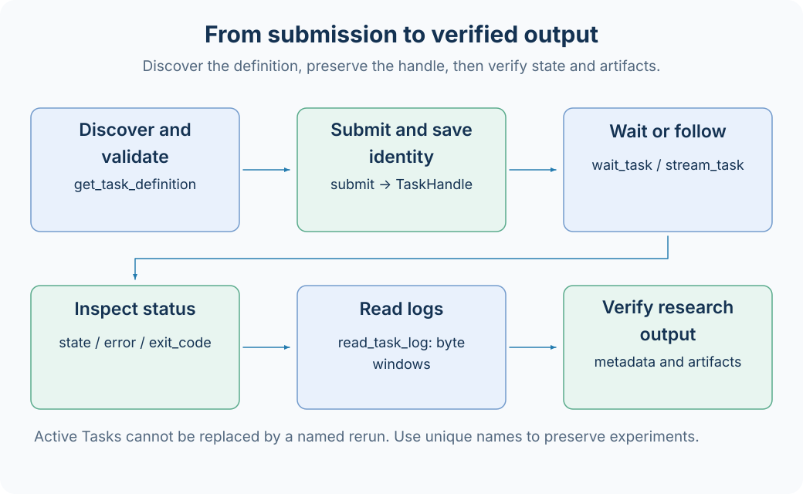
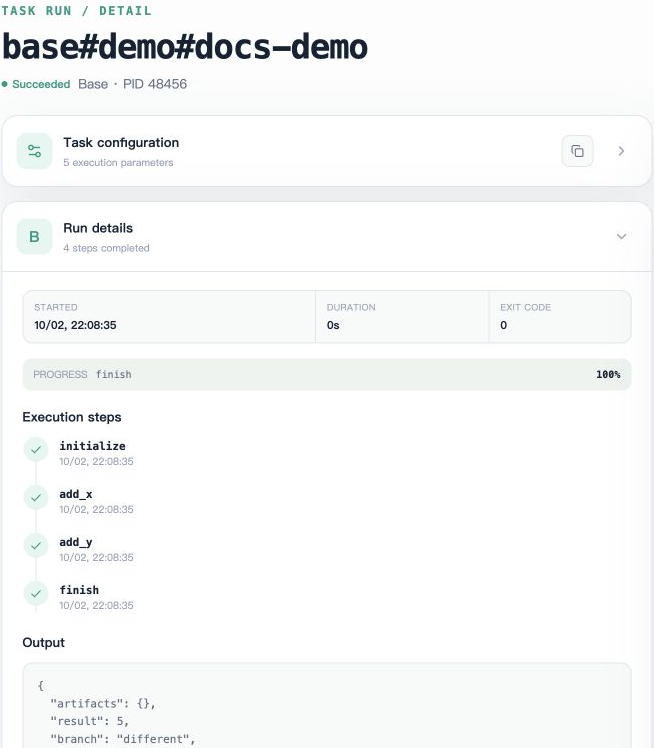
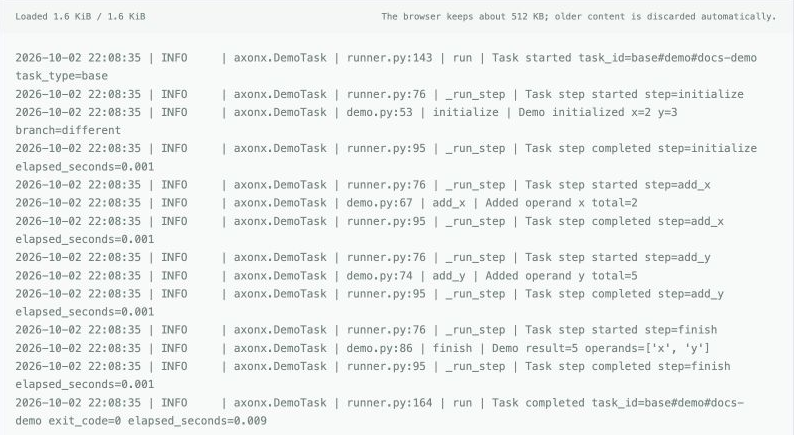

# Task submission and management

This page uses the built-in demo to demonstrate definition discovery, submission, waiting, and status and log inspection. The service must already be started as described in [Quick start](../getting-started/quickstart.md), with `AXONX_SERVICE_TOKEN` configured. demo requires no data-source or model credentials.



## Discover definitions

```bash
axonx list_installed_task_definitions
axonx get_task_definition --task demo
```

Definitions return the registered name, origin, Task type, description, and input_schema/output_schema. demo requires integer parameters `x` and `y`; optional `fail` simulates execution failure. Studio builds its submission form from the same Schema.

Unknown parameters are usually rejected by the Task's input model. The outer Schema of `submit` allows extra business parameters so they can pass through to the specific Task; it does not mean the Task accepts arbitrary fields.

## Submit and save the handle

```bash
axonx submit --task demo --task-name add-01 --x 1 --y 2
```

Save `answer.task_id` and `answer.run_id`. Here the Task ID is `base#demo#add-01`; run_id must use the actual returned value.

To retain multiple experiments, use a new name for each run or omit `--task-name`. Rerunning a fixed name after a terminal state replaces the old directory; active tasks cannot be overwritten by the same name.

In Studio, select the execution machine, open the task submission page, select demo, enter x/y, and submit. Open task details to confirm identity and state; a submission message does not indicate completed execution.

The screenshot below shows the English task list. `docs-demo` and `docs-child` are two independent demo runs created for documentation, both in Succeeded state. Their names differ from this page's CLI example `add-01`, but illustrate the same task management workflow.


## Wait for completion

```bash
axonx wait_task --task-id 'base#demo#add-01' \
  --run-id '<actual returned run_id>' --client-timeout 600
```

Increase the client timeout for long tasks. The default client request timeout is 60 seconds; a client timeout or closing the browser does not cancel the Task, and you can query its state again.

On success, `answer.state` is succeeded and `answer.result` contains outputs including result=3, branch=different, and operands. On failure, JobResponse.success is false; continue by reading error and logs.

For live observation, use:

```bash
axonx stream_task --task-id 'base#demo#add-01' \
  --stream true --client-timeout 600
```

The event stream suits progress and log display; `wait_task` confirms the terminal state of a specific run_id. Subscribing to a stream without checking the final result cannot reliably establish research success.

## Query status and logs

```bash
axonx list_task_ids
axonx list_task_statuses
axonx status --task-id 'base#demo#add-01'
axonx read_task_log --task-id 'base#demo#add-01' --offset -1 --limit 65536
```

Log offset is measured in bytes: `-1` reads the tail, and positive values read from the specified byte offset. limit ranges from 1024–262144, defaulting to 65536. Use offset information in the response for subsequent incremental reads rather than calculating offsets from character counts.

Run details in Studio shows the exit code, steps, and output. In the screenshot, `docs-demo` uses x=2 and y=3, completes initialize, add_x, add_y, and finish in sequence, and returns result=5. The image retains only the execution details area, and the Output JSON at the bottom is incomplete; read the API response or metadata for the full result.



The log area lets you check each step's parameters and accumulated result. In the screenshot below, total changes from 2 to 5 and the final exit_code=0; personal absolute paths have been removed, leaving only log content.



Task progress events and text logs are different records. When investigating errors, check status.error first, then log context; truncated output means the read window is limited, not that the original log contains only that content.

## View successful metadata

```bash
axonx preview_file --path 'base/base#demo#add-01/metadata.json'
```

metadata resides under the type directory, and successful output is in `output_params`, not a top-level result. demo is a base-type task and does not appear in ETL, training, or backtest research result lists.

For research plugins, also check that files referenced by artifacts exist and chart data matches parameters. Successful status only means framework execution completed; it does not prove strategy or data quality meets research requirements.

## Failure, cancellation, and reruns

```bash
# This task demonstrates failed state; the command itself returns a submission handle
axonx submit --task demo --task-name failure-01 --x 1 --y 2 --fail true
axonx status --task-id 'base#demo#failure-01'

# Cancel an actual research task that is still running
axonx cancel --task-id '<active Task ID>'
```

demo finishes quickly and usually cannot reliably demonstrate cancellation. If cancellation returns false, check whether the task has already ended, whether the current manager manages it, and whether the correct execution machine is selected.

After correcting parameters, use a new name to retain the failure record; reusing a fixed name replaces the old task directory. There is no general automatic checkpoint resume. If a plugin implements recovery, follow its documentation.

## Delete terminal tasks

```bash
axonx delete_tasks --task-ids '["base#demo#failure-01"]'
```

Deletion only applies to terminal or metadata-only records; active tasks are rejected. It removes task files. Check [Lineage relationships](../concepts/task-lineage.md) before cleanup to ensure upstream artifacts are no longer needed.

Use `delete_tasks` for ordinary task cleanup and `delete_entries` for arbitrary workspace file deletion; their scopes and protections differ.

## Common failures

| Symptom                                           | Checks and actions                                                      |
| ------------------------------------------------- | ----------------------------------------------------------------------- |
| submit is missing from the Job catalog            | Configure the service token and restart; inspect the actual `/jobs`     |
| Unknown Task                                      | Install the plugin on the execution machine and query definitions again |
| Same-name directory already exists                | Wait for the active task to finish, or use a new name                   |
| wait reports a run identity mismatch              | Check for a same-name rerun and use the original handle                 |
| Record appears in task list but not research page | Check research type and successful metadata                             |

[Task API](../api/tasks.md) · [Lifecycle](../concepts/task-lifecycle.md) · [Task contracts](../reference/task-contracts.md)

Source: [Task command Step](../../../axonx/steps/task/command.py), [TaskManager](../../../axonx/components/task_manager/local/manager.py).
