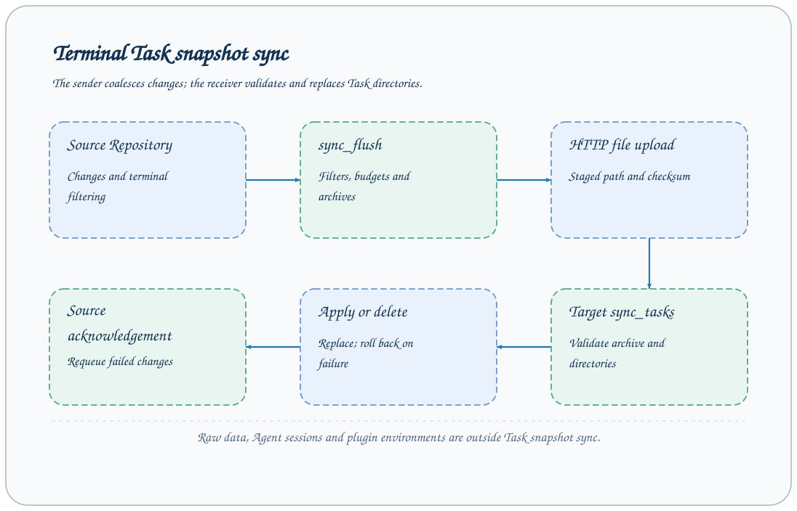

# Task snapshot synchronization

Task synchronization copies snapshots of terminal Task directories from a source service to a target service and propagates deletion of acknowledged tasks. It is suitable for collecting completed research records in another workspace. The default configuration disables the synchronization component, flush Job, and scheduled trigger; enable all three together.



## Scope and direction

The source component's target determines synchronization direction. The sender coalesces Repository changes and only sends Tasks with terminal status. queued/running tasks return to the pending queue and transfer after completion.

Snapshots include status, metadata, events, and artifacts in the task directory; they exclude workspace-wide Tushare raw data, Agent sessions, external text logs, and plugin environments. Workers are not migrated, and the target does not continue running source processes.

A new snapshot replaces a same-name terminal directory on the target. Use different names for independent experiments on the two sides; synchronization is not a backup mechanism that retains multiple versions.

## Prepare the target service

The target uses sync_tasks and file upload capabilities in the default configuration. Configure a separate token and start:

```bash
export AXONX_SERVICE_TOKEN='<receiver token>'
axonx start --service.host 0.0.0.0 --service.port 1024
```

Ensure the source can reach the receiver. The target does not need to enable the sender-side sync component just to receive. Received records can be viewed, but reruns still require the corresponding plugins, data, and environment.

## Minimal source configuration

Create `sync-source.yaml`; the domain below is a placeholder:

```yaml
extends: default
targets:
  - address: http://archive.example:1024
    token: ${AXONX_SYNC_REMOTE_TOKEN}
components:
  sync:
    default:
      backend: local
      task_repository: default
      target: http://archive.example:1024
      sync_on_start: true
      task_ids: []
      task_id_prefixes: []
      max_archives_per_flush: 4
      max_file_bytes: 104857600
      max_archive_bytes: 268435456
      timeout_seconds: 300
jobs:
  sync_flush:
    enable_serve: false
    steps:
      - backend: sync_flush_step
        sync: default
schedules:
  workspace_sync:
    backend: cron
    job: sync_flush
    cron: "* * * * *"
    concurrency_policy: forbid
```

```bash
export AXONX_SERVICE_TOKEN='<source token>'
export AXONX_SYNC_REMOTE_TOKEN='<receiver token>'
axonx start --config sync-source.yaml
```

sync.target must match a configured targets address, or startup fails. In this example, `sync_flush` is not public and is called internally by Scheduler; do not assume it can be called directly from the CLI.

## First verification

1. Submit a demo with a distinct name on the source and wait for completion.
2. Wait for the next flush schedule; check source logs for errors and synchronization results.
3. Query status and metadata for the same Task ID on the target.
4. For research tasks, check artifact file sizes and sha256.
5. On source restart, sync_on_start=true requeues current records; it does not copy only newly added files.

The default minute-level schedule and Repository change-coalescing delay mean this is not real-time byte-by-byte replication.

## Filters and budgets

| Option                   | Meaning                                       |
| ------------------------ | --------------------------------------------- |
| task_ids                 | Exact Task ID allowlist                       |
| task_id_prefixes         | Match Task ID prefixes                        |
| Both filter groups empty | No identity filtering                         |
| Both groups have values  | Either an exact or a prefix match qualifies   |
| max_file_bytes           | Per-file budget, default 100 MiB              |
| max_archive_bytes        | Per-uploaded-archive budget, default 256 MiB  |
| max_archives_per_flush   | Archives per flush, default 4                 |
| timeout_seconds          | Target HTTP call timeout, default 300 seconds |

max_archive_bytes must exceed max_file_bytes and should not exceed the target's upload capacity. The default `/files` maximum upload is 256 MiB. For oversized files, do not simply increase source values while ignoring receiver limits.

Results distinguish uploaded, deleted, rejected, oversized, deferred, and archives. deferred means the current archive budget is exhausted and processing continues later; oversized means a task cannot be copied within the current budget and requires smaller artifacts or an adjusted budget; rejected identifies files that do not satisfy complete-snapshot constraints and calls for inspecting the source directory.

For manual synchronization, upload a valid Task snapshot archive using binary or multipart `POST /files` to the receiving service, then call `sync_tasks` on that same service with the returned `answer.path`. Upload alone does not apply the snapshot. See [File upload and cleanup](../api/workspace.md#file-upload-and-cleanup).

## Deletion, failure, and rollback

The source maintains an acknowledged task set. When an acknowledged task disappears from the source and matches the filters, deletion is sent to the target. Source tasks that were never successfully acknowledged should not propagate deletion as synchronized tasks.

After uploading an archive, the sender calls sync_tasks and checks JobResponse.success; HTTP 200 cannot replace the business result. Failed changes are requeued for retry in the next round, and cleanup of temporary upload files is attempted at the end.

The receiver validates archives and task directories and preserves rollback capability while applying replacement and deletion. Active target tasks cannot be overwritten by synchronization; investigate receiver errors first rather than forcibly deleting running directories.

Rollback covers the current application operation, not long-term historical recovery. Accidental propagation of valid deletion or replacement still requires an independent backup for recovery.

## Troubleshooting

| Symptom                     | Check                                                                                |
| --------------------------- | ------------------------------------------------------------------------------------ |
| No transfers at all         | Whether sync, sync_flush, and schedule are all enabled                               |
| Startup fails               | Whether target exists in targets, component dependencies, and configuration validity |
| running tasks do not appear | Sender only copies terminal tasks; this filtering is expected                        |
| 401/502                     | Target token, connectivity, and receiver logs                                        |
| Artifacts too large         | rejected/oversized, file and archive budgets                                         |
| No raw data on target       | Raw data is outside the Task snapshot scope                                          |

[Scheduling](scheduling.md) · [Remote machines](remote-machines.md) · [Backup and recovery](operations.md) · [Synchronization API](../api/plugins-sync.md)

Source: [Sender component](../../../axonx/components/sync/local.py), [Synchronization protocol implementation](../../../axonx/task/sync/), [Default configuration](../../../axonx/config/default.yaml).
