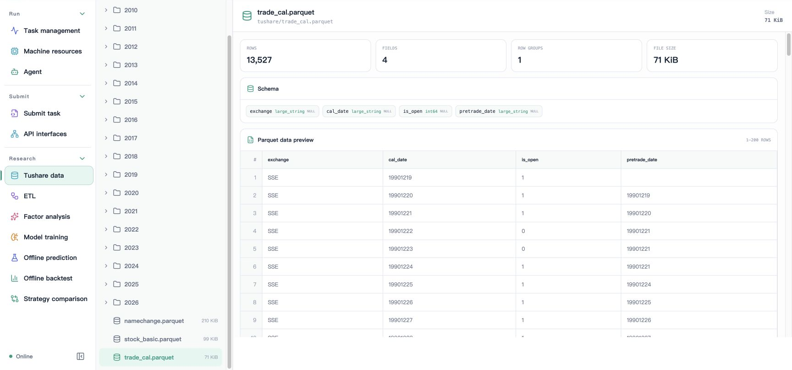

# Workspace browsing and preview

File capabilities are rooted in the configured workspace and only accept workspace-relative paths. List directories to locate records, preview their formats, then clean up as needed. Studio's raw data entry currently focuses on the `tushare` directory; use the Job API for general directory access.

## Browse directories

```bash
axonx list_entries
axonx list_entries --path base
axonx list_entries --path 'base/base#demo#add-01'
axonx list_task_runs --task-type train
```

An empty path means the workspace root. Directory listings show directories first and sort by name; each response includes at most 5000 entries, with truncated indicating undisplayed entries. This is not a recursive file tree.

`list_task_runs` selects task directories with metadata.json. failed or running tasks usually do not appear here; use task status queries to confirm execution.

Paths cannot escape the workspace through absolute paths, `..`, or symbolic links. Directory entries may show symlinks, but they should not be treated as ordinary previewable files.

## Preview records and artifacts

```bash
axonx preview_file --path 'base/base#demo#add-01/status.json'
axonx preview_file --path 'base/base#demo#add-01/metadata.json'
```

Preview responses include file size, format type, and format-specific content. JSON/YAML data is a structured object; on parsing failure, check parse_error rather than assuming the file has no data.

Artifact paths are relative to the task directory. If metadata has `artifacts.dataset.path` set to `data/features.parquet`, compose the full preview path as:

```text
etl/<ETL Task ID>/data/features.parquet
```

## Formats and limits

| Format            | Returned content                           | Limits                                                     |
| ----------------- | ------------------------------------------ | ---------------------------------------------------------- |
| txt               | UTF-8 text prefix                          | At most 512 KiB, marked truncated                          |
| md / markdown     | Body and frontmatter                       | Same as above; frontmatter_error recorded separately       |
| json / yaml / yml | Parsed content and structured data         | Limit notice returned above 32 MiB                         |
| csv               | Column names and row window                | offset/limit control rows                                  |
| parquet           | Columns, types, total rows, and row window | offset/limit control rows                                  |
| Other extensions  | unsupported and size                       | Models, archives, and images are not automatically decoded |

Text is parsed as UTF-8 by default, with BOM support. Renaming a binary file to txt does not make it valid text.

Studio's Tushare data page provides a raw data directory tree and Parquet previews. The screenshot selects `tushare/trade_cal.parquet` and shows the total row count, field types, file size, and first 200-row window.



This screenshot corresponds to the dedicated Tushare entry and does not mean the interface can browse arbitrary service directories or download arbitrary files. General workspace listings and supported-format previews follow this page's Job interfaces and path constraints.

## Row pagination

```bash
axonx preview_file --path 'tushare/2026/20260105/daily.parquet' \
  --offset 0 --limit 200
axonx preview_file --path 'tushare/2026/20260105/daily.parquet' \
  --offset 200 --limit 200
```

The path is only a typical raw-data example; first select an actual file with `list_entries`. offset is the number of data rows to skip, and limit ranges from 1–5000, defaulting to 200.

These parameters apply to CSV/Parquet; they are neither JSON text byte offsets nor directory pagination parameters. Task logs use another interface whose offset is measured in bytes.

For large research files, previews provide quick checks of Schema, dates, and a small sample; complete statistics should read the full file in a local script or research Task. The first screen alone cannot establish that the entire dataset has no missing values.

## Clean up files and directories

```bash
axonx delete_entries --paths '["temporary/report.txt"]'
```

This is a deletion example; first confirm the path exists and is no longer needed. The interface accepts 1–200 paths at once, validates the selection first, then deletes the highest-level roots; selecting both a parent directory and child file does not delete the child twice.

`delete_entries` is a general file capability and lacks TaskManager's active-task protection. Prefer `delete_tasks` when cleaning up an entire Task to avoid directly deleting a directory being written.

The workspace root cannot be deleted, and directory deletion is recursive. Path restrictions prevent leaving the workspace but provide neither undo nor a recycle bin; back up artifacts you need to retain first.

## Upload and subsequent consumption

Plugin installation and synchronization use `/files` with raw binary or multipart uploads to stage artifacts, returning path, size, and sha256 in FileCopy. Receivers consume the returned workspace-relative path rather than the client's source path.

Uploads are not general directory mirroring. Clean up staging files after successful consumption; see [File transfer API](../api/workspace.md) for the specific process.

## Troubleshoot display issues

| Symptom                        | Check                                                                       |
| ------------------------------ | --------------------------------------------------------------------------- |
| File missing from listing      | Execution machine, workspace root, directory level, truncated               |
| JSON has no structured data    | parse_error or file exceeds the structured preview budget                   |
| Table only shows some rows     | offset, limit, Parquet row_count, and has_more                              |
| Research page has no artifacts | Whether metadata exists and artifact path is relative to the Task directory |

[Workspace concepts](../concepts/workspace.md) · [Research artifact protocol](../reference/research-artifacts.md) · [Workspace API](../api/workspace.md)

Source: [Directory operations](../../../axonx/workspace/browser.py), [Preview implementation](../../../axonx/workspace/preview.py), [Path constraints](../../../axonx/workspace/paths.py).
