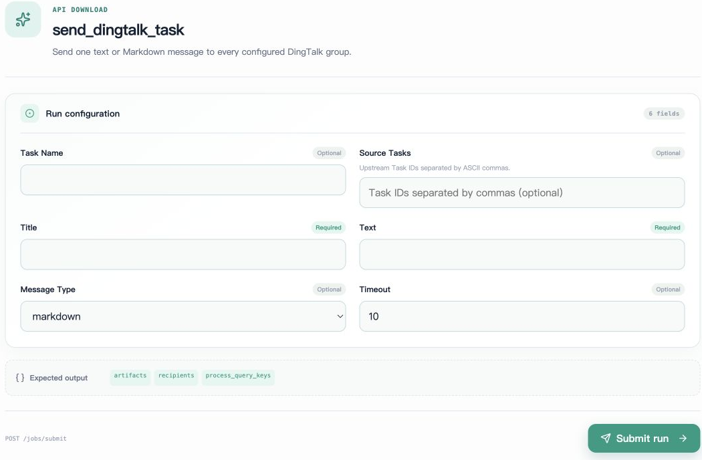

# DingTalk Notifications

`send_dingtalk_task` is an independent `api` Task that sends one message to all groups configured in the environment. It is not automatically bound to research task completion events; callers must explicitly submit it after research succeeds or fails.

## Prerequisites

Prepare valid DingTalk application-robot credentials and recipient groups in the environment of the **machine executing the task**. Do not write credentials into Task parameters or research artifacts.

```bash
export DINGTALK_CLIENT_ID='<application client id>'
export DINGTALK_CLIENT_SECRET='<application client secret>'
export DINGTALK_CONVERSATIONS='{"research":"<open conversation id>"}'
```

`DINGTALK_CONVERSATIONS` must be a nonempty JSON object. Keys are nonempty string labels; values are nonempty string group identifiers. Duplicate values are deduplicated. The current Task has no group-selection parameter and sends to every configured unique group after submission.

## Sending Markdown



Select `send_dingtalk_task` in Studio, fill in Title, Text, and Message Type, then submit. The screenshot is an empty form without recipient groups or credentials. Submission actually sends messages to groups configured on the execution machine.

The following usage example sends an actual external message; run it according to your recipient configuration:

```bash
axonx submit --task send_dingtalk_task \
  --title 'AxonX research completed' \
  --text '### Backtest completed\nView net returns, costs, and execution protocol for the corresponding Task in Studio.' \
  --message-type markdown
```

For actual line breaks, construct a string containing newlines correctly in the shell, or pass arguments through JSON/calling code. `\n` inside ordinary single quotes consists of two characters and does not automatically become a newline:

```bash
message=$(cat <<'MESSAGE'
### AxonX research completed
Check metadata and standard artifacts for the corresponding Task.
MESSAGE
)
axonx submit --task send_dingtalk_task \
  --title 'AxonX research completed' --text "$message" --message-type markdown
```

For text mode, set `--message-type text`. `title` and `text` must each contain at least one character. `timeout` defaults to 10 seconds and must be greater than zero.

## Waiting and checking the response

Save the returned TaskHandle and wait for its `task_id` and `run_id`. Successful output includes:

| Field                | Meaning                                                    |
| -------------------- | ---------------------------------------------------------- |
| `recipients`         | Number of recipient groups after deduplication, at least 1 |
| `process_query_keys` | Message processing query identifiers returned by DingTalk  |

These identifiers mean the API accepted the request and returned references; they do not mean every group member read the message. Ordinary AxonX submission success also does not mean message delivery succeeded. Check the Task's final status.

## Connecting notifications to research

Callers should first wait for the research Task's terminal state, then construct a message with Task ID, date range, and result location. Failure notifications should use actual errors and logs. Do not describe “submission accepted” as “backtest succeeded.”

A notification is another independent Task. To record relationships, pass the research task in `source_tasks` as lineage information. However, the notification implementation does not proactively read upstream results or automatically generate research summaries.

There is currently no unified built-in switch to notify on all task completions. Scheduled Jobs can submit notification tasks, but research-task waiting and message construction still require explicit orchestration.

## Failures and duplicate sends

Missing environment variables, a non-object group configuration, empty group identifiers, or failed DingTalk requests cause the notification task to fail. Check Task logs to identify the exact stage.

The client attempts each group and aggregates failures. If some groups fail, others may already have received the message. Rerunning can send again to groups that succeeded previously. There is currently no notification idempotency protocol keyed by research Task ID. Notification task success and research task success are two independent facts.

## Related documentation and implementation

- [Research workflow](workflow.md), [Task management](../guides/task-management.md)
- [Notification Task](../../../axonx/task/builtins/dingtalk/task.py)
- [DingTalk client](../../../axonx/task/builtins/dingtalk/client.py)
