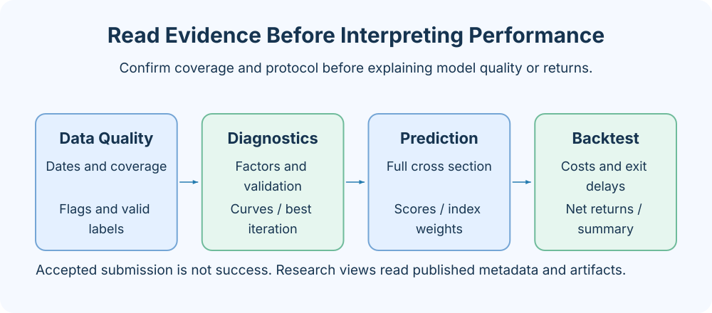
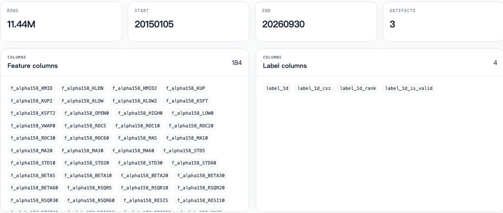
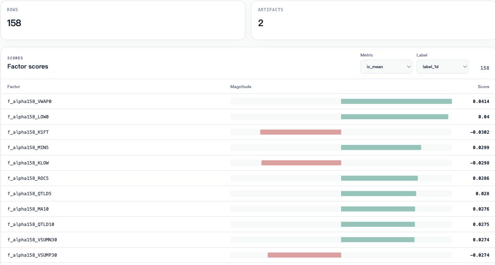
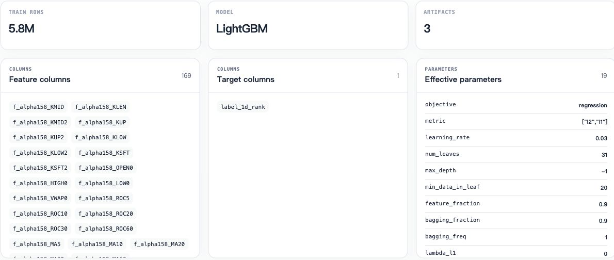

# Interpreting Research Results

Studio organizes successful task results by ETL, factors, training, prediction, and backtesting. Each card corresponds to metadata and file artifacts in the workspace. Charts describe only the data in those artifacts and must be interpreted with the plugin protocol.

Screenshots on this page show existing research results from a remote workspace, with operations and fields in the English UI. Some results come from the `a158_factor` plugin; sample sizes and feature counts reflect those actual experiments. Algorithm descriptions below still refer to the current `a158` implementation.

## From run pages to result pages

Use task pages for execution status, steps, and logs, and research pages for published research metadata. If a task is running, failed, or cancelled, troubleshoot in task details first. If a successful task is absent, check the current machine, task type, and whether `metadata.json` exists and can be read.

After selecting a result, first check task identity, creation time, source tasks, and artifact directory. Use specific Task IDs to compare experiments; rerunning with a fixed name may have replaced original artifacts. The research list count is not the count of all submitted tasks.

## ETL: assess data reliability first

The result summary presents date range, row count, and feature/label columns together. Check coverage before continuing with downstream analysis.

Main checks include date range, row count, feature columns, label columns, stock coverage, and statistics files.

| Observation                      | Question to answer                                                     |
| -------------------------------- | ---------------------------------------------------------------------- |
| `date_range`                     | Does it cover the research goal and retain enough history?             |
| `rows` and stock count           | Is sample size abnormal, or limited to the latest few days?            |
| `feature_columns`                | Are model feature names as expected?                                   |
| `label_columns`                  | Which raw return labels are available in the labels artifact?          |
| Statistics CSV                   | Which columns have missing values, extremes, or insufficient coverage? |
| Trading status and index weights | Is there enough data for buyability, delayed exits, and benchmarks?    |

a158 aligns market data to the trading calendar and combines listing lifecycle, historical names, and price limits to construct trading status. Feature statistics do not replace checks of those statuses. Without weight files, ETL generates empty weights and logs a warning; downstream index benchmarks may be missing.

ETL `statistics` files are a plugin extension. The generic base class does not require every ETL to generate the same statistics. Interpret other plugins according to their own metadata.

## Factor analysis: association and stability

Select metrics and labels through Metric and Label. Both bar direction and value express factor scores.

a158 produces `factor_analysis.csv` and `factor_quantiles.csv`. The former gives diagnostics for each feature; the latter helps examine returns grouped by factor values.

By default, analysis joins the independent labels artifact and uses signal-day buyable samples with valid fixed-next-market-day returns. Changing `tradable_only`, `minimum_daily_samples`, or `quantiles` also changes the sample definition.

The correlation sign indicates direction; stability describes performance across dates. Do not judge a factor effective from one high score alone. Consider daily valid samples, group patterns, missing data, and the research time range.

Studio's `scores` panel uses a plugin-provided “metric group → value” mapping, rather than a test recalculated from raw data in the browser. Check CSV and metadata definitions to confirm each metric's meaning.

## Training: validation and the final model

Training details show samples, features, target column, and effective parameters together to help verify experiment configuration.

Training results include model name, training row count, target column, parameters, metrics, and training curves. a158 saves:

- `model.txt`: the final model fitted with the best iteration count.
- `feature_importance.csv`: gain and split importance.
- `evaluation_history.csv`: per-iteration training/validation history from tuning.

a158's training window includes the start and excludes the end, reserving the final dates for validation. Tuning selects the best iteration count, then refits using all valid samples within the training window. Curves and validation metrics come from the model used to select the iteration count, not an independent out-of-sample evaluation of the final model.

### Reading training curves

Solid lines show training and dashed lines validation. L2 and L1 use left and right axes. Use the bottom zoom bar to inspect selected iterations; do not compare curve heights across axes.

Each position in `training_curve.x` represents an iteration or an ordered time point. All series share the same x; left and right axes allow two groups with different units. Visually close lines do not establish comparable values; first check axes and metric units.

Current a158 places L2 series on the left axis and L1 on the right. If training error keeps declining while validation error stops improving, inspect early-stopping and best iteration counts. The last curve iteration need not equal the saved model's iteration count.

An empty curve means there are no available training points. Charts filter series with mismatched lengths and ignore non-finite values when calculating axis ranges. The reader does not replace complete validation by the Python model. See the [research artifact protocol](../reference/research-artifacts.md) for formats.

### Reading feature importance

gain is cumulative gain from splits, while split is the number of splits using a feature. High importance does not imply causality or stable single-factor returns; highly correlated features share importance. Read results together with factor analysis and out-of-sample predictions.

## Prediction: scores and coverage

The prediction overview shows score distribution, sample coverage, and output fields. Scores in the screenshot belong to that model and are not return probabilities.

a158 saves the complete prediction cross-section, including samples that are not buyable or have no index weights; predictions do not require future labels. Studio displays prediction rows, dates, stock count, score range, buyable rows, and index coverage statistics.

| Statistic                  | Interpretation                                                      |
| -------------------------- | ------------------------------------------------------------------- |
| `rows`, `days`, `symbols`  | Overall prediction file size                                        |
| `pred.mean/min/median/max` | Model output distribution; units depend on the training target      |
| `buyable_rows`             | Rows satisfying the buyable flag on the signal date                 |
| `candidate_rows`           | Buyable candidate count in plugin statistics                        |
| `indices.*`                | Constituent coverage, weight coverage dates, and missing row counts |

The default training target is cross-sectional return rank. `pred` is a score, neither a return nor a probability. Different targets or training plugins may use different score scales; directly comparing absolute scores usually has no common meaning.

`candidate_rows` does not guarantee that every row trades in the final backtest. The backtest may restrict indices, capital may remain tied up in old positions, or the entry buyability proxy may fail. Continue checking the backtest protocol and unfilled-entry statistics.

## Artifacts and traceability

Click artifacts on a result page to preview or locate files. Paths in standard `artifacts` are relative to the current Task directory. `size` is in bytes, and `sha256` is the digest of file contents at generation time.

Do not directly modify model or data files of successful tasks; doing so separates metadata verification information from actual contents. a158 prediction verifies the training model digest and checks model feature names and ordering.

For abnormal results, retain Task ID, run_id, inputs, upstream IDs, metadata, and logs. Use [task lineage](../concepts/task-lineage.md) to verify dependencies, then inspect file contents.

## Related documentation and implementation

- [Interpreting backtest results](backtest.md), [Strategy comparison](strategy-comparison.md)
- [Studio research page](../../../axonx_studio/src/features/research/ResearchPage.tsx)
- [a158 factor diagnostics](../../../plugins/a158/axonx_alpha158/analysis.py)
- [a158 training](../../../plugins/a158/axonx_alpha158/train.py)
