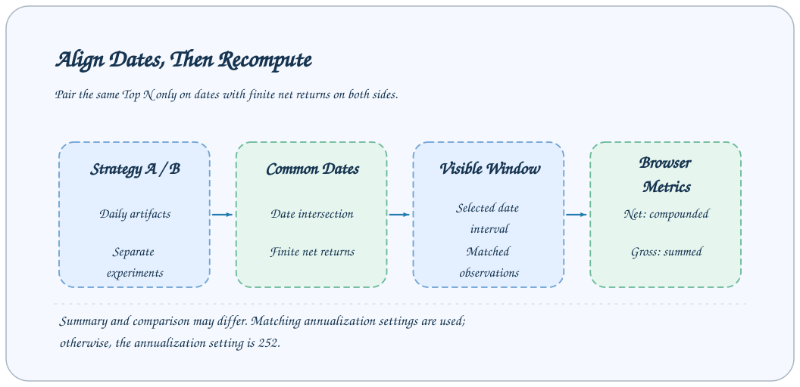
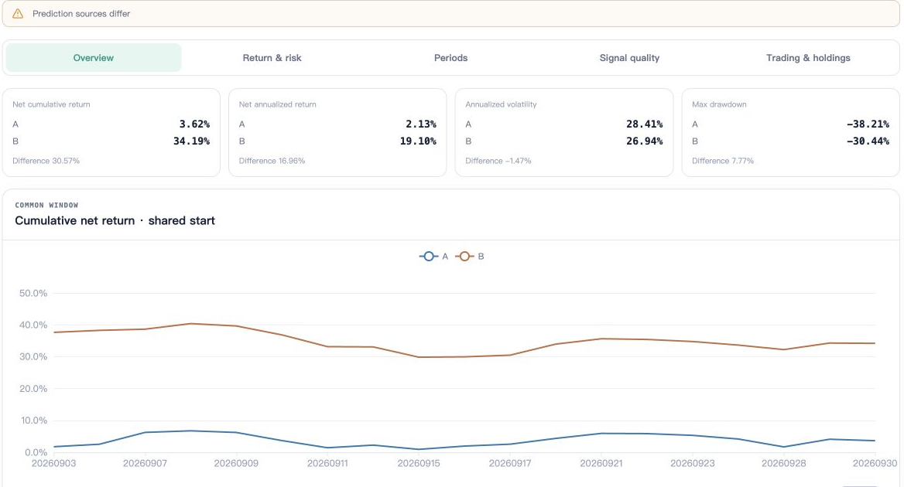
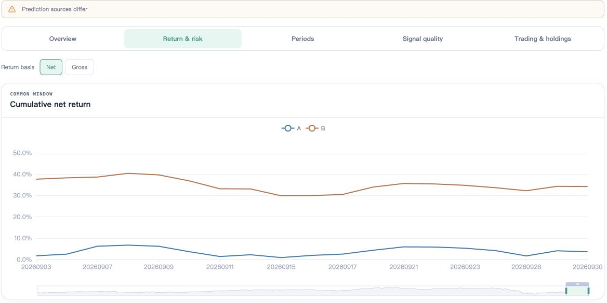
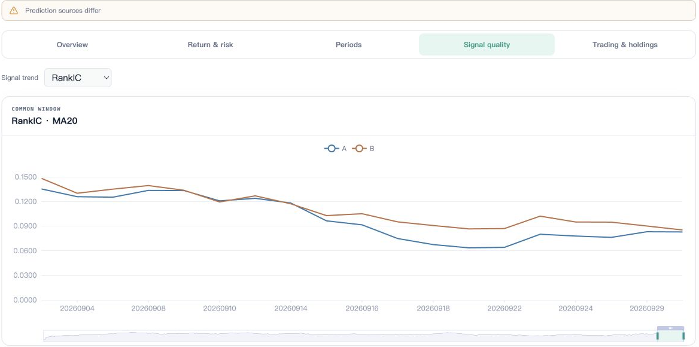
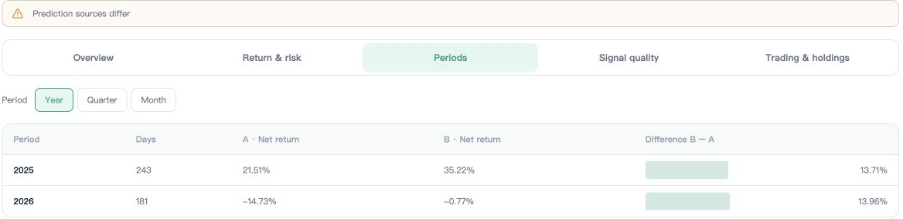
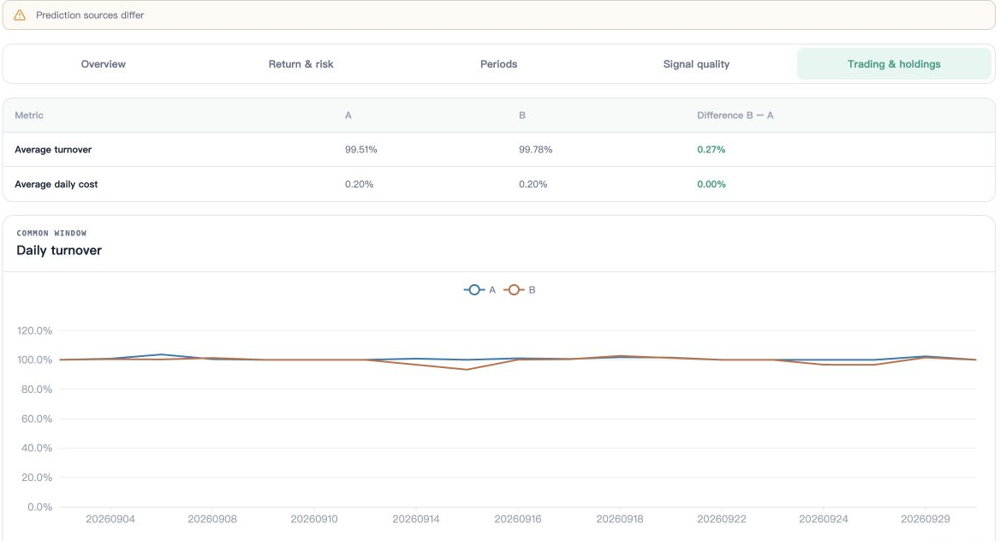

# Strategy Comparison

The Studio strategy comparison page reads daily artifacts from two Backtest Tasks and recalculates returns and risk on common valid dates. Comparison does not submit new research tasks or modify existing artifacts.



## Preparing two experiments

Use different task names to retain different training, prediction, and backtest results. When comparing changes in one factor, keep other settings as consistent as possible—for example, use the same ETL and prediction window while changing only training parameters or costs.

```bash
axonx submit --task a158_backtest --task-name cost-low \
  --source-tasks '<Predict Task ID>' --transaction-cost-rate 0.001
axonx submit --task a158_backtest --task-name cost-high \
  --source-tasks '<Predict Task ID>' --transaction-cost-rate 0.003
```

Wait for each task to succeed, then select A and B on the strategy comparison page. The Task ID identifies the experiment; display names only help recognition. After a rerun with a fixed name replaces the directory, the original result can no longer be treated as retained experiment history.

## Page workflow



The screenshot shows two existing experiments from a remote workspace. **Prediction sources differ** warns that upstream predictions differ; explain differences together with lineage. The displayed values are not expected returns for this page's parameter examples.

1. Select the current machine and two successful backtest records.
2. Check input parameter differences and page warnings.
3. Select a Top N supported by both.
4. Set a common date range and check the number of observations.
5. Read net returns and drawdowns first, then signal quality, period returns, and intersections of target lists.

Without a common portfolio size or common valid dates, the page cannot establish a comparable sample. Do not substitute metrics from each task's full window for common-window results.

## Building the common window

`pairDays` pairs records by `trade_date`, retains only dates where both corresponding `topN_net_return` values are finite, then sorts by date. The user's start and end dates further filter this paired set.

```text
A dates: 01, 02, 03, 04
B dates:     02, 03, 04, 05
Dates with valid net returns on both sides: 02, 03, 04
After selecting 03 through 05: 03, 04
```

This only aligns dates and values. It does not automatically establish that training windows, stock universes, transaction costs, or execution assumptions match. After missing dates are removed, cumulative returns reconnect the remaining dates; this is not the original complete equity trajectory.

## Who computes the metrics

| Displayed content | Data source and calculation location |
| --- | --- |
| Original backtest summary table | Plugin-generated `summary.parquet` |
| Comparison net return, annualized return, volatility, drawdown, win rate | Recalculated by the frontend over the common visible window |
| Comparison average turnover | Mean of finite turnover values in the common window |
| Comparison yearly/quarterly/monthly returns | Frontend grouping and recalculation of cumulative net return |
| IC / RankIC comparison | Subsample of common dates where both metrics are finite |
| Target overlap | Symbol sets in that day's `top30_holdings` |

Even when both tasks originally include identical dates, shortening the window changes annualized return, volatility, and drawdown. Plugin summaries and the comparison page may differ; check the observation range and annualization settings first.

## Return and risk definitions



Switch between Net and Gross in **Return & risk**. The chart's zoom bar can focus on the last segment. Local chart zoom and the page's start/end date filter are separate operations; still check the common page window when interpreting metrics.

Cumulative net return compounds daily net returns; the gross return curve sums daily gross returns. Annualized volatility uses sample standard deviation. Maximum drawdown includes initial equity of 1. Only days with net return greater than zero count as wins.

The comparison page reads `annualization_days` from task inputs. If both values are finite and equal, it uses that value; otherwise, it falls back to 252. Different values trigger an annualization warning. Period returns only recalculate cumulative net return and do not require annualization parameters.

With fewer than two observations in the common window, sample standard deviation, volatility, and ratios may not have finite values and are displayed as missing. A single day's result cannot establish stability.

## Signal quality and target differences



**Signal quality** supports IC or RankIC trends; the screenshot shows RankIC MA20. Missing values and valid observation counts still follow the pairing rules below.

`pairedMean` and `pairedRatio` additionally require both IC or RankIC values to be finite, so signal quality may have fewer valid days than the common net-return window. The 20-row rolling quality curves filter each side's valid values separately; read them together with valid samples and missing values.

Target overlap uses the Jaccard definition:

```text
Overlap = number of target symbols in the intersection / number in the union
A = {a, b, c}, B = {b, c, d}: intersection 2 / union 4 = 50%
```

It is neither the intersection divided by 30 nor capital-weighted overlap. The current page reads `top30_holdings`; changing return Top N does not switch to actual positions of that size. For a158, this compares Top 30 signal targets, including unfilled candidates.

## Period returns and trading observations



**Periods** shows period net returns and the B−A difference within the common window by Year, Quarter, or Month. A strategy can perform differently across years; period results help locate the source of overall differences.



**Trading & holdings** first shows average turnover, average daily costs, and turnover trends. When examining target intersections, retain the previous section's limitations on Top 30 fields; high target overlap is not actual capital-position overlap.

## Forming reliable conclusions

Record both Task IDs, the common window, Top N, costs, annualization settings, and execution protocols. Confirm that changes come from the intended factor, then use lineage to check whether upstream data matches.

Return differences may come from scores, candidate universes, weight coverage, capital tied up in delayed positions, or costs. Explain these mechanisms before discussing model improvements. Page warnings expose known setting differences; they do not automatically certify research comparability.

## Common questions

| Symptom | What to investigate |
| --- | --- |
| Comparison returns differ from the single-task page | Page windows, common valid dates, compounding/summation definitions |
| Fewer valid IC days | Intersection of finite IC values on both sides |
| Target tables remain similar after switching Top N | The target table always uses the Top 30 field |
| Overlap is not common stock count divided by 30 | It uses intersection/union |
| Risk metrics are empty | Observation count, non-finite values, or zero variance |

## Related documentation and implementation

- [Interpreting backtest results](backtest.md), [Task lineage](../concepts/task-lineage.md)
- [Comparison data model](../../../axonx_studio/src/features/research/compare/model.ts)
- [Comparison page and parameter warnings](../../../axonx_studio/src/features/research/compare/StrategyComparePage.tsx)
