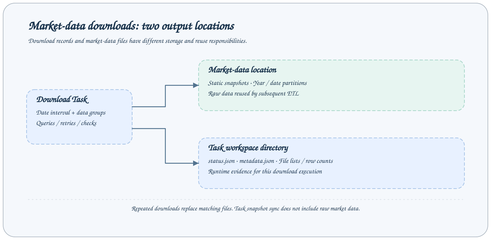
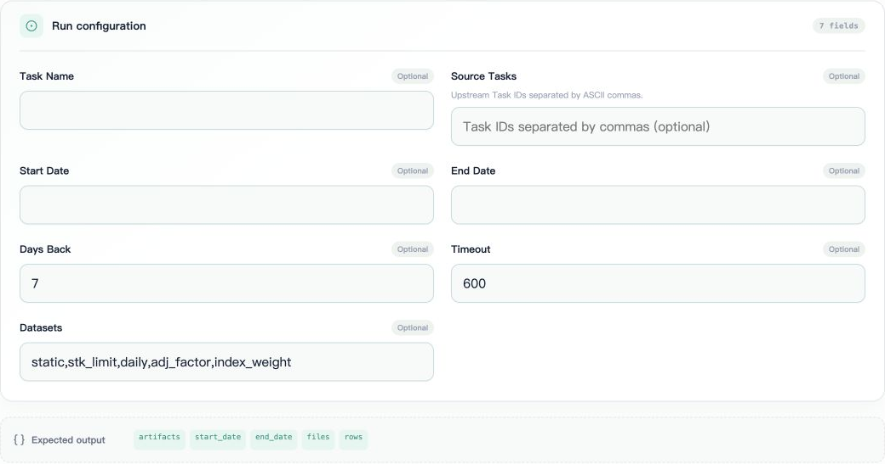

# Tushare Data Downloads

The built-in `download_tushare_task` is an `api` Task that organizes request results into Parquet files in the workspace. It prepares raw data; the ETL plugin generates Alpha158 features.



## Configuring the data connection

Set these variables in the service environment executing the Task:

```bash
export AXONX_TUSHARE_TOKEN='<data API token>'
# Override the URL only for your own compatible API or proxy
export AXONX_TUSHARE_BASE_URL='http://<data service>/dataapi'
```

The built-in client defaults to `http://api.waditu.com/dataapi`. Requests use `<base_url>/<api_name>` and submit `api_name`, `token`, `params`, and `fields` as JSON. Custom services must support this protocol. This token and the `AXONX_SERVICE_TOKEN` protecting the AxonX HTTP service are separate credentials.

Access scope, quotas, and authorization are determined upstream; this page only describes current client and task behavior. For an AxonX proxy, see [HTTP proxy](../guides/http-proxy.md). Do not assume that replacing the URL guarantees protocol compatibility.

## Parameters and dates



Select `download_tushare_task` in **Submit task**. The form displays dates, calendar-day lookback, request timeout, and dataset groups according to the task Schema. The screenshot shows unsubmitted defaults; confirm data credentials on the execution machine before filling it in.

| Field        | Default         | Purpose                                                               |
| ------------ | --------------- | --------------------------------------------------------------------- |
| `start_date` | Empty           | Start date, inclusive                                                 |
| `end_date`   | Empty           | End date; empty means today locally, future dates are capped at today |
| `days_back`  | `7`             | Calendar-day lookback when no start date is given                     |
| `timeout`    | `600` seconds   | Timeout per network request, must be greater than zero                |
| `datasets`   | All five groups | Comma-separated string; also accepts a JSON list of strings           |

Dates accept `YYYYMMDD` and ISO formats; eight-digit integer dates from the CLI are converted back to strings. Date ranges enumerate calendar days. No file is written when a holiday request returns empty data. `days_back` counts calendar days, not trading days.

```bash
axonx submit --task download_tushare_task --days-back 7
axonx submit --task download_tushare_task \
  --start-date 20230101 --end-date 20231231 \
  --datasets 'static,stk_limit,daily,adj_factor,index_weight'
```

Retain the TaskHandle after submission and call `wait_task` to confirm completion. Long ranges may require many requests. Set client wait timeout and individual API timeout separately; see the [research workflow](workflow.md).

## Dataset groups

| Optional group | Query content                            | Output location              |
| -------------- | ---------------------------------------- | ---------------------------- |
| `static`       | `stock_basic`, `namechange`, `trade_cal` | `tushare/` root              |
| `stk_limit`    | Official price limits                    | Corresponding date partition |
| `daily`        | Unadjusted daily market data             | Corresponding date partition |
| `adj_factor`   | Adjustment factors                       | Corresponding date partition |
| `index_weight` | CSI 300 constituent weights, `000300.SH` | Weight record date partition |

`static` queries stock statuses L, D, P, and G, merges the results, and removes duplicates. Static files are snapshots at query time; the `stock_basic` snapshot itself is not complete historical constituent data. Historical name changes come separately from `namechange`.

Weight queries call the API for covered months; month boundaries may extend beyond the requested start and end dates. Results are partitioned by returned weight dates rather than copied to every trading day.

To update only market data:

```bash
axonx submit --task download_tushare_task \
  --start-date 20240101 --end-date 20240131 \
  --datasets 'daily,adj_factor'
```

Groups can be selected independently, but a158 ETL requires at least market data, adjustments, a trading calendar, stock master data, and historical names. Official price limits and index weights affect tradability and benchmark interpretation.

## Output directory


Select a static file or date partition in Studio's **Tushare data** page. The right side displays its Parquet Schema and paginated data. The screenshot shows an existing trading-calendar file from a remote workspace; previewing does not mean the full table has been loaded.

Example using the default `.axonx/` workspace:

```text
.axonx/
  tushare/
    stock_basic.parquet
    namechange.parquet
    trade_cal.parquet
    2023/
      20230103/
        daily.parquet
        adj_factor.parquet
        stk_limit.parquet
      20230131/
        index_weight.parquet
```

Nonempty responses are checked against declared fields, stably sorted, then atomically written as Parquet with zstd compression. Downloading the same file path again replaces the existing file. Empty responses skip writes and do not actively delete existing old files.

Download task metadata `output_params` includes `start_date`, `end_date`, `files`, and per-dataset `rows` counts. `files` is a list of string paths actually written, not the within-directory `artifacts` mapping used by standard research tasks.

## Completeness and failures

The client performs limited retries for network errors and specified transient errors. Rate limits have a separate budget; logs show wait times and retry counts. Invalid JSON, invalid table structures, or errors not declared as supported cause failure.

Static queries use pagination, deduplicate page results, and detect repeated pages and maximum page counts. Daily and weight queries require complete single-request results. A response with `has_more=true` raises an error to avoid treating truncated data as a complete partition.

| Symptom                                 | Checks and actions                                                                                             |
| --------------------------------------- | -------------------------------------------------------------------------------------------------------------- |
| Upstream error or authorization failure | Token, compatible URL, and data service permissions                                                            |
| Long retry waits                        | Rate-limit reasons and retry budget in task logs                                                               |
| Zero rows for a dataset in metadata     | Whether the group was selected, whether the date was a trading day, and whether upstream returned an empty set |
| ETL lacks master data                   | Download `static` separately and check all three static files                                                  |
| Insufficient ETL history                | Download earlier history; the latest 7 days cannot support multi-year training                                 |

Raw data lives outside task directories, so task snapshot synchronization does not automatically copy `tushare/`. When migrating a research environment, back up the data root separately, or first generate and save the data needed for research as ETL task artifacts.

## Related documentation and implementation

- [Workspace browsing](../guides/workspace-files.md), [Quantitative research workflow](workflow.md)
- [Download Task](../../../axonx/task/builtins/tushare/task.py)
- [Client and retries](../../../axonx/task/builtins/tushare/client.py)
