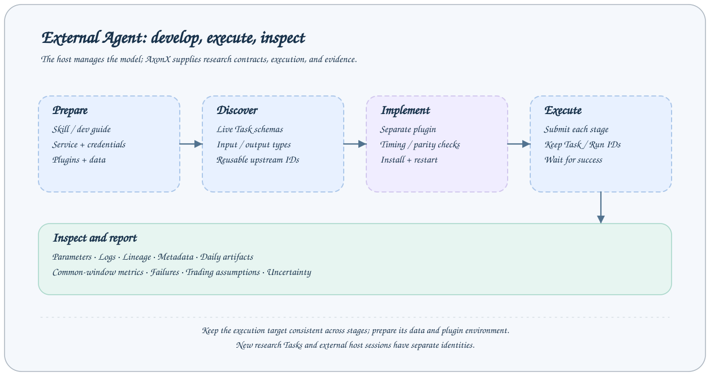

# 外部 Agent：Skill 与 CLI

外部 Agent 使用自己的模型、代码工具与会话环境，开发或优化量化插件，再通过 AxonX 执行和检查研究任务。本页以 CLI 为例；需要宿主直接发现服务工具时，继续阅读 [MCP 接入](mcp-integration.md)。



## 准备服务与说明

先按[快速开始](../getting-started/quickstart.md)启动服务，在执行服务的 Python 环境安装研究插件并准备数据。远程服务的插件和工作区需单独准备，见[远程机器](../guides/remote-machines.md)。使用 CLI 的 Agent 环境需要能执行 `axonx` 命令。

仓库提供 [AxonX Skill](../../../skills/axonx/SKILL.md)，其中定义发现契约、提交等待、检查证据和开发插件的工作流。按宿主支持的 Skill 加载方式使用它；不同宿主的安装目录和配置方式不同。

Skill 使用绝对文档和源码 URL，可以独立复制。示例源码路径相对于 AxonX 仓库根目录。开发代码时，提供源码仓库与文件／命令工具；仅安装 Python 包不会提供示例插件源码。也可以直接让 Agent 阅读[开发与运行指南](../dev_guide.md)。

外部宿主负责模型凭据；AxonX 服务 token 用于连接研究服务。使用已配置凭据，不将 token 放入提示词或研究报告。

## 验证连接与 Task 定义

本机默认服务从 `AXONX_SERVICE_TOKEN` 读取 token：

```bash
axonx version
axonx machine_status
axonx plugin list
axonx get_task_definition --task demo
```

`plugin list` 不指定目标时查询当前 Python 环境。若 CLI 环境与服务环境不同，显式指定服务地址查询其插件，并配置相应 `AXONX_TARGET_TOKEN`。

远程直连示例：

```bash
export AXONX_TARGET_TOKEN='<目标服务 token>'
axonx version --target 192.0.2.10:1024
axonx machine_status --target 192.0.2.10:1024
axonx plugin list --target 192.0.2.10:1024
axonx get_task_definition --task demo --target 192.0.2.10:1024
```

替换示例地址。直连无需启动本机服务；显式 `--target` 即使指向本机，也默认使用 `AXONX_TARGET_TOKEN`。完整连接规则见[客户端配置](../reference/client-configuration.md)。

## 完成一次执行与证据检查

```bash
axonx submit --task demo --x 2 --y 3 --target 192.0.2.10:1024
```

保存响应中的实际 `answer.task_id` 与 `answer.run_id`，检查 `success`，再等待本次运行：

```bash
axonx wait_task --task-id '<task_id>' --run-id '<run_id>' \
  --client-timeout 120 --target 192.0.2.10:1024
axonx status --task-id '<task_id>' --target 192.0.2.10:1024
axonx read_task_log --task-id '<task_id>' --target 192.0.2.10:1024
axonx get_task_context --task-id '<task_id>' --target 192.0.2.10:1024
```

先确认终态为 `succeeded`，再读取 metadata 与其中声明的产物。查询 `success=true` 表示查询成功，提交 `success=true` 表示已受理，两者都不能代替 Task 成功。读取文件用[工作区相对路径](../guides/workspace-files.md)，预览的分页内容不等于完整数据集。

默认省略 `task_name`，让框架生成实例名。显式复用名称会替换已结束任务的记录与产物，见[任务生命周期](../concepts/task-lifecycle.md)。

## 给 Agent 一个具体研究目标

```text
阅读 AxonX Skill 与基线插件源码，开发独立插件或优化指定的已有插件。
明确研究假设和固定条件，实现量化代码，测试特征时点与产物兼容性。
安装到选定服务，查询实际 Task Schema，执行所需研究阶段。
保留实际 Task/Run ID，检查产物，报告可比指标、失败与局限。
在开发窗口选择候选方案，预留独立确认窗口。
```

修改特征通常需要 ETL → Train → Predict → Backtest；修改模型可复用兼容 ETL；修改组合管理可复用兼容 Predict。因子分析按诊断需要从 ETL 独立执行。契约、字段或特征时点变更后，先确认旧上游是否仍可复用。

Agent 开发实验应先按[实验设计与确认](../research/experiments.md)定义控制变量和确认窗口。具体案例与证据见[项目 Benchmark](../../../README_ZH.md#benchmark-agent-开发市场横截面增强特征)与 [Qlib Factor](../../../plugins/qlib_factor/README_ZH.md)；探索 Prompt 示例见 [README 开发流程](../../../README_ZH.md#agent-接入与开发指南)。

## 完成时报告什么

报告执行目标、真实 Task/Run ID、终态、参数与产物位置，以及支持结论的指标和口径。失败时报告实际错误及已完成阶段；尚在运行或未取得完整产物时说明检查范围。

开发实现遵循[贡献指南](../../../CONTRIBUTING_ZH.md)和 [Task 契约](../reference/task-contracts.md)。命令字段见 [CLI 参考](../reference/cli.md)，工具发现与响应处理见 [MCP 接入](mcp-integration.md)。
