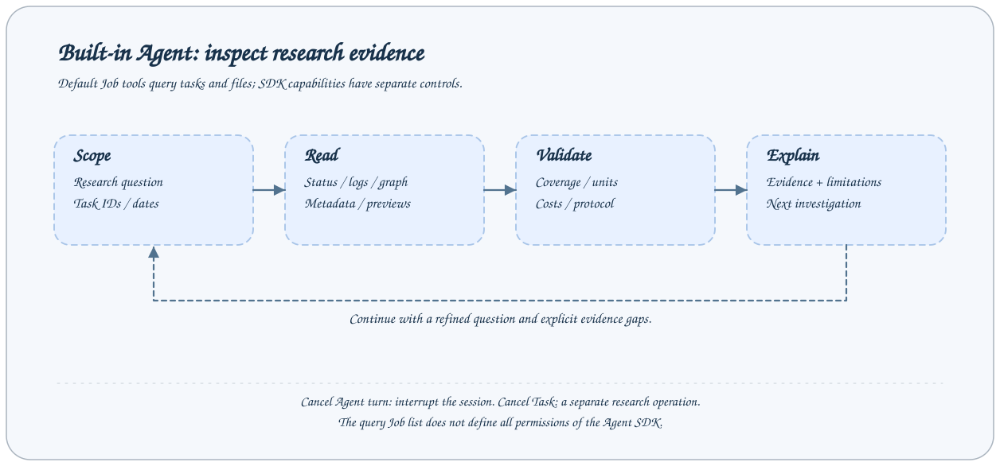
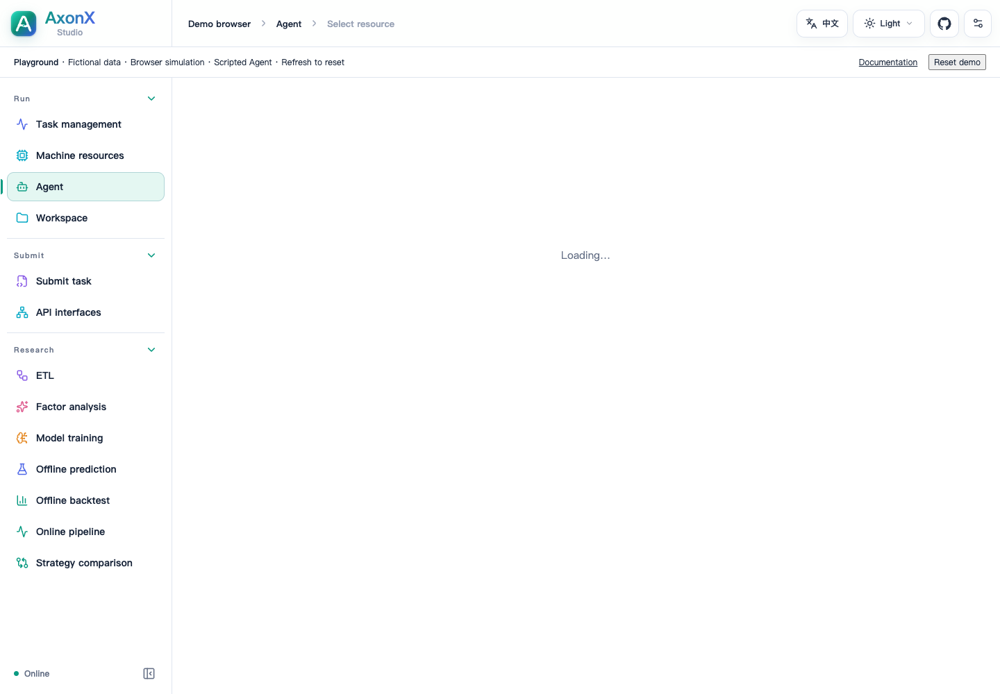

# 内置 Agent 使用

AxonX Agent 将工作区查询工具接入 Claude 后端，用会话完成任务排障和研究结果分析。默认 Job 工具主要用于读取任务、日志、关系和文件；模型结论仍应以真实工具结果为依据。

本页介绍 Studio 中的内置会话。使用 Codex、Claude Code 等外部宿主时，见[外部 Agent](external.md)；两种路径的前置条件见[接入总览](overview.md)。



## 开始前准备

1. 配置服务 token 并启动可用后端。
2. 在服务机器准备 Claude 后端凭据、地址和模型设置，见[Agent 配置](configuration.md)。
3. 在 Studio 设置本机 token，选择机器，进入 Agent 页面。
4. 先确认任务或研究产物确实位于选中机器的工作区。

使用普通任务不要求调用 Agent；Agent 调用需要额外的模型环境和可访问后端。缺少模型凭据时，仍可以通过任务页面与 CLI 直接检查记录。

## 发起一次分析



在 **Agent** 的 **New chat** 输入问题，可按 Enter 发送、Shift+Enter 换行。截图展示静态 Playground 的空白新会话，包含研究 Prompt 和开发配置引导；未发送模型请求，数据与执行均为模拟，也未展示私人历史。

提供具体 Task ID、问题和观察范围。示例提示：

```text
请检查 Task <task_id> 的状态、末尾日志和上游关系，
区分提交失败、执行失败和产物缺失，并给出有证据的下一步。
```

```text
请比较两个 Backtest Task <A> 与 <B> 的协议、日期与成本设置。
先确认共同窗口，再解释净收益与汇总表为何可能不同。
不要把 top30_holdings 当作实际持仓账本。
```

默认工具包括 `list_entries`、`preview_file`、`list_task_ids`、`list_task_statuses`、`status`、`read_task_log`、`get_task_graph` 和 `get_task_context`。Agent 先取得实际信息，再形成答复。

不要只给“分析最新策略”而不给机器或任务范围。多个结果存在时，模型可能选到不同实验；要求它先列出候选任务供你确认。

## 开发或优化插件

开发代码时，提供 [AxonX Skill](../../../skills/axonx/SKILL.md) 或启用内置开发指南，
将 Agent 的 `cwd` 指向可访问的源码仓库，并提供 SDK 文件／命令工具。
默认 `cwd` 是服务工作区，不会自动包含插件源码。
安装与提交通过可用 CLI 或显式配置的 Job 工具完成，见 [Agent 配置](configuration.md)。

向 Agent 提供研究目标、基线或待优化插件、数据、评估窗口、指标、成本和执行目标。分开完成源码修改、选定服务中的安装与 Task 提交，核对服务 Schema 和上游产物，并等待上游成功后再提交依赖 Task。
按[共享开发流程](overview.md#共同的研究循环)推进，探索 Prompt 示例见 [Skill 与研究 Prompt](research-prompt.md)。
代码改动与 Task 证据应独立于会话历史保留。

## 阅读流式消息

Studio 显示文本、思考和工具块，并根据增量事件更新。工具输入和输出说明 Agent 查询了什么，最终文本说明它如何解释证据。

- 状态显示 queued/running 时，结果仍未完成。
- 任务成功不代表所有研究结论可靠；继续核对协议和样本。
- 工具报错时，模型应明确数据缺口；不能把没有取到的文件内容当成事实。
- 最终 `result` 才表示本轮 Job 的终态；连接显示完成不能替代业务成功字段。

消息块是 SDK 消息投影后的界面表示，不能把思考内容当成研究产物。若需要可复现结论，保留实际 Task ID、参数、产物和计算口径。

## 会话续接与管理

新会话由后端生成 UUID，后续发送沿用同一 `session_id`。服务本地会话存储保存历史、标题和标签。Studio 可以打开历史、重命名、设置标签、分叉或删除；具体接口见[Agent API](../api/agent.md)。

分叉创建新的会话身份，用于从既有上下文探索不同问题，不会复制研究 Task 目录，也不会重跑研究链。当前运行中的会话不能删除。

会话保存在当前服务的配置目录中，切换机器会切换查询与会话所在环境。任务快照同步不自动迁移 Agent 历史。

## CLI 与 HTTP 调用

```bash
axonx --stream true agent_chat \
  --message '列出工作区任务，并先读取实际状态再总结。'
```

继续会话时使用后端返回的 UUID：

```bash
axonx --stream true agent_chat \
  --session-id '<返回的 UUID>' \
  --message '请继续检查刚才失败任务的末尾日志。'
```

HTTP 请求参数放在 `arguments` 中：

```bash
curl -N 'http://127.0.0.1:1024/jobs/agent_chat/events' \
  -H "Authorization: Bearer $AXONX_SERVICE_TOKEN" \
  -H 'Content-Type: application/json' \
  -d '{"arguments":{"message":"先读取实际任务状态，再解释工作区中已有的结果。"}}'
```

普通 `/jobs/agent_chat` 调用返回折叠后的 JobResponse；`/events` 返回 SSE 增量事件。模型调用可能耗时，按连接方式设置合理客户端 timeout。

## 停止轮次与取消任务

在 Agent 界面停止，或者调用 `cancel_agent_turn`，会中断当前 SDK 会话轮次：

```bash
axonx cancel_agent_turn --session-id '<正在运行的 UUID>'
```

这不会自动取消已由其他工具或操作提交的独立研究 Task。取消研究任务要使用 `cancel` Job：

```bash
axonx cancel --task-id '<要取消的研究 Task ID>'
```

取消轮次后会话历史可继续使用；取消任务则改变对应 Task 的执行状态。两者不能互相替代。

## 默认工具与权限边界

默认 `job_tools` 不包含 `submit`、`python`、安装、删除或任务取消。需要暴露额外 Job 时由服务管理员显式配置。

但 Claude SDK 自身工具、项目设置、插件和 `permission_mode` 也影响执行能力。默认配置使用 `bypassPermissions`，所以不能将 Job 查询名单理解成整个 Agent 只读。具体权限设计见[配置说明](configuration.md)。

## 失败检查

| 现象                 | 检查                                  |
| -------------------- | ------------------------------------- |
| Agent Job 不在目录中 | token、公开 Job 设置与组件启动        |
| 模型连接失败         | 服务机器的 Claude 环境配置            |
| 会话不存在           | session_id 是否来自同一机器和会话存储 |
| 相同会话请求等待     | 同一会话的轮次锁可能正在占用          |
| 工具不能找到任务     | 当前机器、Task ID 与工作区范围        |
| 会话结束但研究仍运行 | 独立 Task 的生命周期需单独管理        |

## 相关文档与实现

- [Agent 配置](configuration.md)、[MCP 接入](mcp-integration.md)
- [`Claude 会话实现`](../../../axonx/components/agent/claude/backend.py)
- [`流式轮次 Step`](../../../axonx/steps/agent/run.py)
