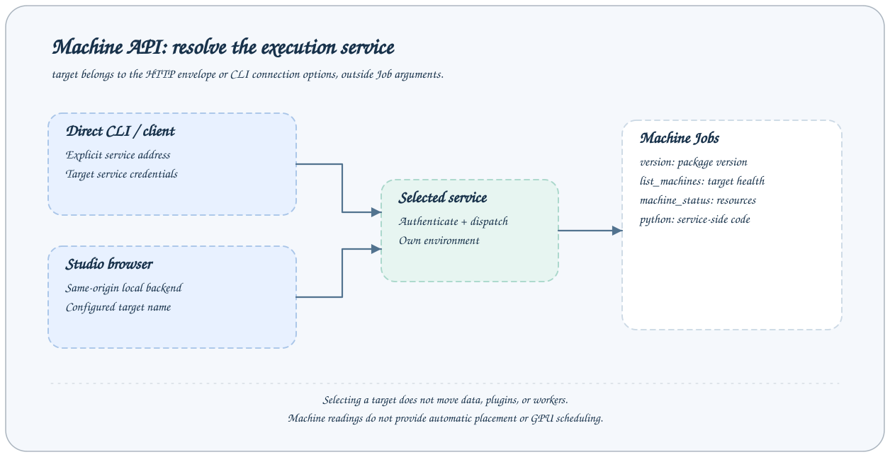

# 机器 API

查询版本、已配置目标健康与机器资源，或在所选服务机器执行命令。target 属于 HTTP 请求封装或 CLI 连接选项，不属于这些 Job 的业务字段。



## 调用约定

以下均为 `POST /jobs/{name}`，请求体是 `{"arguments":{...}}`。远程转发时在封装顶层添加 `target`，不能放进 arguments。每个响应使用 [JobResponse](overview.md#响应与错误)，表格默认值依据当前内置配置和 Step。部署可修改 Job Schema，运行服务的 `/jobs` 是最终依据。

所有示例 JSON 均为结构示例；任务、会话、文件路径与哈希必须替换为本服务实际返回的值。完整通用 TaskStatus 字段见 [Task 协议](../reference/task-contracts.md)。

## 接口清单

| Job              | 用途                              |
| ---------------- | --------------------------------- |
| `version`        | 读取安装包的版本。                |
| `list_machines`  | 检查全部配置的 targets 健康。     |
| `machine_status` | 采样服务机器资源。                |
| `shell`          | 在所选服务机器上执行 shell 命令。 |

## version

读取安装包的版本。

无公开业务参数；使用 `{"arguments":{}}`。

**请求**

```json
{
  "arguments": {}
}
```

**响应**

answer 是版本字符串，metadata.version 同时提供该版本。

```json
{
  "answer": "0.1.0",
  "success": true,
  "metadata": { "version": "0.1.0" }
}
```

**行为与失败情况**

版本值仅为示例；构建分支/提交信息从 machine_status 查看。

## list_machines

检查全部配置的 targets 健康。

无公开业务参数；使用 `{"arguments":{}}`。

**请求**

```json
{
  "arguments": {}
}
```

**响应**

answer 为 MachineHealth 数组，每项 address、healthy。

```json
{
  "answer": [
    {
      "address": "http://node-b:1024",
      "healthy": true
    }
  ],
  "success": true,
  "metadata": {}
}
```

**行为与失败情况**

默认 targets=[] 因而结果为空。healthy=false 可能是网络、token 或服务异常，不等价于资源不足。

## machine_status

采样服务机器资源。

无公开业务参数；使用 `{"arguments":{}}`。

**请求**

```json
{
  "arguments": {}
}
```

**响应**

answer 为 MachineInfo：axonx、cpu、memory、gpus。

```json
{
  "answer": {
    "axonx": {
      "version": "0.1.0",
      "git_commit": null,
      "git_branch": null
    },
    "cpu": {
      "total_cores": 8,
      "physical_cores": 4,
      "usage_percent": 12.0
    },
    "memory": {
      "total_bytes": 16000000000,
      "used_bytes": 4000000000,
      "available_bytes": 12000000000,
      "usage_percent": 25.0
    },
    "gpus": []
  },
  "success": true,
  "metadata": {}
}
```

**行为与失败情况**

cpu 的 total_cores/physical_cores 可为 null；内存单位字节。GPU vendor 仅 nvidia/amd，探测命令不可用或无设备时列表可为空；不承诺检测 Apple GPU。

## shell

在所选服务机器上执行 shell 命令。

| 参数      | 类型   | 必填 | 默认值      | 约束与含义                                    |
| --------- | ------ | ---- | ----------- | --------------------------------------------- |
| `command` | string | 是   | `—（省略）` | 在目标服务机器执行的 shell 命令；minLength=1  |
| `timeout` | number | 否   | `30`        | 命令超时秒数；exclusiveMinimum=0, maximum=300 |

只接受表中业务字段。

**请求**

```json
{
  "arguments": {
    "command": "pwd",
    "timeout": 30
  }
}
```

**响应**

answer 为 ShellOutput：stdout、stderr、exit_code、stdout_truncated、stderr_truncated。success 取决于是否超时及退出码为零。

```json
{
  "answer": {
    "stdout": "/srv/axonx\n",
    "stderr": "",
    "exit_code": 0,
    "stdout_truncated": false,
    "stderr_truncated": false
  },
  "success": true,
  "metadata": {}
}
```

**行为与失败情况**

每个输出流最多保留 1 MiB。超时杀进程组，exit_code=null，stderr 包含超时说明，success=false。子进程使用服务运行用户的权限，机器状态查询没有自动选机功能。

## 失败响应示例

shell 的非零退出与超时都是正常协议返回的业务失败。请求 command="exit 3" 时：

```json
{
  "answer": {
    "stdout": "",
    "stderr": "",
    "exit_code": 3,
    "stdout_truncated": false,
    "stderr_truncated": false
  },
  "success": false,
  "metadata": {}
}
```

超时时 exit_code=null；stderr 包含 `Command timed out after ... seconds`。timeout=0 或 timeout>300 则在 Schema 校验阶段返回 HTTP 422。list_machines 中某个目标 healthy=false 不会让整次列表查询自动失败，应逐台解释结果。

## 相关文档

- [协议、鉴权与错误](overview.md)
- [远程机器](../guides/remote-machines.md)
- [CLI 参考](../reference/cli.md)
- [事件协议](events.md)

实现依据：`axonx/config/default.yaml`、`axonx/steps/machine/` 与 `axonx/components/service/http/jobs.py`。
