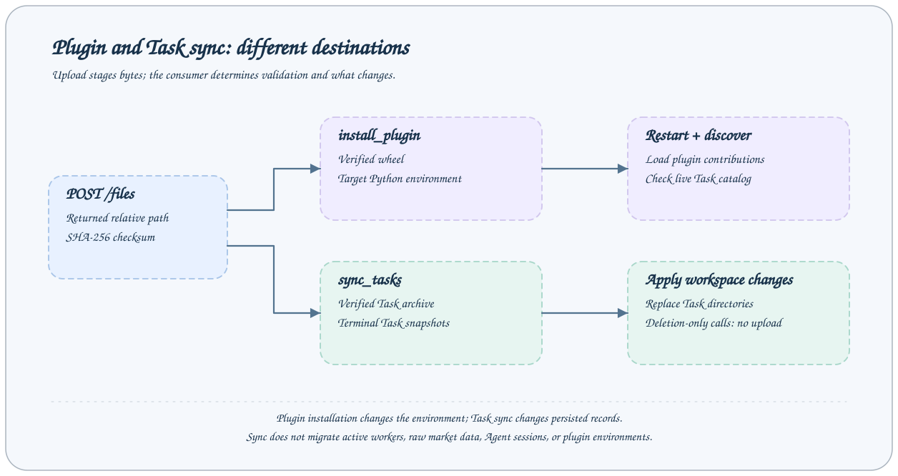

# 插件与同步 API

这组接口改变服务 Python 环境或工作区 Task 目录。文件先上传暂存，再传返回路径给对应消费者。



## 调用约定

以下均为 `POST /jobs/{name}`，请求体是 `{"arguments":{...}}`。远程转发时在封装顶层添加 `target`，不能放进 arguments。每个响应使用 [JobResponse](overview.md#响应与错误)，表格默认值依据当前内置配置和 Step。部署可修改 Job Schema，运行服务的 `/jobs` 是最终依据。

所有示例 JSON 均为结构示例；任务、会话、文件路径与哈希必须替换为本服务实际返回的值。完整通用 TaskStatus 字段见 [Task 协议](../reference/task-contracts.md)。

## 接口清单

| Job                | 用途                                    |
| ------------------ | --------------------------------------- |
| `list_plugins`     | 检查服务 Python 环境的全部 AxonX 插件。 |
| `inspect_plugin`   | 检查一个已安装插件。                    |
| `install_plugin`   | 安装已上传且校验通过的 wheel。          |
| `uninstall_plugin` | 从服务环境卸载插件 distribution。       |
| `sync_tasks`       | 接收任务归档并替换目录，或只应用删除。  |

## list_plugins

检查服务 Python 环境的全部 AxonX 插件。

无公开业务参数；使用 `{"arguments":{}}`。

**请求**

```json
{
  "arguments": {}
}
```

**响应**

answer 为 PluginInfo 数组：distribution、version、plugins、tasks、components、jobs、requirements、content_sha256、sha256、error。

```json
{
  "answer": [],
  "success": true,
  "metadata": {}
}
```

**行为与失败情况**

error 非空表示发现或解析问题；不是所有 Python 安装包都属于 AxonX 插件。

## inspect_plugin

检查一个已安装插件。

| 参数     | 类型   | 必填 | 默认值      | 约束与含义                                        |
| -------- | ------ | ---- | ----------- | ------------------------------------------------- |
| `plugin` | string | 是   | `—（省略）` | distribution 名或插件 entry-point 名；minLength=1 |

Schema 未禁止额外字段；不要据此假定额外字段会被使用。

**请求**

```json
{
  "arguments": {
    "plugin": "axonx-example"
  }
}
```

**响应**

answer 为单个 PluginInfo，与 list_plugins 每项同形。

```json
{
  "answer": {
    "distribution": "axonx-example",
    "version": "0.1.0",
    "plugins": ["example"],
    "tasks": {},
    "components": {},
    "jobs": {},
    "requirements": [],
    "content_sha256": null,
    "sha256": null,
    "error": null
  },
  "success": true,
  "metadata": {}
}
```

**行为与失败情况**

未知或歧义的插件名返回失败。不要混淆 distribution、entry-point 名和 Task 注册名。

## install_plugin

安装已上传且校验通过的 wheel。

| 参数     | 类型   | 必填 | 默认值      | 约束与含义                                   |
| -------- | ------ | ---- | ----------- | -------------------------------------------- |
| `path`   | string | 是   | `—（省略）` | 服务工作区相对路径；minLength=1              |
| `sha256` | string | 是   | `—（省略）` | 上传返回的 SHA-256；正则 `^[0-9a-fA-F]{64}$` |

只接受表中业务字段。

**请求**

```json
{
  "arguments": {
    "path": "tmp/aaaaaaaaaaaaaaaaaaaaaaaaaaaaaaaaaaaaaaaaaaaaaaaaaaaaaaaaaaaaaaaa/axonx_example-0.1.0-py3-none-any.whl",
    "sha256": "aaaaaaaaaaaaaaaaaaaaaaaaaaaaaaaaaaaaaaaaaaaaaaaaaaaaaaaaaaaaaaaa"
  }
}
```

**响应**

answer 为 PluginInstallResult，在 PluginInfo 基础上增加 restart_required。

```json
{
  "answer": {
    "distribution": "axonx-example",
    "version": "0.1.0",
    "plugins": ["example"],
    "tasks": {},
    "components": {},
    "jobs": {},
    "requirements": [],
    "content_sha256": "bbbbbbbbbbbbbbbbbbbbbbbbbbbbbbbbbbbbbbbbbbbbbbbbbbbbbbbbbbbbbbbb",
    "sha256": "aaaaaaaaaaaaaaaaaaaaaaaaaaaaaaaaaaaaaaaaaaaaaaaaaaaaaaaaaaaaaaaa",
    "error": null,
    "restart_required": true
  },
  "success": true,
  "metadata": {}
}
```

**行为与失败情况**

示例哈希和路径仅说明格式，必须替换 POST /files 返回值。校验的是暂存 wheel，不能传本机 source 目录；成功或失败均尝试清理暂存文件。环境安装变化后重启重新装配贡献。

## uninstall_plugin

从服务环境卸载插件 distribution。

| 参数     | 类型   | 必填 | 默认值      | 约束与含义                                        |
| -------- | ------ | ---- | ----------- | ------------------------------------------------- |
| `plugin` | string | 是   | `—（省略）` | distribution 名或插件 entry-point 名；minLength=1 |

只接受表中业务字段。

**请求**

```json
{
  "arguments": {
    "plugin": "axonx-example"
  }
}
```

**响应**

answer 为 PluginUninstallResult：distribution、restart_required。

```json
{
  "answer": {
    "distribution": "axonx-example",
    "restart_required": true
  },
  "success": true,
  "metadata": {}
}
```

**行为与失败情况**

卸载不代表已运行 Application 立即删除内存中的贡献；按重启提示处理。

## sync_tasks

接收任务归档并替换目录，或只应用删除。

| 参数        | 类型   | 必填 | 默认值      | 约束与含义                         |
| ----------- | ------ | ---- | ----------- | ---------------------------------- |
| `path`      | string | 否   | `—（省略）` | 服务工作区相对路径；minLength=1    |
| `deletions` | array  | 否   | `[]`        | 待删除的任务目录路径；maxItems=200 |

只接受表中业务字段。

**请求**

```json
{
  "arguments": {
    "deletions": []
  }
}
```

**响应**

answer 为 SyncTasksReport：archive、applied、deleted、files。

```json
{
  "answer": {
    "archive": null,
    "applied": [],
    "deleted": [],
    "files": 0
  },
  "success": true,
  "metadata": {}
}
```

**行为与失败情况**

path 可省略，deletions 默认为 []，最多 200。path 只接受上传的暂存归档；deletions 是 类型/Task ID 任务目录，不是任意文件路径。接收失败 success=false，answer 是错误文本；归档随后清理。

## 失败响应示例

安装提交的 sha256 格式不合法会返回 HTTP 422；格式正确但制品与哈希不匹配，则安装消费者校验失败并清理暂存文件。再次尝试必须先重新上传。

sync_tasks 对暂存路径/归档的 OSError、TypeError、ValueError 直接返回业务失败文本，例如一个暂存文件不存在：

```json
{ "answer": "Staged file does not exist", "success": false, "metadata": {} }
```

接收端检查目录身份与归档路径，应用替换时保留回滚机制。这里传输的是终态任务目录快照，不迁移进程、插件环境、Agent 会话或原始数据树。

## sync_flush 的可见性

sync_flush 在 default.yaml 中默认被注释；启用示例中的 enable_serve=false 使其只用于内部调度。它不是默认对外 API，不能在 /jobs 中假定存在。结果 SyncReport 含 uploaded、deleted、rejected、oversized、deferred、archives，详见 [任务同步](../guides/task-sync.md)。

## 相关文档

- [协议、鉴权与错误](overview.md)
- [插件管理](../plugins/management.md)
- [CLI 参考](../reference/cli.md)
- [事件协议](events.md)

实现依据：`axonx/config/default.yaml`、`axonx/steps/plugin/` 与 `axonx/components/service/http/jobs.py`。
