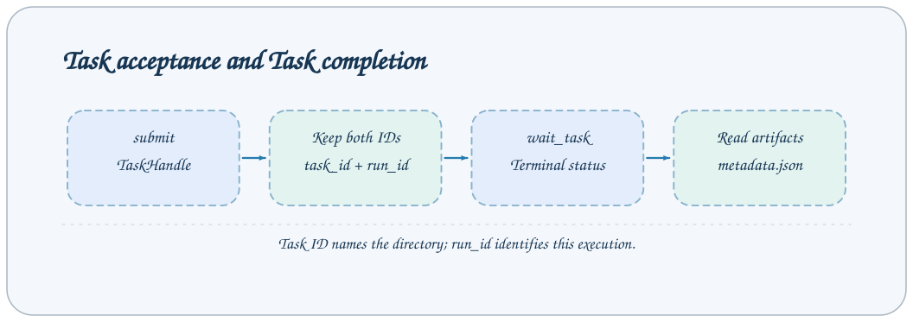

# 任务 API

任务提交、状态、日志和血缘查询共用 Job 协议。先查询注册定义，再提交输入；对特定执行使用 task_id 与 run_id 等待。



## 调用约定

以下均为 `POST /jobs/{name}`，请求体是 `{"arguments":{...}}`。远程转发时在封装顶层添加 `target`，不能放进 arguments。每个响应使用 [JobResponse](overview.md#响应与错误)，表格默认值依据当前内置配置和 Step。部署可修改 Job Schema，运行服务的 `/jobs` 是最终依据。

所有示例 JSON 均为结构示例；任务、会话、文件路径与哈希必须替换为本服务实际返回的值。完整通用 TaskStatus 字段见 [Task 协议](../reference/task-contracts.md)。

## 接口清单

| Job                               | 用途                                       |
| --------------------------------- | ------------------------------------------ |
| `list_installed_task_definitions` | 枚举当前 Python 环境中的内置与插件 Task。  |
| `get_task_definition`             | 查询一个注册定义及输入输出 Schema。        |
| `submit`                          | 启动独立子进程运行 Task。                  |
| `wait_task`                       | 等待提交返回的特定执行结束。               |
| `list_task_ids`                   | 列出存在状态文件的任务身份。               |
| `list_task_statuses`              | 列出状态快照。                             |
| `status`                          | 读取一个任务的当前状态。                   |
| `read_task_log`                   | 按有界字节窗口读取日志。                   |
| `stream_task`                     | 持续跟踪进度与日志直到任务停止。           |
| `get_task_graph`                  | 读取包含所选 Task 的依赖图。               |
| `get_task_context`                | 为 Agent 提供任务路径、状态与关系上下文。  |
| `cancel`                          | 请求取消本服务管理的活跃 worker。          |
| `delete_tasks`                    | 删除终态或 metadata-only Task 与关联文件。 |

## list_installed_task_definitions

枚举当前 Python 环境中的内置与插件 Task。

无公开业务参数；使用 `{"arguments":{}}`。

**请求**

```json
{
  "arguments": {}
}
```

**响应**

answer 是 TaskDefinition 数组。每项含 name、source（native/plugin）、plugin、task_type、description、input_schema、output_schema。

```json
{
  "answer": [],
  "success": true,
  "metadata": {}
}
```

**行为与失败情况**

输出按注册名排序。某个插件类型错误或缺少详细类 docstring，可能使完整目录查询失败。

## get_task_definition

查询一个注册定义及输入输出 Schema。

| 参数   | 类型   | 必填 | 默认值      | 约束与含义                             |
| ------ | ------ | ---- | ----------- | -------------------------------------- |
| `task` | string | 是   | `—（省略）` | Task 注册名，不是 Task ID；minLength=1 |

只接受表中业务字段。

**请求**

```json
{
  "arguments": {
    "task": "demo"
  }
}
```

**响应**

answer 是一个 TaskDefinition；Schema 是 JSON Schema，不是任务执行结果。

```json
{
  "answer": {
    "name": "demo",
    "source": "native",
    "plugin": null,
    "task_type": "base",
    "description": "Demonstrate synchronous Task execution with a small arithmetic workflow.",
    "input_schema": {
      "type": "object",
      "required": ["x", "y"]
    },
    "output_schema": {
      "type": "object"
    }
  },
  "success": true,
  "metadata": {}
}
```

**行为与失败情况**

上面的 Schema 为节选；完整 Schema 以接口返回为准。未知注册名返回业务失败。

## submit

启动独立子进程运行 Task。

| 参数   | 类型   | 必填 | 默认值      | 约束与含义                |
| ------ | ------ | ---- | ----------- | ------------------------- |
| `task` | string | 是   | `—（省略）` | Task 注册名，不是 Task ID |

submit 的 Schema 允许额外字段；除 task 外的字段作为 Task 输入传递，由对应 input_cls 校验，未知输入字段会失败。

**请求**

```json
{
  "arguments": {
    "task": "demo",
    "task_name": "api-demo",
    "x": 1,
    "y": 2
  }
}
```

**响应**

answer 是 TaskHandle：task_id、run_id、task。success=true 表示提交成功。

```json
{
  "answer": {
    "task_id": "base#demo#api-demo",
    "run_id": "f5caee3a7b3c40849d0fb3bdc0f0cd23",
    "task": "demo"
  },
  "success": true,
  "metadata": {}
}
```

**行为与失败情况**

所有 Task 输入字段跟 task 同级传入；demo 的 x、y 必填，fail=false。

通用 Task 输入由具体 Task 的 input_schema 一并公布：

| 输入            | 类型        | 默认值   | 规则                                                             |
| --------------- | ----------- | -------- | ---------------------------------------------------------------- |
| task_name       | string/null | null     | 省略或空字符串产生匿名名；固定名为 1–32 个英文字母、数字或连字符 |
| source_tasks    | string      | 空字符串 | 完整上游 Task ID，以英文逗号分隔；不是字符串数组                 |
| demo.x / demo.y | integer     | 必填     | 两个运算输入；提交时字段名是 x/y，没有 demo 前缀                 |
| demo.fail       | boolean     | false    | 内置失败演示开关；不是全部 Task 的通用参数                       |

插件 Task 的研究参数以 get_task_definition 返回为准，不能把 demo 字段套到其他注册名上。通用 task_name 可省略，source_tasks 默认为空字符串。固定名称只能替换已结束任务，活跃目录产生 FileExistsError；必须保存 run_id。

## wait_task

等待提交返回的特定执行结束。

| 参数            | 类型   | 必填 | 默认值      | 约束与含义                           |
| --------------- | ------ | ---- | ----------- | ------------------------------------ |
| `task_id`       | string | 是   | `—（省略）` | 完整 Task ID；minLength=1            |
| `run_id`        | string | 是   | `—（省略）` | 提交返回的本次执行 ID；minLength=1   |
| `poll_interval` | number | 否   | `1`         | 轮询间隔，单位秒；exclusiveMinimum=0 |

只接受表中业务字段。

**请求**

```json
{
  "arguments": {
    "task_id": "base#demo#api-demo",
    "run_id": "f5caee3a7b3c40849d0fb3bdc0f0cd23"
  }
}
```

**响应**

answer 是终态 TaskStatus；只有 state=succeeded 时 success=true。

```json
{
  "answer": {
    "task_id": "base#demo#api-demo",
    "run_id": "f5caee3a7b3c40849d0fb3bdc0f0cd23",
    "task_type": "base",
    "task_name": "demo",
    "state": "succeeded",
    "config": {
      "task_name": "api-demo",
      "source_tasks": "",
      "x": 1,
      "y": 2,
      "fail": false
    },
    "created_at": "2026-10-02T00:00:00Z",
    "started_at": null,
    "finished_at": null,
    "pid": null,
    "exit_code": 0,
    "error": "",
    "result": {},
    "steps": [],
    "log_path": ""
  },
  "success": true,
  "metadata": {}
}
```

**行为与失败情况**

poll_interval 默认 1 秒，没有业务超时参数。客户端 timeout 应覆盖等待时间。run_id 与目录当前执行不一致时失败，不能用旧 run_id 等待新任务。

## list_task_ids

列出存在状态文件的任务身份。

无公开业务参数；使用 `{"arguments":{}}`。

**请求**

```json
{
  "arguments": {}
}
```

**响应**

answer 是字符串 Task ID 数组。

```json
{
  "answer": ["base#demo#api-demo"],
  "success": true,
  "metadata": {}
}
```

**行为与失败情况**

metadata-only 目录没有状态时不进入此列表；列表不是全历史执行清单。

## list_task_statuses

列出状态快照。

无公开业务参数；使用 `{"arguments":{}}`。

**请求**

```json
{
  "arguments": {}
}
```

**响应**

answer 是 TaskStatus 数组，按 created_at 与 task_id 倒序。

```json
{
  "answer": [],
  "success": true,
  "metadata": {}
}
```

**行为与失败情况**

不提供服务器分页与筛选参数。需要筛选时由客户端按类型、状态和配置处理。

## status

读取一个任务的当前状态。

| 参数      | 类型   | 必填 | 默认值      | 约束与含义   |
| --------- | ------ | ---- | ----------- | ------------ |
| `task_id` | string | 是   | `—（省略）` | 完整 Task ID |

Schema 未禁止额外字段；不要据此假定额外字段会被使用。

**请求**

```json
{
  "arguments": {
    "task_id": "base#demo#api-demo"
  }
}
```

**响应**

answer 是 TaskStatus：身份、config、state、时间、pid、exit_code、error、steps、log_path。

```json
{
  "answer": {
    "task_id": "base#demo#api-demo",
    "run_id": "f5caee3a7b3c40849d0fb3bdc0f0cd23",
    "task_type": "base",
    "task_name": "demo",
    "state": "queued",
    "config": {
      "task_name": "api-demo",
      "source_tasks": "",
      "x": 1,
      "y": 2,
      "fail": false
    },
    "created_at": "2026-10-02T00:00:00Z",
    "started_at": null,
    "finished_at": null,
    "pid": null,
    "exit_code": 0,
    "error": "",
    "result": {},
    "steps": [],
    "log_path": ""
  },
  "success": true,
  "metadata": {}
}
```

**行为与失败情况**

不存在或只有 metadata 的任务没有状态时返回 KeyError 业务失败。queued/running 不是终态。

## read_task_log

按有界字节窗口读取日志。

| 参数      | 类型    | 必填 | 默认值      | 约束与含义                                     |
| --------- | ------- | ---- | ----------- | ---------------------------------------------- |
| `task_id` | string  | 是   | `—（省略）` | 完整 Task ID                                   |
| `offset`  | integer | 否   | `-1`        | 日志读取起始字节偏移；-1 读取尾部；minimum=-1  |
| `limit`   | integer | 否   | `65536`     | 最多读取的字节数；minimum=1024, maximum=262144 |

Schema 未禁止额外字段；不要据此假定额外字段会被使用。

**请求**

```json
{
  "arguments": {
    "task_id": "base#demo#api-demo",
    "offset": -1,
    "limit": 65536
  }
}
```

**响应**

answer 是 TaskLogChunk：content、start_offset、next_offset、file_size、has_more_before、has_more_after、reset。

```json
{
  "answer": {
    "content": "Demo result=3\n",
    "start_offset": 0,
    "next_offset": 14,
    "file_size": 14,
    "has_more_before": false,
    "has_more_after": false,
    "reset": false
  },
  "success": true,
  "metadata": {}
}
```

**行为与失败情况**

offset=-1 读取尾部；offset=0 从头开始。limit 单位字节，不是行数。UTF-8 解码后字符串长度不能代替 next_offset；持续读取用返回的 next_offset。

## stream_task

持续跟踪进度与日志直到任务停止。

| 参数            | 类型   | 必填 | 默认值      | 约束与含义                           |
| --------------- | ------ | ---- | ----------- | ------------------------------------ |
| `task_id`       | string | 是   | `—（省略）` | 完整 Task ID；minLength=1            |
| `poll_interval` | number | 否   | `0.5`       | 轮询间隔，单位秒；exclusiveMinimum=0 |

只接受表中业务字段。

**请求**

```json
{
  "arguments": {
    "task_id": "base#demo#api-demo"
  }
}
```

**响应**

普通调用 answer 是终态 TaskStatus；SSE 有 progress/log，最终 result 携带相同状态。success 按 exit_code==0 设置。

```json
{
  "answer": {
    "task_id": "base#demo#api-demo",
    "run_id": "f5caee3a7b3c40849d0fb3bdc0f0cd23",
    "task_type": "base",
    "task_name": "demo",
    "state": "succeeded",
    "config": {
      "task_name": "api-demo",
      "source_tasks": "",
      "x": 1,
      "y": 2,
      "fail": false
    },
    "created_at": "2026-10-02T00:00:00Z",
    "started_at": null,
    "finished_at": null,
    "pid": null,
    "exit_code": 0,
    "error": "",
    "result": {},
    "steps": [],
    "log_path": ""
  },
  "success": true,
  "metadata": {}
}
```

**行为与失败情况**

默认 poll_interval=0.5 秒。普通 HTTP 调用也会等待到终态，日志事件不会全部装进 answer；实时显示应使用 /events。

## get_task_graph

读取包含所选 Task 的依赖图。

| 参数      | 类型   | 必填 | 默认值      | 约束与含义   |
| --------- | ------ | ---- | ----------- | ------------ |
| `task_id` | string | 是   | `—（省略）` | 完整 Task ID |

只接受表中业务字段。

**请求**

```json
{
  "arguments": {
    "task_id": "base#demo#api-demo"
  }
}
```

**响应**

answer 含 root_id、selected_id、nodes、edges；节点区分 missing、provisional。

```json
{
  "answer": {
    "root_id": "base#demo#api-demo",
    "selected_id": "base#demo#api-demo",
    "nodes": [
      {
        "task_id": "base#demo#api-demo",
        "kind": "base",
        "task_name": "demo",
        "created_at": "2026-10-02T00:00:00+00:00",
        "parent_ids": [],
        "state": "queued",
        "missing": false,
        "provisional": true
      }
    ],
    "edges": []
  },
  "success": true,
  "metadata": {}
}
```

**行为与失败情况**

图来自 status/metadata 中的 source_tasks，只呈现记录关系，不会执行 DAG。节点结构详见任务血缘文档；此例仅展示顶层形状。

## get_task_context

为 Agent 提供任务路径、状态与关系上下文。

| 参数      | 类型   | 必填 | 默认值      | 约束与含义                |
| --------- | ------ | ---- | ----------- | ------------------------- |
| `task_id` | string | 是   | `—（省略）` | 完整 Task ID；minLength=1 |

只接受表中业务字段。

**请求**

```json
{
  "arguments": {
    "task_id": "base#demo#api-demo"
  }
}
```

**响应**

answer 含 task_id、status、metadata_exists、metadata_path、log_path、graph、relations。relations 包括 direct_upstream、ancestors、direct_downstream、missing、provisional。

```json
{
  "answer": {
    "task_id": "base#demo#api-demo",
    "status": {
      "task_id": "base#demo#api-demo",
      "run_id": "f5caee3a7b3c40849d0fb3bdc0f0cd23",
      "task_type": "base",
      "task_name": "demo",
      "state": "queued",
      "config": {
        "task_name": "api-demo",
        "source_tasks": "",
        "x": 1,
        "y": 2,
        "fail": false
      },
      "created_at": "2026-10-02T00:00:00Z",
      "started_at": null,
      "finished_at": null,
      "pid": null,
      "exit_code": 0,
      "error": "",
      "result": {},
      "steps": [],
      "log_path": ""
    },
    "metadata_exists": false,
    "metadata_path": "base/base#demo#api-demo/metadata.json",
    "log_path": null,
    "graph": {
      "root_id": "base#demo#api-demo",
      "selected_id": "base#demo#api-demo",
      "nodes": [
        {
          "task_id": "base#demo#api-demo",
          "kind": "base",
          "task_name": "demo",
          "created_at": "2026-10-02T00:00:00+00:00",
          "parent_ids": [],
          "state": "queued",
          "missing": false,
          "provisional": true
        }
      ],
      "edges": []
    },
    "relations": {
      "direct_upstream": [],
      "ancestors": [],
      "direct_downstream": [],
      "missing": [],
      "provisional": ["base#demo#api-demo"]
    }
  },
  "success": true,
  "metadata": {}
}
```

**行为与失败情况**

metadata_exists 是图中节点已发布元数据的判断，不能仅靠任务提交成功推断产物存在。

## cancel

请求取消本服务管理的活跃 worker。

| 参数      | 类型   | 必填 | 默认值      | 约束与含义   |
| --------- | ------ | ---- | ----------- | ------------ |
| `task_id` | string | 是   | `—（省略）` | 完整 Task ID |

Schema 未禁止额外字段；不要据此假定额外字段会被使用。

**请求**

```json
{
  "arguments": {
    "task_id": "base#demo#api-demo"
  }
}
```

**响应**

answer 是布尔值；true 表示本次完成取消，false 表示没有取消。

```json
{
  "answer": false,
  "success": true,
  "metadata": {}
}
```

**行为与失败情况**

已终态或没有可取消的管理进程返回 false；success=true 与 answer=false 可同时出现。取消研究任务不等于取消 Agent 轮次。

## delete_tasks

删除终态或 metadata-only Task 与关联文件。

| 参数       | 类型  | 必填 | 默认值      | 约束与含义                                              |
| ---------- | ----- | ---- | ----------- | ------------------------------------------------------- |
| `task_ids` | array | 是   | `—（省略）` | 待删除的完整 Task ID 列表；minItems=1, uniqueItems=True |

Schema 未禁止额外字段；不要据此假定额外字段会被使用。

**请求**

```json
{
  "arguments": {
    "task_ids": ["base#demo#api-demo"]
  }
}
```

**响应**

answer 是实际删除成功的 Task ID 列表。

```json
{
  "answer": ["base#demo#api-demo"],
  "success": true,
  "metadata": {}
}
```

**行为与失败情况**

活跃任务、非法 ID、不存在任务或受管理的执行会被跳过；比较请求与返回列表，不能将 success=true 理解为全部已删。

## 失败响应示例

Schema 失败在执行前返回 HTTP 422，例如 wait_task 缺 run_id；Task 执行或查询异常通常返回 HTTP 200 与 success=false。未知 Task 注册名示例：

```json
{
  "answer": "ValueError: Unknown Task: missing. Available: demo",
  "success": false,
  "metadata": {}
}
```

Available 列表由实际安装环境生成。wait_task 返回失败任务状态时 answer 仍是 TaskStatus，state=failed/cancelled，并保留 error 与 exit_code；不能假定失败 answer 永远是字符串。

删除和取消存在“请求有效但没有变更”的结果：delete_tasks 的 answer=[]、cancel 的 answer=false 可以与 success=true 同时出现，客户端应显示实际变更数量。

## 相关文档

- [协议、鉴权与错误](overview.md)
- [任务提交与管理](../guides/task-management.md)
- [CLI 参考](../reference/cli.md)
- [事件协议](events.md)

实现依据：`axonx/config/default.yaml`、`axonx/steps/task/` 与 `axonx/components/service/http/jobs.py`。
