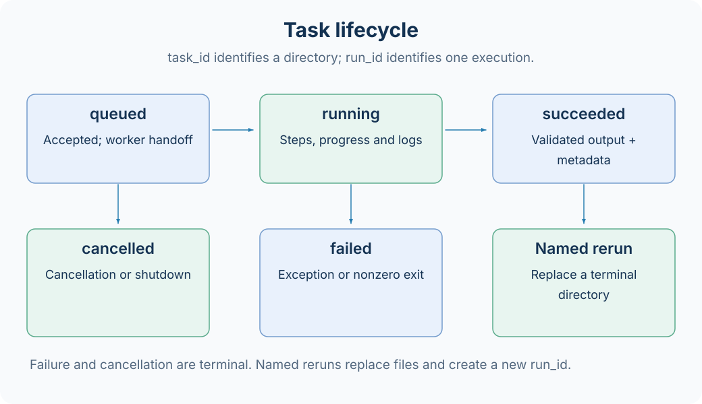

# 任务身份与生命周期

Task ID 标识工作区中的一个任务目录，`run_id` 标识一轮执行。提交受理、执行终态和成功产物发布是不同阶段；正确判断结果需要保存提交返回的 handle，并核对最终状态。



## 三种名字与一个运行标识

| 字段            | 含义                     | 示例                  |
| --------------- | ------------------------ | --------------------- |
| Task 注册名     | 查找定义与输入 Schema    | `demo`                |
| input.task_name | 用户给实例指定的名称     | `trial-01`            |
| task_id         | 类型、注册名和实例名拼接 | `base#demo#trial-01`  |
| run_id          | 每次执行独立生成的标识   | UUID 的十六进制字符串 |

`task_name` 允许 1–32 个英文字母、数字或连字符。省略或传空字符串时，框架使用包含小时级时间前缀和随机后缀的名称。Task ID 中的 `#` 必须保留，shell 中应使用引号。

注意持久状态的 `task_name` 字段当前保存 Task 注册名。实例名称位于 `status.config.task_name`，以及 `metadata.input_params.task_name`。不要用状态顶层的这个字段反推目录后缀。

## 状态含义

| state     | 含义                               | 是否终态 |
| --------- | ---------------------------------- | -------- |
| queued    | 已受理，等待 worker 交接或运行     | 否       |
| running   | 正在执行同步步骤                   | 否       |
| succeeded | 步骤与输出完成，退出码为 0         | 是       |
| failed    | 异常、非零退出码或异常 worker 退出 | 是       |
| cancelled | 取消或管理器关闭导致停止           | 是       |

典型转换为 queued → running → succeeded。queued 和 running 均可能进入 cancelled；步骤异常、输出校验异常或非零退出可进入 failed。

`submit` 没有实现资源排队调度器：queued 是受理交接状态，不能据此假设已有按 GPU、优先级或配额调度的队列。

## 步骤进度

状态中的 `steps` 保存每个已开始步骤的名字、开始结束时间与百分比。Task 可以在步骤内部调用 `report_progress(percentage)`：

- 数值必须处于 0–100。
- 同一步骤不能倒退。
- 步骤正常结束时自动记录 100。
- 失败步骤有结束时间，但不一定为 100。

步骤生成器可以按中间状态动态产生后续步骤，因此当前步骤数量不一定是完整总数。不能简单把“已执行步骤 / 当前步骤数”当成可靠的整项任务百分比。

## 成功记录发布顺序

正常成功执行会依次完成：

1. 所有同步步骤返回。
2. `build_output_params()` 返回正确 output_cls 的实例。
3. 获取输出与退出码；退出码为 0 时写入 metadata。
4. 发布 succeeded 状态。

因此成功状态发布前，metadata 已经写入。失败或取消任务通常只有 status、进度事件和部分产物，没有成功 metadata。Studio 研究列表按 metadata 查找结果，所以任务列表可见不等于研究页面可见。

## 固定名称重跑

```bash
axonx submit --task demo --task-name trial-01 --x 1 --y 2
# 等上一轮进入终态后，才提交同名实验
axonx submit --task demo --task-name trial-01 --x 2 --y 3
```

固定名称对应同一 Task ID。已结束的任务可以被新执行替换，旧任务目录及其中产物会被删除并重新创建；活跃任务不能覆盖。

不同参数的实验比较应使用不同名称，例如 `trial-01`、`trial-02`，或使用默认生成名称。同名重跑并不在一个目录中保存完整历史；历史恢复需要事先备份。

## 等待与取消

`wait_task` 要求 `task_id` 和 `run_id`，防止目录已重跑时读到另一轮结果。`stream_task` 按 Task ID 持续跟踪状态与日志，适合实时观察；需要确认某一轮身份时仍应保留 handle。

```bash
axonx status --task-id 'base#demo#trial-01'
axonx cancel --task-id 'base#demo#trial-01'
axonx cancel --run-id '<run_id>'
```

取消操作接受任意一个 ID：`task_id` 取消在 manager 锁内选定的当前执行；`run_id` 精确取消提交结果或状态中的那次执行，不会取消同名的新 Run。同时指定两个 ID 时会校验当前 Task/Run 是否匹配，不匹配则返回 false；未知 ID 也返回 false。若选定 manager 不管理该活跃 Run，则因无法确认终止而报错。任务很快完成时，取消可能返回 false；这是竞态下的正常情况。关闭服务也会停止其管理的 worker，并将受影响运行记为 cancelled。

文件记录可以恢复查询信息，不能自动恢复一个已中断 Python 进程的内存状态。

[复合 Task](../guides/composite-tasks.md) 在父 worker 中同步执行子 Task，各子 Task 有独立的 Task ID 和 run ID。取消父 Task 来停止该 worker，管理器会将其活动子 Task 收敛为 cancelled；worker 异常退出时则收敛为 failed。即使父 Task 失败，成功子 Task 仍保留自身 metadata。允许子任务失败后继续也会使父 Task 最终失败，后续尝试成功不会清除早先的失败尝试。

## 相关文档

[任务管理](../guides/task-management.md) · [工作区](workspace.md) · [日志与恢复](../guides/operations.md) · [Task 契约](../reference/task-contracts.md)

源码：[身份规则](../../../axonx/task/core/identity.py)、[TaskRunner](../../../axonx/task/runtime/runner.py)、[TaskManager](../../../axonx/components/task_manager/local/manager.py)。
