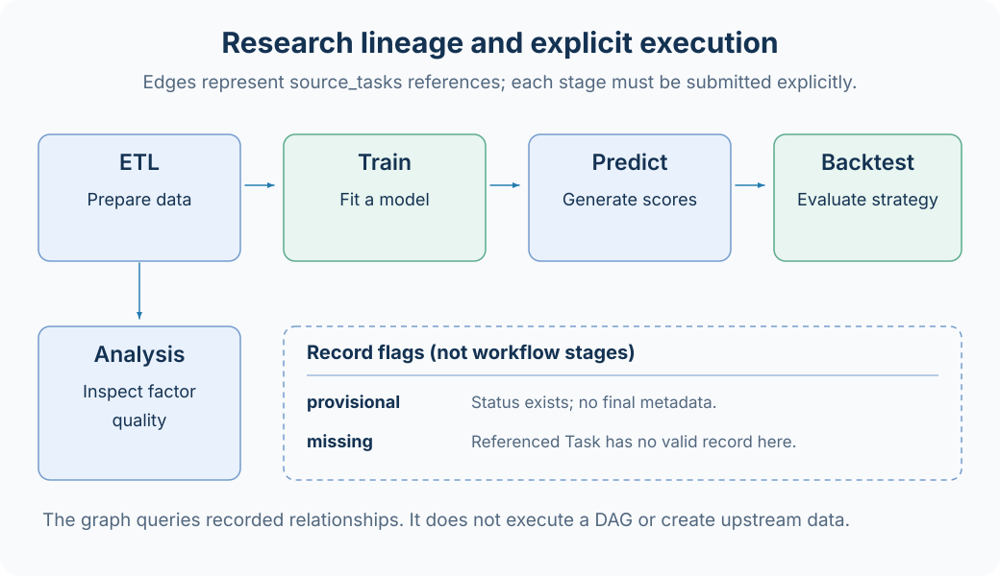
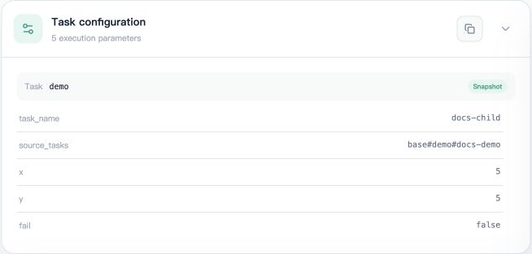

# 任务依赖与血缘

AxonX 用 `source_tasks` 记录某个任务引用了哪些上游 Task。血缘图帮助追溯数据、模型、预测和回测的关系；各阶段仍需要显式提交和确认完成。



## 传入上游身份

所有 BaseInputParams 都有 `source_tasks`，格式为英文逗号分隔的 Task ID 字符串：

```json
{
  "task_name": "prediction-01",
  "source_tasks": "etl#my-etl#dataset-01,train#my-train#model-01"
}
```

这是字符串，不是 JSON 数组，也不是文件路径。解析会验证 Task ID 格式并规范化内容。插件还可以通过 `source_task(TaskType.TRAIN)` 要求恰好一个指定类型的上游，缺少或多个匹配都会报错。

下面仅展示参数组合，`my-predict` 是示例注册名，应先替换成已安装插件的真实定义及必需参数：

```bash
axonx get_task_definition --task '<已安装的预测 Task 注册名>'
axonx submit --task '<已安装的预测 Task 注册名>' \
  --task-name prediction-01 \
  --source-tasks 'etl#my-etl#dataset-01,train#my-train#model-01'
```

基础协议验证 ID 形式，不等于验证上游目录存在、成功、数据口径一致或模型适用。具体 Task 应在读取阶段校验需要的文件与元数据。

## 图从哪里生成

成功 Task 的 metadata.input_params.source_tasks 是最终关系来源。没有成功 metadata 的任务，查询端使用 status.config.source_tasks 生成临时关系。

| 字段 | 解释 |
| --- | --- |
| parent_ids | 当前节点声明的上游 Task ID |
| provisional=true | 有状态记录，尚无最终 metadata |
| missing=true | 某个上游被引用，但工作区没有有效记录 |
| state | 有 status 时的执行状态，可为空 |
| edges.from / edges.to | 从上游指向下游 |

图查询返回与选中任务相连的关系分量，包含上游和下游，并不只返回直接父节点。`root_id` 是图中的根标识，不是“下一步应执行”的调度指令。

## 查询和检查

```bash
axonx get_task_graph --task-id 'predict#my-predict#prediction-01'
axonx get_task_context --task-id 'predict#my-predict#prediction-01'
```

Studio 的任务血缘入口可用于选择节点、查看关联任务和跳转结果。需要精确确认某个节点时，继续检查其 status、metadata 和 artifacts；边存在仅说明引用关系被记录。

下面用两个内置 demo 任务展示记录方式。`docs-child` 的参数快照明确设置 `source_tasks=base#demo#docs-demo`，同时使用自己的 x=5、y=5。



Relationships 区域因此显示 `docs-demo` → `docs-child`。这是用户分别提交两个 Task 后形成的追溯关系；demo 的计算只使用自己的 x/y，不会因为 source_tasks 自动读取上游结果，也不会自动调度下游。


排查回测异常时，通常从 Backtest 向上检查 Predict 的日期、Train 的模型配置，再检查 ETL 的数据窗口。相同注册名不代表相同配置，相同类型也不代表相同数据版本。

## 在插件中读取上游

```python
from axonx.enums import TaskType

train_id = self.input_params.source_task(TaskType.TRAIN)
train_dir = self.source_task_dir(train_id)
```

`source_task_dir()` 定位本机工作区中该 Task 的目录。它不会自动到远端下载上游，也不会执行尚未完成的任务。读取 artifact 时应使用元数据中的相对路径并核对文件存在。

跨机器执行下游前，应明确把所需终态上游目录放到执行机器，并安装相容插件。只把上游 ID 传到远程并不会迁移它的产物。

## 命名和删除的影响

固定名称重跑复用 Task ID 并替换目录。已有下游仍指向同一个 ID，但上游内容可能已经改变；因此需要可追溯实验时，应采用不同实例名称，并保留参数和产物校验和。

删除上游后，下游记录仍可能存在，图上会出现 missing 节点。删除不是级联删除全部后代，也不保证后代可以重新运行。清理实验前先检查连通关系并备份需要复用的结果。

自引用不会形成有效图边；不合法关系在容错读取时可能被忽略。不要把血缘图当作完整的研究逻辑验证器或循环依赖检测报告。

## 相关文档

[任务管理](../guides/task-management.md) · [研究流程](../research/workflow.md) · [工作区](workspace.md) · [Task 契约](../reference/task-contracts.md)

源码：[source_tasks 规则](../../../axonx/task/core/identity.py)、[输入模型](../../../axonx/task/core/params.py)、[关系图](../../../axonx/task/query/graph.py)。
