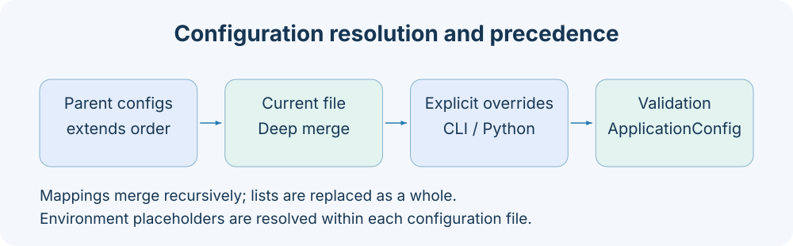

# 框架扩展

框架扩展适用于需要新的长生命周期依赖、异步接口步骤或调用编排的场景。研究算法通常写为同步 Task，沿用 [已有开发指南](../dev_guide.md)；不要为纯研究任务引入服务组件生命周期。



## 选择扩展点

| 扩展点        | 典型职责                       | 执行与状态                         |
| ------------- | ------------------------------ | ---------------------------------- |
| BaseComponent | 连接、缓存、外部资源、托管依赖 | _start/_close，应用生命周期        |
| BaseStep      | 调用组件、组合结果、发送事件   | async execute，每次 Job 新实例     |
| PipelineJob   | 顺序组合多个 Step              | 公共 Schema、defaults、最终结果    |
| BaseJob       | 需要自定义事件执行契约         | 自己实现 stream(arguments, system) |
| BaseTask      | 研究数据计算与产物发布         | 同步步骤；submit 可启动 worker     |

Job 是 Application 内的异步编排；Task 的步骤是同步函数。两者的 Step 名称相似，基类与执行边界不同。

## Provider 与局部 registry

`@provider("backend")` 声明类的实现名。框架自带的 axonx 模块会注册为 built-in；外部 Python 类只声明身份，不自动污染全局注册表。嵌入应用需通过 Application(providers=...) 或合法插件 manifest 交给当前应用。

同一 registry 的（类别，backend）不能有不同所有者；相同实现与所有者重复注册可幂等。装配完成后 registry 冻结。名字属于配置契约，不应用类名猜测。

## 可运行的 Component、Step、Job 示例

以下独立脚本在临时工作区创建一个 formatter 组件，通过 Step 读取文本并返回格式化结果，不需要启动 HTTP 服务。

```python
import asyncio
import tempfile
from pathlib import Path
from axonx import Application, BaseComponent, BaseStep, provider
from axonx.components.job import ProgressEvent

@provider("prefix_formatter")
class PrefixFormatter(BaseComponent):
    component_type = "formatter"

    def __init__(self, prefix="AxonX: ", **kwargs):
        super().__init__(**kwargs)
        self.prefix = prefix

    async def _start(self):
        self.logger.info("formatter ready")

    async def _close(self):
        self.logger.info("formatter closed")

    def format(self, text):
        return self.prefix + text

@provider("format_text")
class FormatTextStep(BaseStep):
    async def execute(self):
        formatter = self.get_component("formatter", "default")
        self.response.answer = formatter.format(self.context["text"])
        await self.emit(ProgressEvent(name="formatted", percentage=100))

async def main():
    with tempfile.TemporaryDirectory() as directory:
        config = {
            "workspace_dir": str(Path(directory) / "workspace"),
            "log_dir": str(Path(directory) / "logs"),
            "log_to_console": False,
            "log_to_file": False,
            "components": {
                "formatter": {"default": {
                    "backend": "prefix_formatter", "prefix": "AxonX: "
                }}
            },
            "jobs": {
                "format": {
                    "description": "Format a text value.",
                    "parameters": {
                        "type": "object",
                        "properties": {"text": {"type": "string"}},
                        "required": ["text"],
                        "additionalProperties": False,
                    },
                    "steps": [{"backend": "format_text"}],
                }
            },
        }
        async with Application(
            providers=(PrefixFormatter, FormatTextStep), **config
        ) as app:
            response = await app.run_job("format", {"text": "hello"})
            assert response.success
            assert response.answer == "AxonX: hello"
            print(response.model_dump(mode="json"))

asyncio.run(main())
```

Application 中组件先启动，再启动 Job；关闭反序。Step 在执行时取组件，避免跨请求保存 self.context 或把连接放进模块全局。这里 formatter 已启动才可被调用，Step 自身不承担 _start/_close。

## 声明组件依赖

托管组件之间用 depend 声明，ComponentGraph 校验并注入：

```python
@provider("report_cache")
class ReportCache(BaseComponent):
    component_type = "report_cache"

    def __init__(self, formatter="default", **kwargs):
        super().__init__(**kwargs)
        self.depend("formatter", formatter, PrefixFormatter)

    async def _start(self):
        self.logger.info(self.formatter.format("cache ready"))
```

这段接在前例类定义后；在 providers 中加入 ReportCache 类，并在 components 中配置其命名实例。depend 的 attribute 必须是合法标识符，不能重复；required=true 时必须给实例名。expected base 必须声明非 BASE 类别。依赖缺失、类型不匹配、环路都在启动前失败。

启动失败会回滚已成功启动的资源；关闭会尝试所有资源，不因第一个异常中断清理。_start 中部分分配的资源应能在 _close 中释放，确保失败启动也可回滚。

## 参数、默认值与 system

PipelineJob 使用 RuntimeContext：按 defaults → caller arguments → system 递归合并，再深拷贝执行 context。嵌套覆盖保留未指定的默认字段，列表和标量整体替换，空对象保留已有嵌套字段。公共参数先由 JSON Schema 校验；Schema 内的 default 不自动补齐必填参数。defaults 用于执行 context，不替代公共输入的 required 校验。

```yaml
jobs:
  format:
    parameters:
      type: object
      properties:
        text: { type: string }
      required: [text]
      additionalProperties: false
    defaults:
      internal_mode: simple
    steps:
      - backend: format_text
```

Step 可声明 injected_parameters，用于框架拥有的 system 字段。它们不能与公共 properties 冲突，也不能由 caller 传入。agent_depth 就是内置实例；不应在对外示例中让用户提交它。target 是保留的传输选择字段，不能声明成 Job 业务参数。

## 事件与结果

Step 通过 `await self.emit(...)` 发送 ProgressEvent、LogEvent、ArtifactEvent 或 AgentMessageEvent；通过 self.response 设置 answer、success、metadata。PipelineJob 最后统一生成 ResultEvent，因此普通 Step 不应自行构造重复终态。

默认事件缓冲 64 项；emit 会在缓冲满时等待，实现有界背压。耗时同步计算或文件操作应放线程、Task worker 或其他适合的执行层，避免阻塞应用事件循环。

Step 抛异常会被 pipeline 转为失败结果；设置 success=false 后剩余 Step 不再执行。客户端看到最终 result 才能确定业务结束，见 [事件协议](../api/events.md)。

## manifest 扩展边界

插件可贡献 BaseComponent 类、JobConfig 与 BaseTask。Component 类别必须与声明匹配；manifest 描述 backend，应用配置描述命名实例。

当前插件 loader 用 BaseComponent 校验组件类；BaseStep 只继承 ComponentBase，不能直接通过 manifest components.step 加载。自定义 Step 使用 `Application(providers=...)` 注入。插件 Job 可以组合内置 Step；manifest 的 `components.step` 不支持直接加载 BaseStep 子类。

更多包协议见 [插件 manifest](../reference/plugin-manifest.md)。

## 验证范围

扩展验证应覆盖实际风险：Provider 冲突、依赖缺失/环路、启动回滚、关闭异常聚合、输入 Schema、普通结果与流式终态的一致性，以及断开消费时的资源清理。对研究 Task 另验证 typed input/output、失败状态与产物路径。

新增 backend 后先用最小 Application(providers=...) 验证，再接真实服务、插件环境和 Studio 表单；不要把 UI 能生成表单等同于 Task 研究逻辑已经正确。

实现依据：`axonx/components/base.py`、`axonx/components/registry.py`、`axonx/core/graph.py`、`axonx/core/composition.py`、`axonx/steps/base.py`、`axonx/components/job/pipeline.py` 与 `axonx/components/job/context.py`。

## 实时采集、在线推理与预测比对

`axonx.task.contracts` 导出三个可选的任务编写合同：

- `BaseRealtimeApiTask`（`api`）：实现 `collect(window, budget)`。返回 `None` 继续轮询，或返回状态为 `done`、`skipped`、`incomplete` 的 `WindowResult`。异常记录失败窗口并停止任务。
- `BaseInferenceTask`（`inference`）：在 `initialize_run` 中解析单个模型并设置非空 `model_identity`，实现 `inputs_ready` 和 `infer`。输入等待超时记录 `incomplete`；数据质量、历史新鲜度异常记录 `failed` 并停止任务。初始化时复制模型身份用于审计；插件也必须固定实际 Predictor。
- `BasePredictionCompareTask`（`analysis`）：实现 `compare(key)`，返回 `PredictionComparison`。状态包括 `consistent`、`different`、`protocol_mismatch`、`missing`、`error`。逐项隔离异常，即使单项失败也完成汇总报告。此合同不继承因子分析的 rows/scores。

窗口输入包含按开始时间排序、key 唯一的 `ExecutionWindow`，其 `start_at`、`end_at` 必须带时区，另有正数 `poll_interval_seconds`。等待与耗时使用共享 `WindowClock`，测试可注入假时钟。`DeadlineBudget.remaining_seconds` 使用单调时钟，插件必须据此限制每次请求超时、重试及退避。此工具无法强制中断同步钩子。已错过的窗口标记 skipped；超过截止时间返回的结果不能标记 done。

插件可实现 `window_skip_reason(window)`，在等待前跳过不适用的业务窗口（例如休市），并在审计记录中保留原始时间安排。

`initialize_run` 获取任务拥有的资源；成功、初始化失败或执行失败后都会调用 `close_run`。清理异常不替代主异常。进程取消仍由现有 worker/task manager 管理，插件不新增进程调度器。

原子发布的 `manifest.json` 在执行期间记录模型身份与已结束窗口，任务失败时也保留；`comparison.json` 逐项记录比对结果。成功输出通过 `artifacts` 索引报告，路径相对任务目录。TaskRunner 继续独占任务状态、身份及 metadata。业务数据保存在插件显式目录，先发布数据与元数据，再发布 ready 标记。最终数据发布、质量检查、归一化、交易日历与通知语义由插件负责；AxonX 不新增 Tushare 或模型依赖。

算法验证与模型等价性由研究插件负责。

## 复合 Task 与清理

同步业务顺序、条件和循环使用 `BaseCompositeTask`，通过内置 `submit` Job 只提交父任务。子任务在父任务 worker 内执行并保留独立记录，数据依赖显式传入 `source_tasks`。详见 [复合 Task](../guides/composite-tasks.md)。

插件清单注册 Task；部署配置可以定义轻量 `pipeline` Job 和定时任务：

```yaml
extends: default
jobs:
  refresh:
    backend: pipeline
    defaults:
      task: refresh_data
    steps:
      - backend: submit_task
schedules:
  refresh:
    job: refresh
    cron: "0 16 * * *"
```

共享数据锁及业务重叠策略由业务 Task 负责；复合 Task 不提供分布式锁。调度并发策略只覆盖 Job 调用，提交 Job 在后台 Task 完成前已经返回。TaskManager 监督已受理 worker，并负责停机和取消。取消父 Run 会停止同进程子任务；关闭提交 Job 不会取消已受理的 Task。

Task manager 实现 `cancel(task_id=None, run_id=None)`，至少提供一个 ID：`task_id` 在 manager 锁内选定当前执行，`run_id` 精确指定某个 Run。同时提供两个 ID 时会校验当前身份，不匹配则返回 false。需要精确清理某次执行时传 `run_id`。

同步 `BaseTask.close()` 在步骤执行后释放资源，包括步骤和初始化失败。清理失败不会覆盖原步骤异常。`on_failure(error)` 可在步骤、输出构造或清理失败时保存业务摘要，失败状态仍由 runner 管理。强制终止进程时不能保证回调执行。

内置 Tushare client 负责关闭自己创建的 session。`retry_rate_limit_forever=True` 按 `rate_limit_retry_seconds` 持续重试频率超限，其他限制仍采用有限重试。`query` 和 `query_has_more` 接收可选 `DeadlineBudget`，限制等待及连接／读取超时，不会把它传给 API。Requests 的超时不保证请求的总耗时，缓慢持续返回的响应可能超过截止时间。收包、JSON 解析、DataFrame 构建和分页合并后检查预算，拒绝超时结果；这些检查不会中断正在执行的网络或计算工作。无截止时间时，频率重试持续到成功或 worker 终止。内置钉钉的 `send_dingtalk_message` 与通知 Task 共用经过校验的环境配置。

## 股票持仓策略

`BaseStockBacktestTask.portfolio_policy()` 向共用股票成交账本提供可选的 `PortfolioPolicy`。插件实现 `replacement_limit(n)` 和 `should_exit(rank=..., age=..., n=...)`；决策只接收当日合格候选排名与已持有的市场日数。引擎在首次建仓后限制每侧实际成交数量，优先退出最差排名，并统一处理报价校验、现金、费用与产物。策略持仓没有固定计划退出日期。[Alpha158 Strategy](../../../plugins/a158_strategy/README_ZH.md) 使用此扩展。
