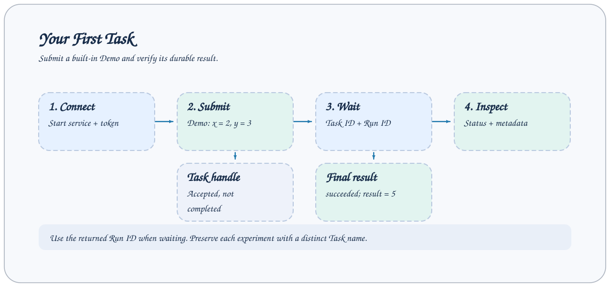

# 快速开始

本页使用内置 `demo` Task 完成安装、服务连接、异步提交、等待和产物检查。Demo 只对两个整数求和，不需要 Tushare、钉钉或模型凭据。



## 安装

AxonX 要求 Python 3.12 或更高版本，本地 TaskManager 支持 macOS 与 Linux。创建虚拟环境：

```bash
python -m venv .venv
source .venv/bin/activate
pip install axonx
axonx help
```

需要预构建的浏览器界面时，使用 `pip install "axonx[studio]"`。开发工具通过 `axonx[dev]` 安装，`axonx[full]` 包含两者。

### 从源码安装

```bash
git clone https://github.com/FlowLLM-AI/AxonX.git
cd AxonX
pip install -e ".[studio]"
```

安装前激活虚拟环境。此方式使用核心源码和已发布的 Studio 资源。修改前端见 [Studio 开发](../development/studio.md)，开发依赖见[贡献指南](../../../CONTRIBUTING_ZH.md)。

研究插件单独安装，见[研究工作流](../research/workflow.md)。

## 配置并启动服务

在终端 A 设置自己的服务 token，再启动：

```bash
export AXONX_SERVICE_TOKEN='replace-with-your-local-service-token'
axonx start --service.host 127.0.0.1
```

默认端口是 `1024`，工作区是当前目录下的 `.axonx`，日志目录为 `logs`。服务保持运行，下面的调用在终端 B 执行。终端 B 激活同一 Python 环境，并设置与服务相同的 token：

```bash
source .venv/bin/activate
export AXONX_SERVICE_TOKEN='replace-with-your-local-service-token'
axonx version
```

预期返回 `success: true` 的 `JobResponse`。默认 Job 要求鉴权；未配置服务 token 时，它们不会出现在公开目录。完整规则见[鉴权与权限边界](../guides/authentication.md)。

检查健康和公开目录：

```bash
curl -sS http://127.0.0.1:1024/health \
  -H "Authorization: Bearer $AXONX_SERVICE_TOKEN"
curl -sS http://127.0.0.1:1024/jobs \
  -H "Authorization: Bearer $AXONX_SERVICE_TOKEN"
```

`/health` 应返回 `answer.running: true`。`/jobs` 描述本服务对外暴露的 Job，Task 定义通过下一步查询。

端口被占用时，将服务启动命令改成 `axonx start --service.host 127.0.0.1 --service.port 8181`。客户端命令追加 `--target 127.0.0.1:8181 --token "$AXONX_SERVICE_TOKEN"`，curl 地址也相应改为 `8181`。

## 发现并提交 Demo

查看 Demo 的说明与输入输出 Schema：

```bash
axonx get_task_definition --task demo
```

输入必填 `x` 和 `y`，`fail` 默认为 `false`。首次提交时使用明确的实例名，便于查找：

```bash
axonx submit --task demo --task-name first-demo --x 2 --y 3
```

预期响应示例：

```json
{
  "answer": {
    "task_id": "base#demo#first-demo",
    "run_id": "<本次返回的运行标识>",
    "task": "demo"
  },
  "success": true,
  "metadata": {}
}
```

保留实际返回的 `run_id`。`success: true` 表示提交已接受，接下来仍需检查 Task 最终状态。

## 等待并检查结果

将运行标识替换为上一步真实值：

```bash
axonx wait_task --task-id 'base#demo#first-demo' \
  --run-id '<实际返回的 run_id>' --client-timeout 120
axonx status --task-id 'base#demo#first-demo'
axonx read_task_log --task-id 'base#demo#first-demo'
```

最终状态应为 `succeeded`，`result.result` 为 `5`。`wait_task` 同时检查 Task ID 与 run_id，避免等待到同名重跑的其他执行。

也可以在任务运行时跟随进度和日志：

```bash
axonx stream_task --task-id 'base#demo#first-demo' --stream true
```

Demo 很快结束，跟随命令可能直接读到终态。对于长任务，根据实际时长调整 `--client-timeout`；它是客户端请求超时，不是 Task 执行时限。

## 查看持久化记录

成功任务目录中包含 `status.json`、`events.jsonl` 和 `metadata.json`：

```text
.axonx/
  base/
    base#demo#first-demo/
      status.json
      events.jsonl
      metadata.json
```

通过工作区 API 读取元数据：

```bash
axonx preview_file --path 'base/base#demo#first-demo/metadata.json'
```

`metadata.json` 的 `input_params` 记录参数，`output_params.result` 为 `5`。Demo 没有额外数据文件，因此 `artifacts` 为空是正常结果。路径相对服务的工作区；运行日志通过状态中的 `log_path` 指向另行配置的日志目录。

## 在当前进程执行

不需要常驻服务时，用不同实例名执行：

```bash
axonx exec --task demo --task-name direct-demo --x 2 --y 3
```

命令完成后直接打印 Task 输出。`exec` 与 `submit` 的执行入口不同，但共享 Task 输入输出与持久记录格式。

固定 `task_name` 不是不可变版本号：再次执行相同注册名和实例名，会替换已结束任务目录；活跃任务不能被同名提交覆盖。需要保留多个实验时，使用不同名字或省略 `task_name` 让框架生成。详见[任务身份与生命周期](../concepts/task-lifecycle.md)。

## 下一步

- 使用 [Studio](studio.md) 在浏览器提交和查看同一工作区的任务。
- 按[量化研究流程](../research/workflow.md)安装研究插件并准备数据。
- 查询完整[CLI 参数](../reference/cli.md)、[服务端配置](../reference/configuration.md)与 [Task API](../api/tasks.md)。

启动失败、鉴权失败或产物缺失时，见[常见问题](../faq.md)和[日志排障](../guides/operations.md)。
