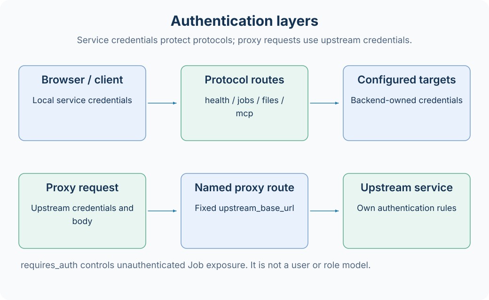

# 鉴权与权限边界

AxonX 服务使用一个 Bearer token 保护协议调用。这个凭据代表对服务公开能力的访问，不是按用户、项目或角色细分的权限模型。配置 token 是运行默认任务 Job 的必要入门步骤。



## 配置服务凭据

默认配置读取 `AXONX_SERVICE_TOKEN`：

```bash
export AXONX_SERVICE_TOKEN='<自行生成的服务 token>'
axonx start
```

显式 YAML 可使用环境展开：

```yaml
extends: default
service:
  token: ${AXONX_SERVICE_TOKEN}
```

非空 token 才是有效凭据；修改配置或环境后需要重启服务。示例中的占位符不是可复用的真实凭据。

## 协议保护范围

| 路由 | 配置服务 token 后 |
| --- | --- |
| /health | 需要 Bearer |
| /jobs 及其子路径 | 需要 Bearer，包括 SSE |
| /files 及其子路径 | 需要 Bearer |
| /mcp 及其子路径 | 需要 Bearer |
| Studio 静态页面 | 不由协议 token 拦截，API 仍需凭据 |
| /proxy/{name} | 使用上游鉴权，不检查服务 token |

预检 OPTIONS 不执行这份 Bearer 校验。允许跨源请求不是允许无凭据执行 Job，真实协议调用仍需鉴权。

```bash
curl -fsS 'http://127.0.0.1:1024/jobs' \
  -H "Authorization: Bearer $AXONX_SERVICE_TOKEN"
```

token 用完整 `Authorization: Bearer <token>` header 传入，不是查询参数。MCP Streamable HTTP 客户端也应设置相同 header。

## 为什么没有 token 时 Job 目录缺失

Job 默认 `requires_auth: true`。没有配置服务 token 时，这些 Job 不进入公开目录；只有 is_servable 且不要求鉴权的 Job 才能公开。

```yaml
jobs:
  public_version:
    requires_auth: false
    steps:
      - backend: version_step
```

这是显式公开低风险版本查询的配置示例。`requires_auth: false` 只影响“无 token 的服务是否暴露这个 Job”；服务一旦启用了 token，它仍受协议层 Bearer 校验。

因此目录缺少 Job 与 HTTP 401 是两种不同情况：前者先检查服务的公开筛选条件，后者检查请求凭据。

## CLI 与远程凭据

| 调用方式 | 默认凭据来源 |
| --- | --- |
| CLI 未显式 --target | AXONX_SERVICE_TOKEN |
| CLI 显式 --target | AXONX_TARGET_TOKEN |
| CLI --token | 覆盖默认环境来源 |
| Studio 本机 API | 浏览器设置中的本机 token |
| Studio 后端转发 | 本机服务配置 targets[].token |

```bash
export AXONX_TARGET_TOKEN='<目标服务 token>'
axonx version --target 'https://research.example:443'
```

不要将目标 token 填到本机 Studio 设置里。Studio 先向本机协议鉴权，随后本机服务用 targets 中的凭据向目标鉴权。

Python 客户端应显式传 token，除非调用代码自己实现环境变量读取；不要把 CLI 的自动加载规则推广到每个客户端类。

## Studio 保存 token

在 Studio 的设置/连接凭据入口填入本机服务 token，然后重新加载 Job 目录。token 的作用域是当前浏览器的本机连接；共享浏览器资料可能共享这些设置。

页面可以在未设置 token 时加载，但任务定义、资源和研究查询会失败。截图与分享配置时，应移除真实凭据和机器信息。

## 能力权限的实际范围

有权调用公开 Job 的客户端可以使用该目录中的能力。默认目录包含 shell、插件安装、任务删除与文件删除等操作，应按部署场景理解这个 token 的访问范围。

`enable_serve: false` 可阻止某个 Job 被协议公开，供内部调度使用。隐藏页面入口并不等于关闭后端 Job，应以实际 `/jobs` 和服务配置为准。

Agent 的默认 Job 工具列表主要包含查询能力，但 SDK 工具、project settings、cwd 和 permission_mode 仍会影响它的权限。默认 Agent 使用 bypassPermissions，不能据查询列表断言整个 Agent 是只读的。

代理路由传递上游请求凭据，其作用与远程 Job 转发不同。不要把服务 Bearer token 误用为数据源 token。

## 排查凭据问题

1. 先确认请求到达哪台服务，核对地址与执行机器。
2. 用带 Bearer 的 `/health` 检查协议访问。
3. 查询 `/jobs`，确认 Job 已公开。
4. Studio 转发失败时分别检查本机和目标凭据。
5. 检查服务是否在更新 token 后重启。

[远程机器](remote-machines.md) · [API 总览](../api/overview.md) · [Agent 配置](../agent/configuration.md) · [HTTP 代理](http-proxy.md)

源码：[鉴权与公开筛选](../../../axonx/components/service/http/app.py)、[Job 配置](../../../axonx/config/models.py)、[CLI token 加载](../../../axonx/cli/main.py)。
