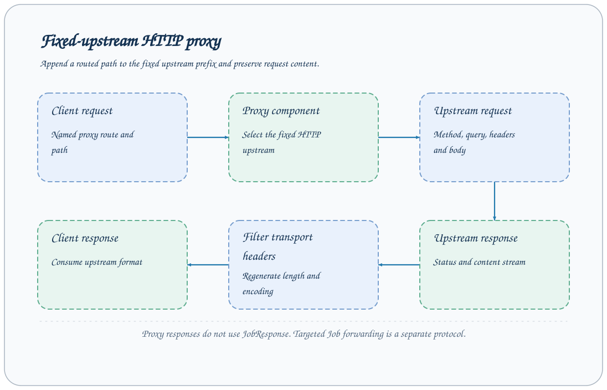

# HTTP 上游代理

命名 proxy 组件把 `/proxy/{name}` 请求转发给配置的固定 HTTP(S) 上游，保留请求方法、查询、端到端头和正文。这个入口直接使用上游格式，不经过 JobResponse 封装，也不同于 targets 的远程 Job 转发。



## 启用一个代理

创建 `proxy.yaml`：

```yaml
extends: default
components:
  proxy:
    tushare:
      backend: http
      upstream_base_url: ${AXONX_PROXY_UPSTREAM}
      timeout: ${AXONX_TUSHARE_PROXY_TIMEOUT:-600}
```

```bash
export AXONX_PROXY_UPSTREAM='https://data.example/api'
export AXONX_SERVICE_TOKEN='<服务 token>'
axonx start --config proxy.yaml
```

上游地址是占位示例，替换为实际兼容接口。本例使用独立环境变量 AXONX_PROXY_UPSTREAM，避免与数据 Task 的 AXONX_TUSHARE_BASE_URL 混淆。默认配置的注释示例使用后者；同一服务运行代理和 Task 时，应分别设置上游地址与客户端代理地址，避免转发回自身。默认 proxy 未启用，该名字请求返回 Unknown proxy。

upstream_base_url 必须是含主机的 HTTP(S) URL；timeout 必须大于 0。地址固定在服务配置中，客户端不能通过参数选择任意上游。

## 路径如何映射

| 客户端路由                         | 示例上游                       |
| ---------------------------------- | ------------------------------ |
| /proxy/tushare                     | https://data.example/api/      |
| /proxy/tushare/query               | https://data.example/api/query |
| /proxy/tushare/query?date=20260105 | 同路径并保留 query             |

name 选择 proxy 组件，后续 path 追加到上游前缀。包含 `.`、`..` 路径段或试图逃离前缀的路径会被拒绝。

支持 DELETE、GET、HEAD、OPTIONS、PATCH、POST、PUT。查询参数按多值形式转发，正文以内容流传递；代理不主动解析研究字段。

## 调用示例

以兼容 JSON POST 上游为例：

```bash
curl -sS 'http://127.0.0.1:1024/proxy/tushare/trade_cal' \
  -H 'Content-Type: application/json' \
  -d '{"api_name":"trade_cal","token":"<上游数据源 token>","params":{"start_date":"20260105","end_date":"20260105"},"fields":""}'
```

请求字段由上游协议决定。示例不会使用服务 token 代替数据源 token；真实使用仍需满足数据源权限和调用额度。

也可以发送上游要求的 Authorization header。代理不会自动把配置中的 service.token 转换成上游凭据。

## 鉴权与请求头

`/proxy` 不属于服务 Bearer 保护的协议根。即使服务启用 token，proxy 仍按上游请求自身的鉴权规则处理；部署入口应按所需暴露范围配置。

代理保留端到端请求头，但移除 host、connection 等逐跳头及 Connection 声明的头。host 由选定上游生成。

响应按上游状态码返回，保留端到端响应头。httpx 解码响应内容后，content-encoding/content-length 会被移除或重新生成，避免把解码正文配上旧传输头。

## 超时与错误

| 情况                 | 结果                 |
| -------------------- | -------------------- |
| 名字不存在           | 404 Unknown proxy    |
| 非法代理路径         | 422 请求错误         |
| 上游连接失败         | 502 网关错误         |
| 上游超时             | 504 网关超时         |
| 上游正常返回 4xx/5xx | 保留上游状态与响应体 |

代理响应没有 `success`、`answer` 包装，客户端应按 HTTP 状态和上游正文判断。Job 转发的业务 success=false 和 proxy 错误是不同诊断路径。

服务日志记录代理方法与路径；上游拒绝时同时检查上游 token、字段和权限，不要只改 AxonX 服务 token。

## Tushare 使用路径

download_tushare_task 的客户端读取环境变量 `AXONX_TUSHARE_BASE_URL`。将它设为代理根地址 `http://127.0.0.1:1024/proxy/tushare`，客户端会追加 API 名，例如 `/trade_cal`，再由代理访问配置上游。代理不自动下载数据、不改交易日，也不提供数据缓存。

源服务负责固定上游连接，数据 Task 仍负责自己的凭据、参数、重试与 Parquet 写入。详见[Tushare 数据下载](../research/tushare.md)。

[鉴权](authentication.md) · [远程机器](remote-machines.md) · [部署](deployment.md)

源码：[HTTP proxy](../../../axonx/components/proxy/http.py)、[proxy 路由](../../../axonx/components/service/http/proxy.py)、[proxy 错误](../../../axonx/components/proxy/base.py)。
