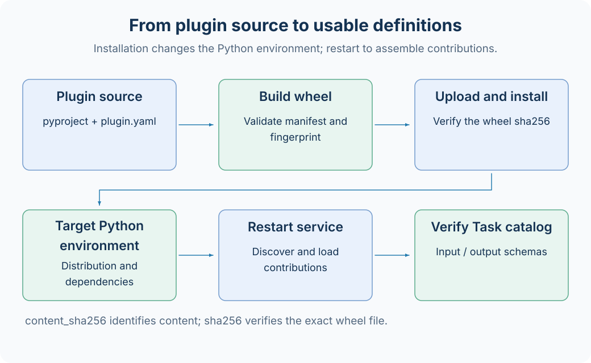

# 插件安装与部署

插件是提供 AxonX Task、Component 和 Job 的 Python 包。本地管理命令操作当前 Python 环境，只有显式 `--target` 才操作远程服务。构建与安装会读取插件代码和依赖，安装后通常需要重启服务重新装配贡献。



## 三种名称

| 名称         | 用途                     | 来源                           |
| ------------ | ------------------------ | ------------------------------ |
| distribution | Python 包安装与卸载      | pyproject.toml 的 project.name |
| plugin name  | 发现与区分插件入口       | axonx.plugins entry point      |
| Task 注册名  | submit / exec / 定义查询 | plugin.yaml 的 tasks           |

这三个名字可能不同。不要把 distribution 名直接传给 `--task`，先查看插件贡献中的 Task 注册名。

## 查看当前环境

```bash
axonx plugin list
axonx plugin show '<distribution 或插件名>'
axonx plugin inspect '<distribution 或插件名>'
```

查看字段包括 distribution、version、入口名、requirements 和贡献。Task 注册名仍需进一步用定义接口获取输入输出 Schema。

本地 CLI 直接检查当前环境，不经 HTTP。服务使用另一虚拟环境时，CLI 本地结果不一定代表常驻服务环境。

## 从源码构建和检查

仓库中的 a158 目录可作为源码路径示例：

```bash
axonx plugin inspect ./plugins/a158
axonx plugin build ./plugins/a158 --output ./dist/plugins
```

源码构建需要 pyproject、manifest 和有效贡献，工具会构建 wheel 并检查内容。构建不是运行研究任务，也不需要提交 Task。

没有 `--output` 时，CLI 默认缓存位于当前目录的 `.axonx/plugins/artifacts/<content_sha256>`。这个缓存路径由插件 CLI 自己选择，不自动跟随另一个服务的 workspace_dir。

对已有 wheel 可直接 inspect/install，但不能同时指定 `--output`：

```bash
axonx plugin inspect './dist/plugins/<实际 wheel 文件名>.whl'
```

## 本地安装

```bash
axonx plugin install ./plugins/a158
# 插件开发时可选 editable，只改变当前环境
axonx plugin install -e ./plugins/a158
```

editable 只能用于本地源码目录，不支持 `--target` 或 `--output`。开发时源码变化可以被环境读取，但常驻 Application 中已装配的 Job/Component 仍应通过重启重新加载。

服务配置的 `plugins.sources` 可在启动时安装来源，路径解析见[配置参考](../reference/configuration.md)。已安装且有效的插件通过入口点发现，不使用一个照搬其他项目的显式启用列表。

## 部署到远程

```bash
export AXONX_TARGET_TOKEN='<远程服务 token>'
axonx plugin list --target 'http://research.example:1024'
axonx plugin install ./plugins/a158 --target 'http://research.example:1024'
```

CLI 在本机把源码构建为 wheel，上传到远程 `/files`，核对返回 sha256，再调用远程 install_plugin，并在结束后清理暂存文件。安装 Job 在目标服务的 Python 环境运行。

`plugin build` 只在本机执行，不支持 `--target`。远程 inspect 用于查询目标已安装插件，而不是把本机源码目录传到目标后检查。

## 校验和与重启

| 字段             | 解释                                        |
| ---------------- | ------------------------------------------- |
| content_sha256   | 内容/源码指纹，用于构建缓存和内容识别       |
| sha256           | 具体 wheel 文件的校验和，用于传输与安装核验 |
| restart_required | 当前应用需重启以重新装配插件贡献            |

两个 sha256 字段并不保证相同：wheel 的压缩与包内容封装会改变具体文件字节。安装接口应传上传回执的 wheel sha256，不传源码指纹。

安装成功只代表环境变更完成。按 restart_required 重启执行服务，之后查询：

```bash
axonx list_installed_task_definitions --target 'http://research.example:1024'
axonx get_task_definition --task '<插件 Task 注册名>' \
  --target 'http://research.example:1024'
```

## 卸载与排障

```bash
axonx plugin uninstall '<distribution 或插件名>'
axonx plugin uninstall '<distribution 或插件名>' \
  --target 'http://research.example:1024'
```

卸载影响后续加载代码，不自动删除历史研究产物。已有 metadata 仍可读，但重跑可能需要恢复原插件版本。

| 问题                 | 检查                                        |
| -------------------- | ------------------------------------------- |
| 注册名冲突           | 插件贡献是否与内置或其他插件同名            |
| manifest 无效        | 类型、module:Class、Task docstring 与类基类 |
| 安装成功但 UI 没更新 | restart_required、目标机器、运行环境        |
| wheel 校验失败       | 使用上传回执 sha256，重新传输正确文件       |
| 缺模型依赖           | 检查 requirements 与目标环境的设备库        |

[插件 manifest](../reference/plugin-manifest.md) · [远程机器](remote-machines.md) · [已有开发指南](../dev_guide.md)

源码：[插件 CLI](../../../axonx/plugin_kit/cli.py)、[wheel 构建](../../../axonx/plugin_kit/wheel.py)、[安装器](../../../axonx/plugin_kit/installer.py)。
