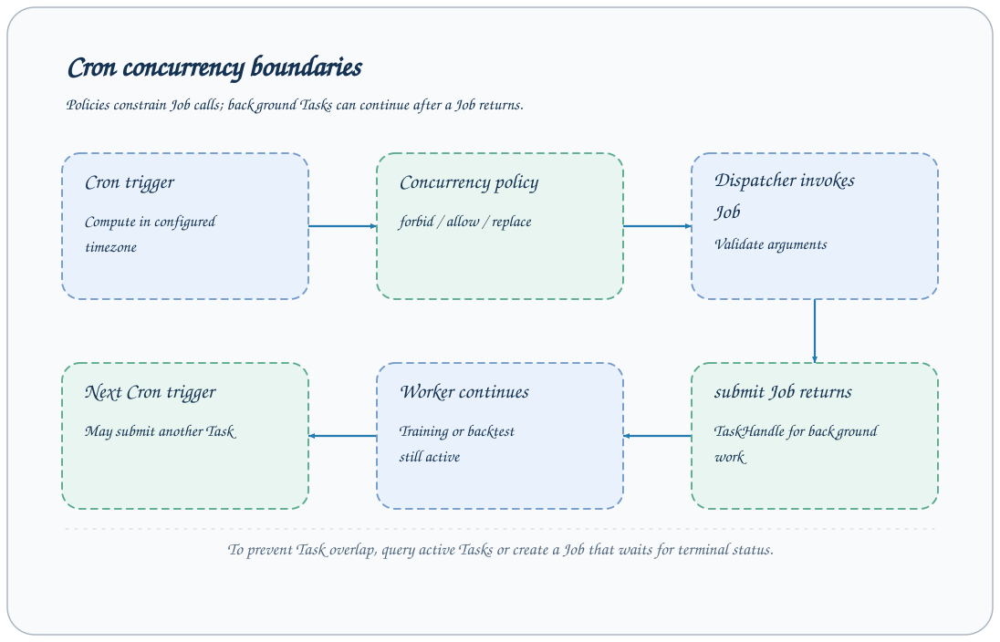

# 定时 Job 调度

Scheduler 按 Cron 和时区触发配置中的 Job，传入固定 arguments。默认 `schedules` 为空，没有后台定时研究。调度并发策略限制的是被调用 Job 的生命周期，提交后继续运行的 Task 需要单独控制。



## 最小配置

下面每小时调用一次版本 Job，适合检查调度配置且不产生外部副作用：

```yaml
extends: default
schedules:
  hourly_version:
    backend: cron
    job: version
    cron: "0 * * * *"
    timezone: Asia/Shanghai
    arguments: {}
    concurrency_policy: forbid
```

```bash
axonx start --config scheduled.yaml
```

将配置保存为 scheduled.yaml 后再运行命令。Scheduler 与服务在同一 Application 内启动，不需要单独部署另一调度进程。

启动时检查 Job 是否存在，并用该 Job 的 Schema 校验 arguments。不合法 Cron、未知时区、未知 Job 或参数错误都会阻止正常启动，不能靠等到触发时再解决。

## Cron 与时区

| 示例 | 意图 |
| --- | --- |
| `* * * * *` | 每分钟 |
| `0 * * * *` | 每小时整点 |
| `0 18 * * 1-5` | 工作日 18 点 |
| `30 2 * * *` | 每天 2:30 |

默认调度时区使用 Application 的 timezone，默认 Asia/Shanghai；每个 schedule 可覆盖。

实现使用 croniter 计算下一次时间。这不是交易日历，工作日表达式也不能排除节假日或闭市日。数据下载、训练和回测必须自行验证需要的交易日范围。

服务必须运行到触发时刻。当前循环计算下一次执行，没有持久化补跑历史错过触发的队列，也不保证停机期间的调度自动补偿。

## 传入 Job 参数

```yaml
schedules:
  daily_demo:
    backend: cron
    job: submit
    cron: "0 18 * * 1-5"
    arguments:
      task: demo
      x: 1
      y: 2
    concurrency_policy: forbid
```

省略 task_name 每次生成独立 Task ID，可以保留多轮结果。使用固定名称会在终态后替换同名目录，任务仍活跃时下一次提交失败。

`submit` 的外层 Schema 允许透传参数，具体 Task 的字段仍由 input_cls 验证；调度启动通过不代表所有插件运行前置条件都成立。

## 并发策略

| 策略 | 上次 Job 仍在运行时 |
| --- | --- |
| forbid | 跳过新触发并记录日志，默认值 |
| allow | 同时执行新的 Job |
| replace | 取消旧 Job 调用，等待取消，再触发新调用 |

例如 submit 几乎立即返回 TaskHandle，但训练 worker 可以继续数小时。此时 forbid 看见 submit Job 已结束，下次仍会提交新的训练 Task。

replace 取消的是 asyncio Job 调用，不应被解释为取消它先前启动的全部 worker。若要限制研究重叠，可写自定义 Job 查询目标任务状态、保留 run_id 并等待终态，或在提交前显式拒绝重叠研究。

## 调度内部 Job

任务同步常把 sync_flush 设置为 `enable_serve: false`，仅通过内部 Dispatcher 被调度调用：

```yaml
schedules:
  workspace_sync:
    backend: cron
    job: sync_flush
    cron: "* * * * *"
    concurrency_policy: forbid
```

此片段需要先按[任务同步](task-sync.md)配置 sync 组件和 sync_flush Job，不是独立完整配置。调度目标不要求作为公开 HTTP Job 暴露。

## 运行检查与关闭

查看服务日志中的跳过、异常和 Job 失败消息。Scheduler 检查 response.success，业务失败会记 warning；失败不会自动变成另一个补跑任务。

对于 submit 调度，另查 Task 状态与日志确认研究完成。外部通知 Job 还应考虑重复发送与失败重试语义，不能只套用每天 Cron 便视为可靠通知流程。

关闭 Application 时会停止调度循环并取消仍在执行的 Job。TaskManager 的 worker 关闭由自己的生命周期负责，详见[部署](deployment.md)。

[Task 管理](task-management.md) · [任务同步](task-sync.md) · [配置参考](../reference/configuration.md) · [Job 与 Task](../concepts/jobs-and-tasks.md)

源码：[CronScheduler](../../../axonx/components/scheduler/cron.py)、[ScheduleConfig](../../../axonx/config/models.py)。
