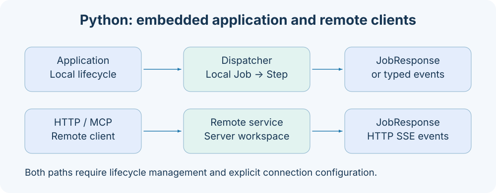

# 客户端与连接配置

客户端配置确定“连接哪台服务、如何鉴权、等待多久”。它与 [ApplicationConfig](configuration.md) 是两个对象：客户端不会安装插件、启动 TaskManager 或读取服务端环境；同一个 target 在 CLI 直连与 Studio 转发中也具有不同路径。



## ClientOptions

| 字段          | 类型             | 默认值 | 含义                            |
| ------------- | ---------------- | ------ | ------------------------------- |
| target        | string/null      | null   | 明确连接地址；null 使用发现规则 |
| timeout       | 正浮点数         | 60.0   | HTTP/MCP 请求等待预算           |
| token         | 非空 string/null | null   | 协议 Bearer token               |
| stream        | boolean          | false  | CLI 使用事件入口                |
| stream_format | blocks/json      | blocks | CLI 事件展示格式                |

ClientOptions 为 strict、frozen 模型，禁止额外字段。Python 传入真正的数值、布尔值；不要传 `stream="true"`。CLI 会先做自然值转换，`--client-timeout` 映射到 timeout。HttpClient/McpClient 构造参数只接收连接相关值，stream 与 stream_format 应由调用者选择消费方法。

## 地址规则

```text
127.0.0.1:1024              → http://127.0.0.1:1024
https://node-b:443/         → https://node-b:443
http://[::1]:1024           → http://[::1]:1024
```

所有地址都必须提供端口；https://node-b 没有显式端口会失败。禁止 credentials、query、fragment 与非根路径，不能把 `/mcp` 写进 target；McpClient 会自动追加该路径。

未显式传 target 时依次使用：

1. 服务进程公布的 AXONX_SERVICE_TARGET。
2. 默认 http://127.0.0.1:1024。

服务绑定 0.0.0.0 时公布客户端可连接的 127.0.0.1；该环境变量是进程内发现信息，不是远程机器注册表。异常地址会记录日志并回退默认地址。

## CLI token 来源

```bash
axonx version --token your-service-token
axonx version --target node-b:1024 --token your-target-token
```

省略 --token 时，CLI 加载 .env（不覆盖已有环境），然后：

| 场景              | 使用的环境变量      |
| ----------------- | ------------------- |
| 没有显式 --target | AXONX_SERVICE_TOKEN |
| 有显式 --target   | AXONX_TARGET_TOKEN  |

即使显式 target 指向本机，也会选 AXONX_TARGET_TOKEN。不能假定直连自动从 ApplicationConfig.targets 提取凭据。

```bash
axonx wait_task --task-id 'base#demo#example' \
  --run-id your-returned-run-id --client-timeout 600
axonx stream_task --task-id 'base#demo#example' \
  --stream true --stream-format json --client-timeout 600
```

timeout 是客户端超时，wait_task 没有对应任务超时字段。客户端超时或退出不等于后台 Task 被取消；需要时显式调用 cancel。

## Python 显式连接

```python
import asyncio
import os
from axonx.components.client import HttpClient

async def main():
    async with HttpClient(
        target="node-b:1024",
        token=os.environ["AXONX_TARGET_TOKEN"],
        timeout=120.0,
    ) as client:
        response = await client.run_job("version", {})
        print(response.model_dump(mode="json"))

asyncio.run(main())
```

Python BaseClient 不读取 AXONX_SERVICE_TOKEN/AXONX_TARGET_TOKEN 作为自动凭据，须显式传 token。它只使用 target 的环境发现规则。必须进入 async with 或显式 start/close。

## Studio 的同源转发

浏览器请求当前同源 `/jobs`，在本机设置中保存本机 token。选择远程机器后，JobInvocation 顶层 target 指向已配置地址；本机后端匹配 targets 并使用该目标 token 发出远程请求。

```yaml
# 服务端 app.yaml 中的目标设置
extends: default
targets:
  - address: node-b:1024
    token: ${NODE_B_TOKEN}
```

```json
{
  "arguments": {},
  "target": "http://node-b:1024"
}
```

上例用于本机 `/jobs/machine_status`。本机 401 与远端 401 是不同故障：前者检查浏览器保存的本机 token，后者检查后端 targets 配置的 token。未配置地址报 422；不能借此任意代理网络请求。

## worker 交接变量

AXONX_TASK_WORKSPACE_DIR、AXONX_TASK_LOG_DIR、AXONX_TASK_TIMEZONE、AXONX_TASK_ID、AXONX_TASK_RUN_ID、AXONX_TASK_CREATED_AT 由 TaskManager 写入子进程环境，确保 worker 与提交端共享身份和路径。

这些是框架内部执行交接字段。普通用户应通过配置 workspace_dir/log_dir/timezone 与 submit 输入控制任务，不应手工伪造 run_id 或 created_at 来创建执行。迁移工作区也不等于恢复原 worker。

## 连接失败处理

health() 将连接失败、协议拒绝或无效健康响应折叠为 false；run_job() 则可能抛 RemoteServiceError，其 status_code 在 HTTP 拒绝时有值。JobResponse.success=false 是业务失败，通常不会被转换为该异常。

进一步排查见 [鉴权](../guides/authentication.md)、[远程机器](../guides/remote-machines.md)、[运维](../guides/operations.md)。

实现依据：`components/client/base.py`、`cli/main.py`、`utils/target.py`、`components/service/http/app.py`。
