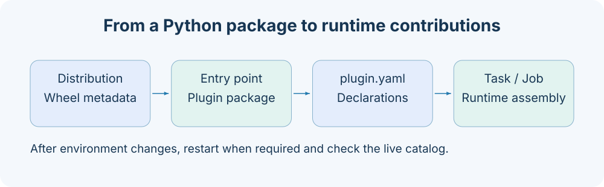

# 插件包与贡献协议

插件是带 `axonx.plugins` entry point 与包内 plugin.yaml 的 Python distribution。manifest 声明 Task、托管组件后端与 Job；安装和运行装配是两个阶段。先检查包元数据与声明，再启动应用核对注册定义和公开 Job。



## 三种名称

| 名称               | 示例          | 使用位置                              |
| ------------------ | ------------- | ------------------------------------- |
| distribution       | axonx-example | pip 元数据、安装与卸载                |
| plugin entry point | example       | 插件发现与 manifest 所属包            |
| Task 注册名        | example_task  | submit.task、get_task_definition.task |

这些名字不要求相同。Task ID 另由任务类型、注册名与实例名称组成，不能用 distribution 代替注册名执行任务。

## 最小包布局

```text
example-project/
  pyproject.toml
  axonx_example/
    __init__.py
    plugin.yaml
    tasks.py
```

pyproject.toml：

```toml
[build-system]
requires = ["setuptools>=84.0.0"]
build-backend = "setuptools.build_meta"

[project]
name = "axonx-example"
version = "0.1.0"
requires-python = ">=3.12"
dependencies = ["axonx>=0.1.0"]

[project.entry-points."axonx.plugins"]
example = "axonx_example"

[tool.setuptools.packages.find]
where = ["."]
include = ["axonx_example*"]

[tool.setuptools.package-data]
axonx_example = ["plugin.yaml"]
```

entry point 指向一个 Python package；plugin.yaml 必须被包含进 wheel。只写源码 manifest 而未包含 package-data，会导致安装后发现失败。

## manifest 字段

```yaml
tasks:
  example_task: axonx_example.tasks:ExampleTask
components: {}
jobs: {}
```

| 字段       | 类型                              | 默认值 | 契约                                    |
| ---------- | --------------------------------- | ------ | --------------------------------------- |
| tasks      | dict[非空名,非空符号目标]         | {}     | 符号必须为 BaseTask 子类                |
| components | dict[类别,dict[backend,符号目标]] | {}     | 符号必须为 BaseComponent 子类且类别匹配 |
| jobs       | dict[非空名,JobConfig]            | {}     | JobConfig 使用服务配置同一模型          |

顶层禁止额外字段；根必须是 YAML mapping。名称与字符串目标去掉首尾空白并要求非空。`module:Class` 目标先导入模块，再逐级取属性；字符串不满足格式、属性不存在或不是目标基类均失败。 Task 可以从同一 wheel 内额外的包或独立模块导入辅助代码；通过服务安装时，这些模块会与入口包一起刷新。

Task 必须声明固定 TaskType、input_cls 和 output_cls，建议添加详细的类 docstring。查询定义时从类 docstring 提取 description；缺少或仅含空白时返回空字符串。Task 最小开发流程见 [已有开发指南](../dev_guide.md)。

所有注册的 Task 都必须遵守 [`BaseTask`](../../../axonx/task/core/task.py) 的公共开发协议。
[`axonx.task.contracts`](../../../axonx/task/contracts/) 中的研究基类是可选标准契约；采用后必须保留其参数字段与校验规则。
核心协议与标准研究契约的适用范围及实现要求见[必须遵守的开发协议](../dev_guide.md#必须遵守的开发协议)。

## Job 与组件贡献

下面的 Job 使用内置 version_step，无需新增 Step：

```yaml
tasks: {}
components: {}
jobs:
  example_version:
    description: Return version through the plugin job.
    parameters:
      type: object
      properties: {}
      additionalProperties: false
    steps:
      - backend: version_step
```

JobConfig 全部字段见 [配置参考](configuration.md#jobconfig)。插件 Job 与应用配置同名会报错，不会自动让配置覆盖插件。

组件贡献只声明 backend 实现，实例仍由 ApplicationConfig.components 配置：

```yaml
# plugin.yaml 的声明片段
components:
  proxy:
    example_proxy: axonx_example.proxy:ExampleProxy
```

```yaml
# app.yaml 的实例片段；ExampleProxy 需继承 BaseProxyComponent
components:
  proxy:
    reports:
      backend: example_proxy
```

当前 loader 使用 BaseComponent 作为 components 的基类约束。BaseStep 继承 ComponentBase 而不是 BaseComponent，因此不能直接把自定义 BaseStep 放进 manifest 的 components.step；此类局部扩展示例使用 Application(providers=...)，见 [框架扩展](../development/framework-extensions.md)。不要仅凭类别名称推断所有 Provider 都可从 manifest 加载。

## 发现、安装与装配

启动时 sources 为空则检查当前环境已安装插件；sources 非空则先准备这些源的安装/构建，再返回环境插件目录。sources 不是简单的启用名称列表，也不是“只加载这些插件”的白名单。

```yaml
extends: default
plugins:
  sources:
    - ./plugins/example
```

上述路径按声明配置文件所在目录解析。远程部署用 CLI build/install 或上传 wheel；不能让远端解释客户端的源目录路径。

Application 使用局部 registry，发现后的贡献按所有权合并。两个插件相同 Task 注册名、Job 名或相同类别/backend 都拒绝；Task 与内置重名也拒绝。registry 冻结后不能随意新增 provider。

## wheel 与内容指纹

| 字段             | 含义                     | 用途               |
| ---------------- | ------------------------ | ------------------ |
| sha256           | wheel 文件字节的 SHA-256 | 上传与安装制品校验 |
| content_sha256   | 插件内容指纹             | 构建缓存与内容身份 |
| requirements     | wheel 的依赖元数据       | 安装环境需求       |
| restart_required | 安装/卸载结果提示        | 服务贡献重新装配   |

相同源内容与缓存不代表 wheel 字节必然相同；不要拿 content_sha256 替代上传返回的 sha256。远程 install 必须接收 POST /files 返回的 path 与 sha256。editable 只适用于本地源码环境，不能远程部署。

```bash
axonx plugin inspect ./plugins/example
axonx plugin build ./plugins/example --output ./dist
axonx plugin install ./plugins/example
axonx plugin list
```

这些命令执行检查、构建或安装，需在实际插件目录使用。安装结果要求重启时，重启后查询 get_task_definition 与 /jobs 验证贡献；通过服务安装仅贡献 Task 的 wheel 后，后续 Task 查询与提交无需重启；已装配的 Component/Job 仍需重启。详见[插件管理](../plugins/management.md#校验和与重启)。

## 命名配置贡献

同一个包还可以发布 axonx.configs entry point：

```toml
[project.entry-points."axonx.configs"]
example = "axonx_example.config:example"

[tool.setuptools.package-data]
axonx_example = ["plugin.yaml", "config/*.yaml"]
```

如果 attr 是已存在对象，resolver 加载它，若可调用则调用并取得 YAML/JSON 路径；否则把目标包作为目录，按 attr/name 取对应配置文件。必须定位到一个实际配置文件。同名配置歧义会拒绝，不静默选一个。

仓库 qlib_a158 使用独立 distribution axonx-qlib-a158、插件 entry-point qlib_a158 与 axonx_qlib_a158 包，可作为真实包结构参考。

## 相关文档

- [插件管理](../plugins/management.md)
- [插件 API](../api/plugins-sync.md)
- [CLI 参考](cli.md)

实现依据：`plugin_kit/manifest.py`、`loading.py`、`contributions.py`、`runtime.py`、`wheel.py`、`config/resolver.py`。
