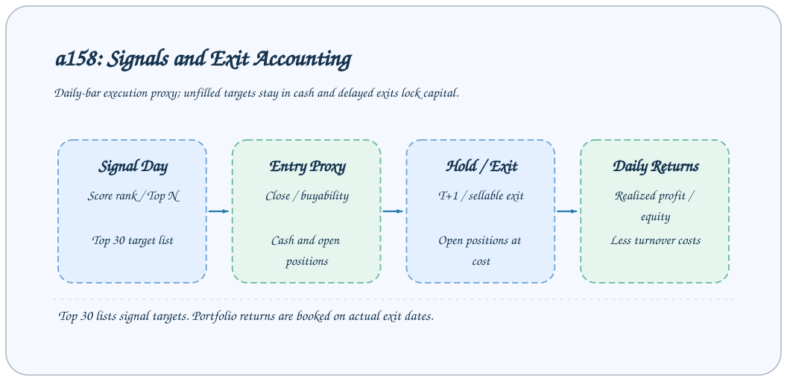
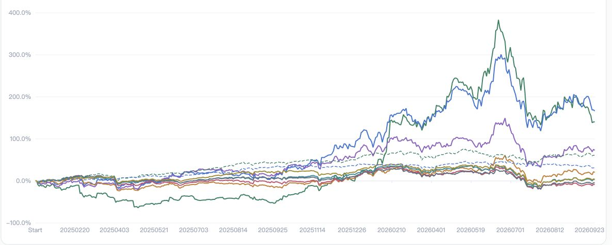
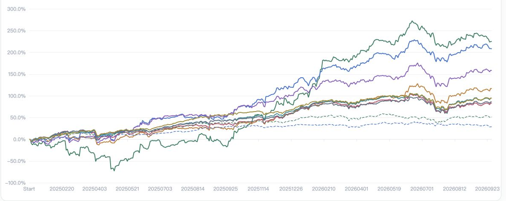
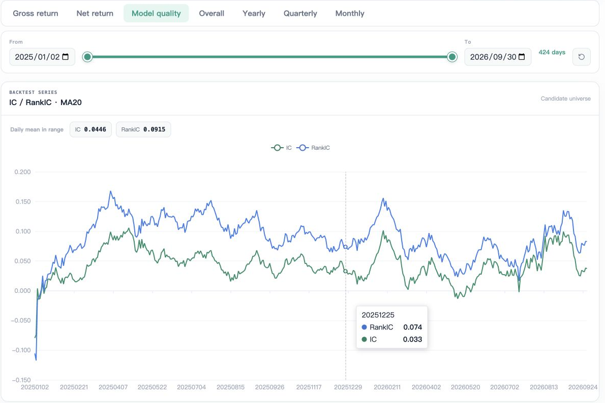
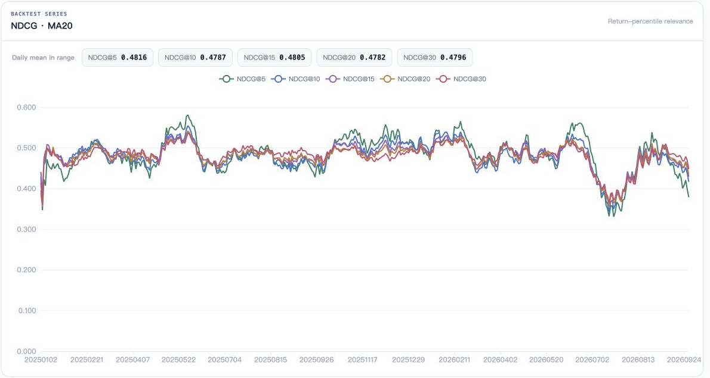
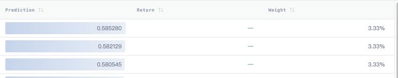
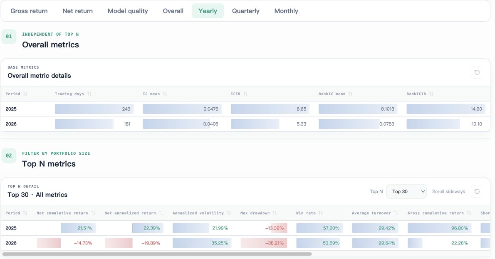
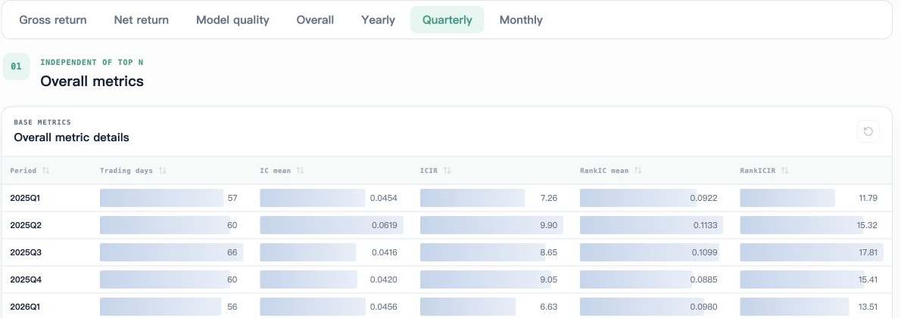
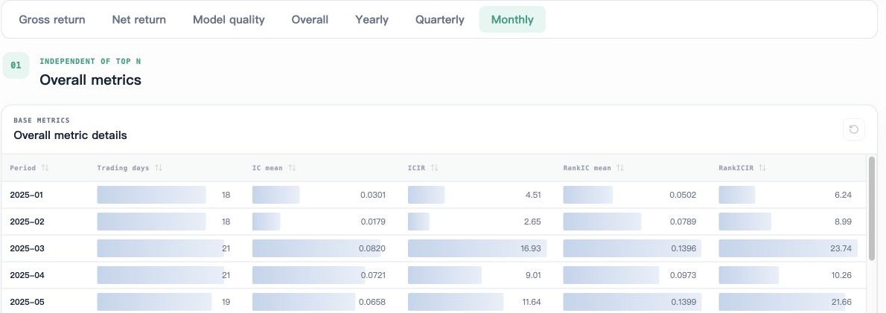

# 回测结果解读

回测页面读取成功 Backtest Task 的 `daily` 与 `summary` 产物，展示收益、信号质量、目标清单和分期统计。本文解释当前 a158 插件，其他插件需要先核对自己的 `protocol`。



## 运行回测

```bash
axonx submit --task a158_backtest --source-tasks '<Predict Task ID>' \
  --transaction-cost-rate 0.002 \
  --annual-risk-free-rate 0.012 --annualization-days 252
```

提交后使用 TaskHandle 的 `task_id`、`run_id` 等待成功，再进入 Studio 回测页面。输入上游必须满足 a158 预测字段和布尔类型检查，并声明 `actual_return_unit=decimal`。

| 参数 | 默认值 | 含义 |
| --- | --- | --- |
| `transaction_cost_rate` | `0.002` | 按换手应用的交易成本率，十进制 |
| `annual_risk_free_rate` | `0.012` | 风险调整指标的年无风险收益率 |
| `annualization_days` | `252` | 插件汇总使用的年交易日数 |
| `minimum_index_weight_coverage` | `0.90` | 指数基准所需最小权重覆盖 |
| `index_codes` | `[]` | 限制候选指数范围，例如 `["hs300"]` |

当前组合规模固定为 Top 1、2、3、5、10、15、20、30，不通过本插件输入参数任意配置。基准定义由 metadata 的 `dimensions.benchmarks` 提供。

## 信号、买入与退出

插件先在信号日筛选可买、评分有限的候选，按评分降序排列；同分时按代码稳定排序。配置多个指数代码时采用符合任一指定指数成分条件的候选。

每天模拟收盘卖出到期旧仓，再尝试买入当天目标。新买仓位最早下一交易日退出，资金留在旧仓直到实际退出。不满足 `entry_is_buyable` 的目标留下现金；组合已满、同一代码已持仓或资金不足也会影响买入。

收益在实际退出日期记账，未退出持仓按本金成本留在账上。它不是每日按市价估值的净值，也没有模拟盘后排队、部分成交和实际资金释放细节。延期退出、未结算仓位可能影响整个窗口的收益解释。

## 日频收益字段

以 `top30_` 为例：

| 字段 | 含义 |
| --- | --- |
| `gross_return` | 当日已实现退出利润 / 期初账面权益 |
| `turnover` | 当日实际买入和卖出本金较大值 / 期初权益 |
| `transaction_cost` | 成本率乘换手率 |
| `net_return` | 毛收益减交易成本 |
| `count`、`open_positions` | 当前未退出的持仓数量 |
| `delayed_open_positions` | 延期退出而仍持有的仓位数 |
| `unsettled_positions` | 尚无退出日期的仓位数 |
| `exits`、`delayed_exits` | 当日退出与延期退出数量 |
| `unfilled_entries` | entry 可买检查失败的目标数 |

`daily.trade_date` 是回测日历日期；组合收益对应这一天实际退出的收益，IC 则对应这一天的信号诊断，两者不应混成同一笔交易。

## 先读协议，再看收益图

以下截图来自远程工作区已有回测结果，以英文界面展示图表与表格；该实验的收益数值不代替本页对 `a158` 实现的说明。收益图保留绘图区，具体序列名称应在自己的页面图例中核对。



**Net return** 展示扣费后净收益复利轨迹，适合观察资金曲线与回撤。



**Gross return** 以日毛收益累加展示，不能直接拿末值与插件汇总的毛收益复利数值相等比较。

Studio 的收益图从当前选择范围内的日频数据重新计算：

```text
净累计收益 = ∏(1 + 每日净收益) − 1
毛收益图   = Σ(每日毛收益)
```

两天收益 `+10%`、`-10%` 的净复利结果是 `-1%`，简单累加是 `0%`。这是展示口径差异，不是相同数值的两种配色。

插件 `summary.parquet` 的 `gross_cumulative_return` 使用毛收益复利。因此 Studio 毛收益累加曲线的末值不保证等于汇总表中的毛累计收益。净收益图与汇总的复利口径一致，但窗口不同仍会产生差异。

图表日期滑块与起止日期会改变展示窗口和窗口内均值，汇总表来自插件预先生成的 overall、year、quarter、month 行，不会因滑块自动重新跑插件。

## 信号质量



**Model quality** 显示 IC 与 RankIC 的 MA20，并给出所选日期范围内的日均值。悬停可读某个日期的曲线值，范围均值与移动均值曲线是不同统计。



NDCG 面板展示 Top 5、10、15、20、30 的排名诊断与窗口均值，帮助观察高评分目标的排序质量；它不代替执行成本和组合收益。

- `ic`：严格单日有效标签上评分与收益的 Pearson 相关。
- `rank_ic`：同一严格标签范围内的 Spearman 相关。
- `topN_ndcg`：候选截面中，严格单日收益相关性上的排名诊断。

Studio 还展示 20 行窗口的移动平均，开始位置使用已有样本。缺失或非有限值被排除，窗口不足 20 个有效观测时不是完整 20 日统计。IC 高不必然意味着扣费后收益高，执行约束和成本会改变结果。

## Top 30 表的准确含义



此图仅保留 Prediction、Return、Weight 三列。收益尚不可用时显示空值；权重和评分应结合目标清单协议解释。

当前前端硬编码读取 `top30_holdings`，表格可以排序并随图表光标日期更新、锁定或跳到最新一天。

这个字段是信号日 Top 30 **目标候选清单**，包含当天未能买入的股票，既不是实际仓位账本，也不是用户选中 Top N 的完整成交记录。表内 `daily_return` 来自该目标最终持有收益，可能跨越延期退出；`weight` 是目标明细的权重代理，不是实际资金账本权重。

即使 `dimensions.holding_detail_top_n` 描述其他规模，当前页面仍读取 `top30_holdings`。扩展插件不能只换字段名就期望前端自动展示任意 Top N。

## 汇总指标


**Overall** 的基本信号指标独立于组合规模；Top N 收益指标在对应详情区展示。

| 指标 | a158 汇总口径 |
| --- | --- |
| 净累计收益 | 日净收益复利 |
| 净年化收益 | 累计净值按观察天数与年交易日数年化 |
| 年化波动 | 日净收益样本标准差乘年化平方根 |
| 最大回撤 | 含初始净值 1 的净复利曲线峰值回撤，负数 |
| 胜率 | 净收益大于零的日比例，零收益不算胜 |
| 平均换手 | 日换手平均值 |
| 毛 Sharpe | 毛收益减日化无风险收益后的均值/样本标准差并年化 |
| 对基准 IR | 毛收益减基准收益的均值/样本标准差并年化 |
| ICIR / RankICIR | 相应日相关系数的均值/样本标准差并年化 |

指数权重覆盖不足时基准可为空，风险调整指标也可能缺失。`universe` 基准是插件候选范围内满足收益条件的平均收益，不应直接称为交易所全市场指数。

## 分年、季度与月度观察



**Yearly** 同时展示按年信号指标与所选 Top N 的收益指标。先确认每年的观察天数，再比较年化、波动和回撤。



**Quarterly** 将时间范围拆到季度，帮助定位变化集中在哪个阶段；行数据来自插件生成的季度汇总。



**Monthly** 适合逐月检查信号稳定性。表格支持滚动和排序，月样本较少时比率变化也会更大。

## 发现异常时

先核对预测的 decimal 收益单位，再检查日期范围、候选规模、成本、延期退出和未结算仓位。修改参数应新建实验 Task；在页面换 Top N 或窗口只改变观察，不重新执行回测。

## 相关文档与实现

- [策略比较](strategy-comparison.md)、[研究产物协议](../reference/research-artifacts.md)
- [`插件回测协议`](../../../plugins/a158/axonx_alpha158/backtest.py)
- [`回测记账与汇总`](../../../plugins/a158/axonx_alpha158/internal/backtest.py)
- [`Studio 回测展示`](../../../axonx_studio/src/features/research/backtest/BacktestView.tsx)
