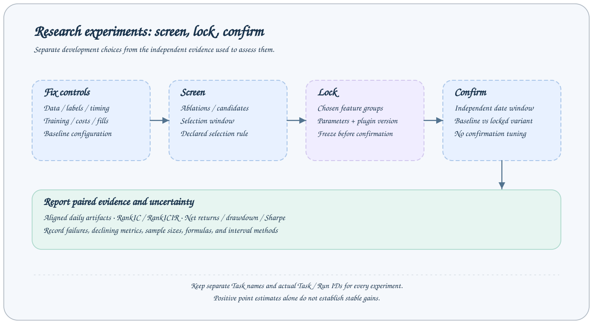

# 实验设计与独立确认

AxonX 保存执行证据，实验设计决定这些证据能支持什么结论。本页说明如何把一次参数或特征修改组织为可检查的研究比较；具体算法和历史实验数值由插件文档维护。



## 先定义问题与控制变量

执行前记录研究假设、基线、候选方案、选择规则和评估窗口。比较特征方案时固定数据快照、标签、样本过滤、训练参数和回测假设；比较成本或组合管理时固定兼容的预测产物。

| 要记录的内容       | 核对方式                                                 |
| ------------------ | -------------------------------------------------------- |
| 执行服务与插件版本 | 保存目标地址、服务版本、插件版本或源码版本               |
| 数据快照与时点     | 保存来源、覆盖日期、分区及校验信息；确认信号何时可用     |
| 样本与模型         | 保存标签、过滤规则、训练与验证窗口、超参数和随机种子     |
| 执行与成本         | 保存股票池、成交代理、延迟退出、成本率、年化与无风险设置 |
| 选择规则           | 事先确定候选集、主要指标、约束和并列时的处理             |
| 实验证据           | 保存 Task/Run ID、输入、metadata、日志和关键产物         |

固定随机种子不能替代固定数据和依赖环境。字段时点必须符合预测时可用信息，不能用未来标签或未来可交易性构建特征。

## 分开训练、筛选与确认

1. **训练与验证**：在训练窗口内选择模型参数或早停轮数。
2. **筛选**：在预先指定的样本外窗口比较候选方案，按事先规则选择。
3. **锁定**：记录选择理由、特征组、模型参数与执行协议。
4. **独立确认**：只比较基线与锁定方案；不根据这个窗口的结果继续选组或调参。

用于选择方案的窗口不能同时作为独立确认。若看到确认结果后继续修改，需将该窗口视为开发信息，为新方案重新建立确认设计。

Alpha158 Factor 的具体案例使用 2015–2022 年训练、2023–2024 年筛选、2025-01-01 至 2026-09-30 确认。它是历史实验设置，新的实验应根据数据和问题定义自己的窗口。

## 用 Task 保存消融链

优先复用兼容的上游数据，让每个候选方案拥有独立的 Train、Predict 和 Backtest 身份。每次提交保存真实返回的 Task/Run ID，等待成功后再提交下游。框架记录血缘，但不自动运行整条 DAG。

```text
共同 ETL
  ├─ 基线 Train → 筛选 Predict → 筛选 Backtest
  └─ 候选 Train → 筛选 Predict → 筛选 Backtest
锁定方案后
  ├─ 基线 Train → 确认 Predict → 确认 Backtest
  └─ 锁定 Train → 确认 Predict → 确认 Backtest
```

使用默认生成名称或不同的显式名称；同名重跑会替换终态目录。失败和作废运行也应保留原因，不只汇报成功结果。命令与等待方法见[研究流程](workflow.md)，增强插件的分组消融命令见[复现实验](../../../plugins/a158_factor/README_ZH.md#安装与执行)。

## 比较共同窗口与相同口径

先核对双方协议、数据、日期、Top N、成本和年化参数，再比较收益与风险。Studio [策略比较](strategy-comparison.md)可以对齐共同有效日期并重算指标；日期对齐不自动保证研究设置相同。

信号质量与组合收益应分别报告：RankIC 衡量排序相关性；净收益、回撤与 Sharpe 还受成本和成交、退出假设影响。某一个 Top N 改善不能推导所有组合规模都改善。

[回测解读](backtest.md)区分插件汇总、前端窗口重算、毛收益与净收益。实验额外计算的净 Sharpe 应明确公式与数据来源，不能直接用原产物的 gross Sharpe 代替。

## 解释增量与不确定性

同一日期上的基线与增强方案可构成配对差值。报告点估计时，同时说明有效样本、缺失日期和时间相关性处理。区块 bootstrap 的统计对象、区块长度、次数与随机种子都应记录。

Alpha158 Factor 的历史报告对每日 RankIC 和 Top10 / Top20 日净收益差值使用 20 交易日循环区块 bootstrap，重采样 2000 次、随机种子 42。三项 95% 区间均跨零。这些区间也不是年化复利收益差的区间。

这种计算属于实验分析，Studio 策略比较页面不会自动生成上述 bootstrap 检验。原始日级产物、对齐方法与计算记录需要在实验环境保留。

## 阅读 Agent 开发的增强案例

[项目 Benchmark](../../../README_ZH.md#benchmark-agent-开发市场横截面增强特征)介绍 Agent 如何开发独立插件并通过 AxonX 执行研究。[Alpha158 Factor](../../../plugins/a158_factor/README_ZH.md)维护特征定义、任务参数、结论和复现命令。

详细历史材料包括[实验计划](../../../plugins/a158_factor/DEVELOPMENT_PLAN.md)、[执行过程](../../../plugins/a158_factor/EXPERIMENT_PROCESS.md)、[完整结果](../../../plugins/a158_factor/EXPERIMENT_RESULTS.md)和[校验材料索引](../../../plugins/a158_factor/experiments/README.md)。汇总与校验材料随仓库提供；完整提交响应、原始日志及日级 Parquet 保留在实验本地归档。复现指南支持新执行，不承诺重新取得未发布的历史数据快照或产物。

## 报告结论

报告基线与锁定方案、选择过程、独立窗口、指标变化和不确定性；列出失败记录、下降的指标及交易假设限制。任务成功说明执行完成，研究结论仍需由这些证据支持。
