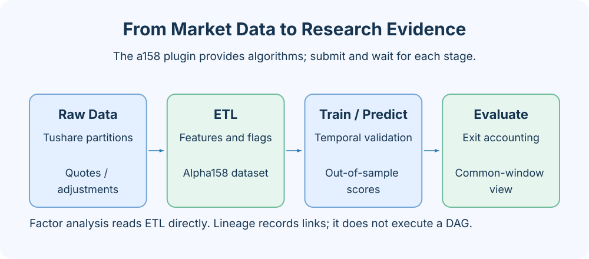
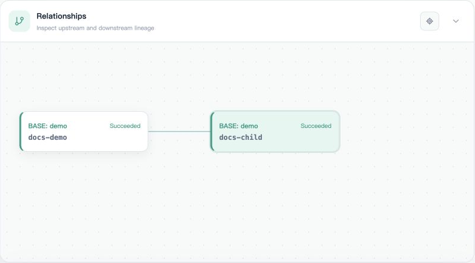
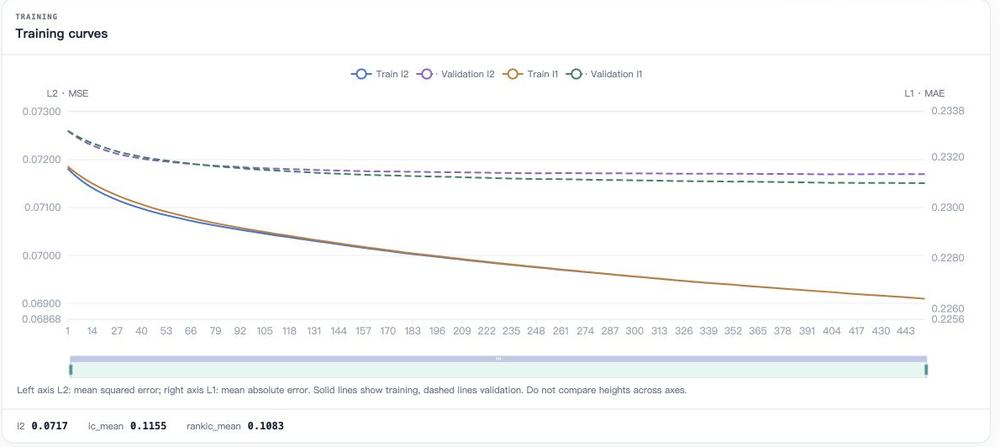
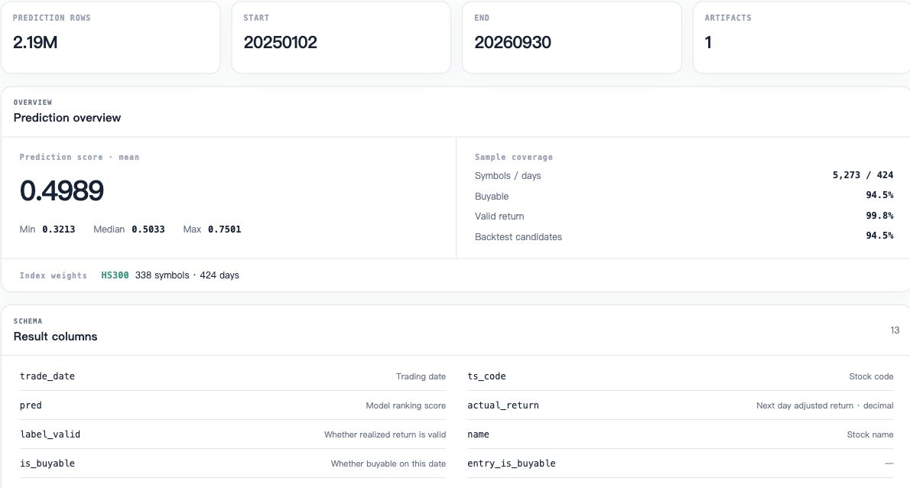
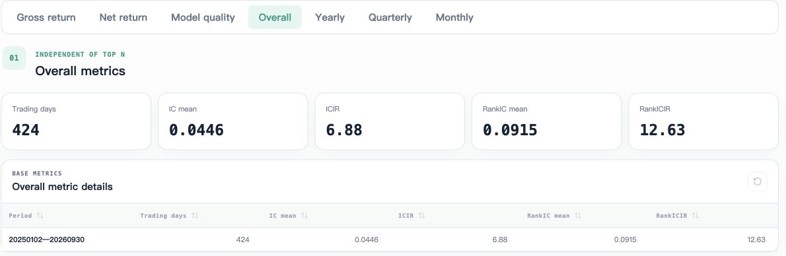
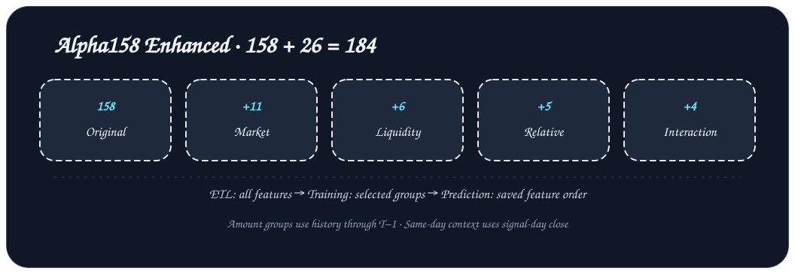

# Alpha158 Enhanced 插件

[English](README.md) · [简体中文](README_ZH.md) · [插件管理](https://flowllm-ai.github.io/AxonX/zh/plugins/management)

独立的 AxonX 量化研究插件，提供数据处理、因子分析、LightGBM 训练、样本外预测和 TopN 回测。

增强版保留原始 158 个特征，增加 26 个市场环境、成交金额分组、相对表现和交互特征，总计 184 个。它包含自己的实现，不依赖原插件的 Python 包。成交金额表示交易活跃度，不代表市值。



## 安装与检查

要求 Python 3.12+；本地任务执行支持 macOS 和 Linux。安装在执行服务使用的 Python 环境中，再重启服务以重新加载插件。LightGBM、NumPy 和 Polars 随插件依赖安装。

```bash
pip install axonx-alpha158-enhanced
axonx plugin list
axonx plugin show axonx-alpha158-enhanced
```

源码开发时，在仓库根目录执行：

```bash
pip install -e ./plugins/a158_enhanced
axonx plugin inspect ./plugins/a158_enhanced
```

本机 CLI 的环境不一定是远程服务的环境。远程部署先配置目标服务 token，再明确指定目标：

```bash
export AXONX_TARGET_TOKEN='<service token>'
axonx plugin install ./plugins/a158_enhanced --target 'http://<host>:1024'
axonx plugin list --target 'http://<host>:1024'
```

按安装响应中的 `restart_required` 重启目标服务，再查询 Task 定义。完整的构建、卸载和部署说明见[插件管理](https://flowllm-ai.github.io/AxonX/zh/plugins/management)。

## 数据准备

在执行服务环境配置 `AXONX_TUSHARE_TOKEN`，使用内置 `download_tushare_task` 准备工作区下的 Tushare Parquet 数据。默认 ETL 输入目录是工作区中的 `tushare/`，不是当前 shell 目录。

```bash
axonx submit --task download_tushare_task \
  --start-date 20140101 --end-date 20260930 \
  --datasets 'static,stk_limit,daily,adj_factor,index_weight'
```

保存返回的 `task_id` 和 `run_id`，等待下载成功后再提交 ETL：

```bash
axonx --client-timeout 86400 wait_task \
  --task-id '<download_task_id>' --run-id '<download_run_id>'
```

| 文件                                                             | 用途                                 |
| ---------------------------------------------------------------- | ------------------------------------ |
| `*/*/daily.parquet`, `*/*/adj_factor.parquet`                    | 行情与复权因子，必需                 |
| `trade_cal.parquet`, `stock_basic.parquet`, `namechange.parquet` | 交易日历、股票主数据和历史名称，必需 |
| `*/*/stk_limit.parquet`                                          | 官方涨跌停价格，影响可交易判断       |
| `*/*/index_weight.parquet`                                       | 沪深 300 成分权重，影响指数池与基准  |

提前准备足够的历史数据供滚动窗口使用。示例训练期从 2015 年开始，因此下载从 2014 年开始。下载默认只回看七个自然日，不能据此假设历史数据齐全。数据凭据、分区布局与更新方式见 [Tushare 数据下载](https://flowllm-ai.github.io/AxonX/zh/research/tushare)。

## 任务与执行

| Task             | 上游            | 产物                                 |
| ---------------- | --------------- | ------------------------------------ |
| `a158e_etl`      | 工作区行情数据  | 特征、标签、交易状态和统计           |
| `a158e_factor`   | ETL Task ID     | 因子诊断与分析结果                   |
| `a158e_train`    | ETL Task ID     | 模型、训练协议、验证曲线和特征重要性 |
| `a158e_predict`  | Train Task ID   | 全横截面预测与预测统计               |
| `a158e_backtest` | Predict Task ID | 日级回测、分期汇总与持仓相关产物     |

因子分析从 ETL 分支执行，不是训练的前置任务。按以下顺序提交；每一步都使用实际返回的 Task ID，等待任务成功后再提交下游。

```bash
axonx submit --task a158e_etl --start-date 20150101 --end-date 20260930

# ETL 成功后
axonx submit --task a158e_factor --source-tasks '<etl_task_id>'
axonx submit --task a158e_train --source-tasks '<etl_task_id>' \
  --train-start 20150101 --train-end 20230101 \
  --context-groups market,liquidity,relative,interaction

# 训练成功后
axonx submit --task a158e_predict --source-tasks '<train_task_id>' \
  --pred-start 20230101 --pred-end 20260930

# 预测成功后
axonx submit --task a158e_backtest --source-tasks '<predict_task_id>'
```

每次等待都同时提供本次运行的两个标识：

```bash
axonx --client-timeout 86400 wait_task \
  --task-id '<task_id>' --run-id '<run_id>'
axonx get_task_definition --task a158e_train
```

远程执行时，上述提交、等待和定义查询命令都加上同一个 `--target`。不要只远程安装插件后又在本机环境执行任务。



## 关键参数

| 阶段 / 参数                                       | 默认值                  | 说明                               |
| ------------------------------------------------- | ----------------------- | ---------------------------------- |
| ETL `start_date` / `end_date`                     | `20140101` / null       | 输出起始日 / 最后日期，包含边界    |
| ETL `min_history_coverage`                        | `0.8`                   | 滚动特征最低历史覆盖率             |
| Train `train_start` / `train_end`                 | `20150101` / `20230101` | 训练起始日包含，截止日不包含       |
| Train `label_column`                              | `label_1d_rank`         | 按日横截面排名的收益标签           |
| Train `trim_tail`                                 | `0.025`                 | 按日剔除原始收益两端各 2.5%        |
| Train `validation_ratio`                          | `0.10`                  | 训练期末尾日期留作内部验证         |
| Train `num_boost_round` / `early_stopping_rounds` | `1000` / `50`           | 最大迭代 / 早停轮数                |
| Train `random_seed`                               | `42`                    | 模型抽样随机种子                   |
| Predict `pred_start` / `pred_end`                 | `20230101` / null       | 预测区间；起始日不能早于训练截止日 |
| Backtest `transaction_cost_rate`                  | `0.002`                 | 乘以每日实际换手率的交易成本       |
| Backtest `annualization_days`                     | `252`                   | 年化交易日数                       |

完整参数以执行环境中 `get_task_definition` 返回的 Schema 为准。

## 特征、标签与回测口径

原始特征使用 `f_alpha158_*` 名称，包含 13 个当日价形特征以及 5、10、20、30、60 日窗口的 29 组滚动特征。行情使用复权价格，并保留交易日历和上市状态信息。

正常标签为信号日 T 收盘至 T+1 收盘的复权收益；无法按计划卖出时延迟至首个可卖日期。训练、因子和信号排名评估仅使用有效且未延迟的一日样本。预测保留完整横截面，不事先按未来标签筛掉股票。

回测按当天信号排名并用当天收盘价模拟买入，使用日线可交易代理；未模拟盘后排队与部分成交。持仓锁定资金直到实际退出，未结清持仓按成本记账，净收益在退出日确认。Top30 持仓明细是信号目标，不等于实际持仓账本。

收益、成本、IC 与持仓的详细定义见 [回测解读](https://flowllm-ai.github.io/AxonX/zh/research/backtest)。

## 在 Studio 查看结果

在任务详情检查参数、日志、metadata 和上游关系；在研究结果页面查看 ETL、因子、训练、预测和回测产物。下图是已有实验的界面示例，不代表本插件每次运行的结果。







## 排查问题与源码

| 问题            | 检查项                                                      |
| --------------- | ----------------------------------------------------------- |
| 没有注册的 Task | 安装环境、插件入口、服务重启和目标机器                      |
| ETL 缺少数据    | 工作区 tushare 分区和三个静态文件；历史日期覆盖             |
| 预测日期报错    | pred_start 必须不早于 train_end，且模型与 ETL metadata 完整 |
| 结果与示例不同  | 数据快照、特征组、区间、标签、参数和成本是否一致            |

[插件注册](axonx_alpha158_enhanced/plugin.yaml) · [ETL](axonx_alpha158_enhanced/etl.py) · [因子分析](axonx_alpha158_enhanced/analysis.py) · [训练](axonx_alpha158_enhanced/training.py) · [预测](axonx_alpha158_enhanced/predict.py) · [回测](axonx_alpha158_enhanced/backtest.py)

[研究流程](https://flowllm-ai.github.io/AxonX/zh/research/workflow) · [研究结果](https://flowllm-ai.github.io/AxonX/zh/research/results) · [任务管理](https://flowllm-ai.github.io/AxonX/zh/guides/task-management)

## 特征组



| `context_groups` 分组 | 新增数量 | 内容                                                                                           |
| --------------------- | -------: | ---------------------------------------------------------------------------------------------- |
| `market`              |       11 | 市场收益均值/中位数、上涨占比、收益 IQR、涨跌停比例、5/20 日趋势、标准化冲击、放量和金额集中度 |
| `liquidity`           |        6 | 截至 T−1 的成交金额排名、个股放量、低/高金额组收益、组间价差及 5 日均值                        |
| `relative`            |        5 | 相对市场/金额组收益、当日收益排名、5/20 日相对趋势                                             |
| `interaction`         |        4 | 市场冲击/下跌幅度 × 相对收益、金额组价差 × 金额排名、市场放量 × 个股放量                       |

增强 ETL 一次生成全部 184 个特征，训练通过 `--context-groups` 选择分组：`none` 保留 158 个，`market` 保留 169 个，`market,liquidity,relative` 保留 180 个，四组全开保留 184 个。原始名称保持 `f_alpha158_*`，新增名称使用 `f_context_*`。预测严格沿用训练 metadata 保存的特征顺序。

金额分组使用截至 T−1 的历史数据，当日环境信息在信号日收盘后可用。收益使用相邻交易日复权收盘，行情缺失时不将跨停牌期收益混为一天收益；统计池独立于未来标签和可买性。完整名称与时点协议见 [cross_section.py](axonx_alpha158_enhanced/internal/cross_section.py)，ETL metadata 记录 `context.feature_groups` 和时点协议。

## 当前版本与实验结论

0.1.2 默认启用四组完整方案，与筛选期锁定并经过确认期评估的 184 特征方案一致。训练使用 2015–2022 年，筛选使用 2023–2024 年，最终确认使用 2025-01-01 至 2026-09-30。

| 确认期指标       |    基线 | 四组完整方案 |
| ---------------- | ------: | -----------: |
| RankIC           |  0.0915 |       0.0967 |
| 年化 RankICIR    | 12.6313 |      11.9480 |
| Top10 净年化收益 |  −5.74% |       28.21% |
| Top20 净年化收益 |  −3.24% |       24.93% |

该数据快照中 RankIC、Top10/20 净年化收益提升，但 RankICIR 和 Top1–3 收益下降。确认期三项日配对增量的 95% 区块 bootstrap 区间均跨零，正向点估计不足以证明稳定增量。模型 gain 衡量模型使用程度，不等于单个特征的独立贡献。

### 信号质量


### TopN 组合结果


净 Sharpe 根据扣费后的日净收益计算；Top30 净 Sharpe 未保存。这两张图汇总上述历史实验，不代表新数据上的预期表现。

## 实验文档与材料

详细历史文档保留中文原文；英文 README 提供完整的使用、协议、结论与复现入口。

| 文档                              | 内容                                                                 |
| --------------------------------- | -------------------------------------------------------------------- |
| [实验计划](DEVELOPMENT_PLAN.md)   | 研究目标、数据与信号时点、候选特征、控制变量、筛选与确认规则         |
| [实验过程](EXPERIMENT_PROCESS.md) | 实施步骤、验证检查、异常修复、时间与 Task/Run ID、方案锁定、最终安装 |
| [实验结果](EXPERIMENT_RESULTS.md) | 消融、全部 TopN、分年与环境表现、配对统计区间、重要性和局限          |
| [材料索引](experiments/README.md) | 随仓库提交的指标与验证汇总                                           |

材料包括[原始字段对照](experiments/baseline_data_parity.json)、[特征覆盖率](experiments/context_feature_coverage.csv)、[训练参数](experiments/training_parameters.json)、[筛选指标](experiments/selection_metrics.json)、[锁定决定](experiments/selection_decision.json)、[确认指标](experiments/confirmation_metrics.json)、[日配对统计](experiments/paired_diagnostics.csv)、[环境诊断](experiments/regime_metrics.csv)和[特征重要性](experiments/selected_feature_importance.csv)。

完整提交响应、状态、原始日志、日级 Parquet 和作废运行保留在本地归档，不随仓库提交。过程文档记录其用途、标识与异常处理。新实验应建立独立记录，不复用历史任务句柄。

## 复现实验

使用前面的远程部署命令安装插件，按实验计划准备数据并记录固定快照。提交一次从 2015 年开始的增强 ETL；基于同一 ETL 分别训练 `none`、`market`、`market,liquidity,relative` 和 `market,liquidity,relative,interaction`。固定训练期、模型参数、费用 0.002 和随机种子 42。

```bash
axonx submit --task a158e_train --source-tasks '<etl_task_id>' \
  --context-groups none --train-start 20150101 --train-end 20230101 \
  --target 'http://<host>:1024'

# 为各候选特征组分别训练，并等待每个模型成功。
axonx submit --task a158e_predict --source-tasks '<train_task_id>' \
  --pred-start 20230101 --pred-end 20241231 --target 'http://<host>:1024'
# 等待预测成功后再回测。
axonx submit --task a158e_backtest --source-tasks '<predict_task_id>' \
  --target 'http://<host>:1024'
```

按计划的筛选规则锁定方案后，仅对基线和锁定方案运行确认期预测：`--pred-start 20250101 --pred-end 20260930`，等待后分别回测。保存配置、模型、预测、回测汇总和日级产物；不同数据快照的实验应另行报告。绑定历史服务的本地恢复/报告脚本不随仓库提交。

实验报告的净 Sharpe 使用扣费日收益减日无风险收益计算，区别于原回测产物中的 gross Sharpe。收盘成交代理、延迟退出、未结清持仓按成本记账仍属于实验口径。

## 本地验证

在仓库根目录安装开发依赖后执行：

```bash
PYTHONPATH=plugins/a158_enhanced .venv/bin/python -m pytest \
  plugins/a158_enhanced/tests/test_cross_section.py \
  tests/unit/test_alpha158_labels.py tests/unit/test_alpha158_backtest.py -q
```

测试覆盖未来数据因果性、原始特征契约、历史分组、停牌、平值、历史不足，以及统计池独立于标签和可买性。
